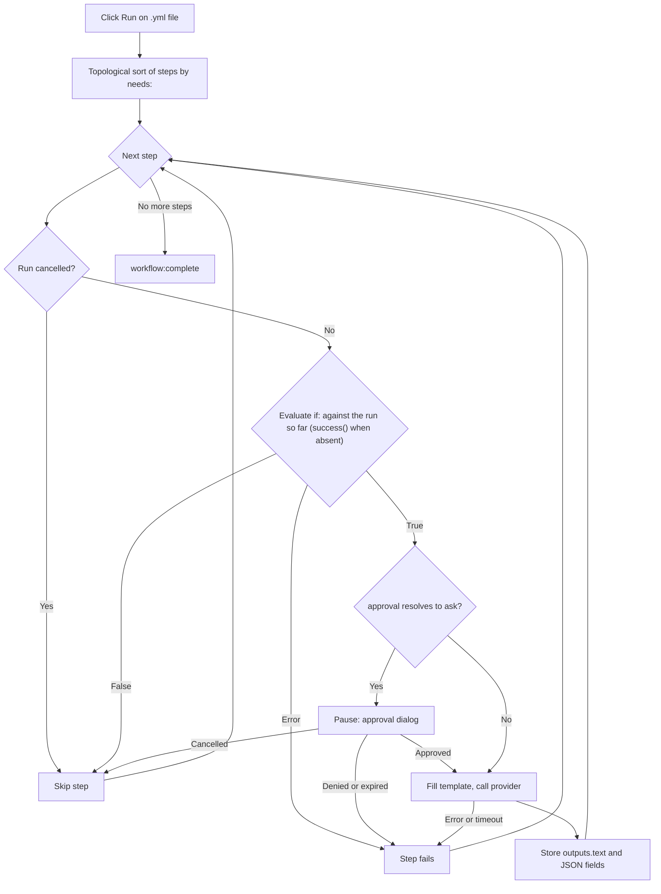

<script setup>
// Skip Vue template processing for the whole page so ${{ }} expressions
// in code spans and fenced YAML blocks are not interpreted as Vue bindings.
</script>

<div v-pre>

# Genie-Workflows

Ein **Genie-Workflow** ist eine YAML-Datei, die mehrere KI-Schritte zu einer Pipeline verkettet. Während ein einzelnes [KI-Genie](/de/guide/ai-genies) einen Prompt auf Ihren Text anwendet, führt ein Workflow einen geordneten Graphen aus Schritten aus — jeder Schritt kann ein Genie aufrufen, seine Ausgabe an den nächsten Schritt weitergeben, Sie um Genehmigung bitten oder eine kleine integrierte Aktion ausführen — und zeigt Ihnen während der Ausführung die gesamte Pipeline als Live-Diagramm.

::: tip Feature-Flag
Genie-Workflows sind hinter einer Opt-in-Einstellung verborgen. Schalten Sie unter **Einstellungen → Erweitert** die **Entwickler-Tools** ein, um die experimentelle Gruppe anzuzeigen, und dann die **Workflow-Engine**. Ist sie eingeschaltet, öffnet sich eine Workflow-Datei mit ihrem Schrittgraphen und einer Symbolleiste mit **Ausführen** / **Abbrechen** neben dem YAML-Quelltext, und Workflow-Genies können ausgeführt werden. Ist sie ausgeschaltet, erscheint eine Workflow-Datei als gewöhnlicher YAML-Baum, und ein Workflow-Genie in der Auswahl verweigert die Ausführung. GitHub-Actions-Dateien sind in keinem Fall betroffen — sie öffnen sich immer im [GitHub Actions Workflow-Viewer](/de/guide/workflow-viewer).
:::

## Wann ein Workflow sinnvoll ist

| Bedarf | Verwenden Sie |
|--------|---------------|
| Eine einzelne Transformation (Umschreiben, Übersetzen, Zusammenfassen) | Ein Markdown-[Genie](/de/guide/ai-genies) |
| Gliederung → Entwurf → Politur, wobei jede Stufe die nächste speist | Einen Workflow |
| Verschiedene KI-Modelle für verschiedene Stufen | Einen Workflow |
| Eine Genehmigung durch einen Menschen vor einem teuren oder heiklen Schritt | Einen Workflow |
| Strukturierte (JSON-)Ausgabe, die nachfolgende Schritte Feld für Feld lesen | Einen Workflow |

Wenn ein einzelner Prompt die Aufgabe erledigt, schreiben Sie ein Markdown-Genie. Greifen Sie nur dann zu einem Workflow, wenn Sie Stufen zusammensetzen, Daten zwischen ihnen weiterleiten oder für eine Genehmigung pausieren müssen.

## Einen Workflow schreiben

Ein Workflow ist eine YAML-Datei mit einem Namen, optionalen Standardwerten und einer geordneten Liste von Schritten. Hier ist ein vollständiges, lauffähiges Beispiel — es entspricht `triage-and-translate.yml`, dem mit VMark mitgelieferten Beispiel:

```yaml
name: Triage and Translate
description: Rewrite rough notes into clean English, then translate the result.

defaults:
  approval: auto

steps:
  - id: rewrite
    uses: genie/rewrite-in-english
    with:
      input: "Replace this seed text with the notes you want rewritten before running."

  - id: translate
    uses: genie/translate
    needs: rewrite
    with:
      input: ${{ steps.rewrite.outputs.text }}

  - id: save
    uses: action/save-file
    needs: translate
    with:
      path: triage-and-translate.out.md
      input: ${{ steps.translate.outputs.text }}
```

Dieser Workflow hat drei Schritte. `rewrite` führt das mitgelieferte Markdown-Genie `genie/rewrite-in-english` auf dem Ausgangstext aus. `translate` wartet darauf (`needs: rewrite`) und speist dessen Textausgabe in `genie/translate` ein. `save` schreibt die Übersetzung nach `triage-and-translate.out.md` im Arbeitsbereich. Das Ergebnis ist ein Graph aus drei Knoten, der von links nach rechts abläuft.

### Workflow-Datei oder GitHub-Actions-Datei?

Beide sind YAML, und VMark öffnet jede `.yml`- / `.yaml`-Datei in derselben geteilten Ansicht. Unterschieden werden sie so, in dieser Reihenfolge:

| Prüfung | GitHub-Actions-Workflow | VMark-Workflow |
|---------|-------------------------|----------------|
| Pfad unter `.github/workflows/` | Immer — dieser Ordner gehört GitHub | Nie |
| `on:` und `jobs:` auf oberster Ebene (außerhalb dieses Ordners sind beide nötig) | Ja | Nie |
| `steps:` auf oberster Ebene, deren `uses:` `genie/`, `action/` oder `webhook/` nennt | Nie — seine Schritte liegen innerhalb eines Jobs | Ja |

Auch ein VMark-Workflow darf `on:` haben, aber nie `jobs:`: Eine Datei mit `jobs:` auf oberster Ebene wird nie ausgeführt. Außerhalb von `.github/workflows/` wird sie nur dann als GitHub Actions geöffnet, wenn sie auch `on:` auf oberster Ebene hat; andernfalls ist sie einfaches YAML, ebenso wie eine Datei, die keiner der beiden Formen entspricht.

::: info Wo das mitgelieferte Beispiel liegt
Das Beispiel wird im App-Bundle ausgeliefert — `VMark.app/Contents/Resources/resources/workflows/examples/triage-and-translate.yml` unter macOS, anderswo im `resources`-Ordner der App — sowie im [Quell-Repository](https://github.com/xiaolai/vmark/blob/main/src-tauri/resources/workflows/examples/triage-and-translate.yml). Es wird nicht in Ihren Genies-Ordner kopiert: Um es als [Workflow-Genie](/de/guide/workflow-genies) auszuführen, kopieren Sie es selbst dorthin und bearbeiten den Ausgangstext.
:::

### Felder auf oberster Ebene

| Feld | Erforderlich | Zweck |
|------|--------------|-------|
| `name` | Ja | Menschenlesbare Bezeichnung des Workflows. |
| `description` | Nein | Einzeilige Zusammenfassung. |
| `defaults` | Nein | Standardwerte für `model`, `approval` und `limits`, die auf jeden Schritt angewendet werden (siehe [Einstellungen pro Schritt](#einstellungen-pro-schritt)). |
| `env` | Nein | Umgebungsvariablen, in `with:`-Werten lesbar als `${{ env.NAME }}` oder `${VAR}`. |
| `steps` | Ja | Die geordnete Liste der Schritte. |

### Schrittfelder

```yaml
- id: my-step           # required; unique within the workflow
  uses: genie/<name>    # required; what this step runs (see Step types)
  with:                 # inputs to the step
    input: "text or an ${{ ... }} expression"
  needs: prior-step     # optional; a single id or a list of ids
  if: ${{ success() }}  # optional condition (see Conditions)
  approval: ask         # optional; "auto" (default) or "ask"
  model: claude-sonnet  # optional; overrides defaults / genie default
  limits:
    timeout: 120s       # optional; default 300s
    max_tokens: 4096    # optional; REST providers only
```

### Schritttypen

Das Präfix von `uses:` entscheidet, was ein Schritt tut.

| `uses:`-Präfix | Verhalten |
|----------------|-----------|
| `genie/<name>` | Lädt das passende Markdown-Genie, füllt seine Prompt-Vorlage aus der `with:`-Map des Schritts und ruft den aktiven KI-Anbieter auf. |
| `action/read-file` | Liest einen arbeitsbereichsrelativen Pfad. Der Dateiinhalt wird zur Textausgabe des Schritts. |
| `action/read-folder` | Liest jede Datei direkt im arbeitsbereichsrelativen Ordner `with.path` — optional nur die, die `with.accept` entsprechen (`*.md` oder eine Liste wie `*.md,*.txt`) — in Namensreihenfolge, jede eingeleitet durch eine Zeile `--- name ---`. Bis zu 1.000 Dateien, 10 MB pro Datei und insgesamt 100 MB. |
| `action/save-file` | Schreibt `with.input` nach `with.path` (arbeitsbereichsrelativ). Der Pfad muss ein Literal sein — kein `${{ }}`-Ausdruck —, damit die Datei vor dem Lauf gesichert werden kann (siehe [Einen Lauf rückgängig machen](#einen-lauf-ruckgangig-machen)). |
| `action/notify` | Protokolliert `with.message`. |
| `action/copy` | Gibt `with.input` unverändert zurück — praktisch, um einen Wert umzubenennen oder aufzufächern. |

::: warning
`webhook/*`-Schritte werden noch nicht unterstützt — ein Workflow, der einen verwendet, wird vor der Ausführung abgelehnt. Genies mit Dateiausgabe (`output.type: file` / `files`) sind ebenfalls zurückgestellt.
:::

Ein erfolgreicher Schreibvorgang von `action/save-file` wird von [Kohärenz](/de/guide/coherence) aufgezeichnet, mit den Leseschritten, die ihn gespeist haben, als Eingaben — allerdings nur, soweit **Identitätsblock beim Speichern einfügen** (Einstellungen → Dateien & Bilder) es zulässt: Ist die Einstellung aus, wird kein `.vmark`-Ordner angelegt und keine Datei mit einem Identitätsblock versehen, und ein Arbeitsbereich, der bereits einen hat, zeichnet den Schreibvorgang nur für ein Dokument auf, das er bereits verfolgt.

## Genie-Schritte und `with:`-Aliase

Wenn ein `genie/<name>`-Schritt ausgeführt wird, lädt VMark die Markdown-Vorlage dieses Genies und füllt ihre `{{...}}`-Platzhalter aus der `with:`-Map des Schritts. Das ist die Brücke, über die **bestehende Markdown-Genies unverändert in Workflows laufen**.

Die Bindungsregeln, nach Vorrang geordnet:

| Platzhalter | Wird aufgelöst zu | Wenn er fehlt |
|-------------|-------------------|---------------|
| `{{input}}` | `with.input` | Ungebunden → Schritt schlägt fehl |
| `{{content}}` | `with.content`, sonst `with.input` | Nur fatal, wenn keines vorhanden ist |
| `{{context}}` | `with.context`, sonst leerer String | Nie fatal — fällt auf `""` zurück |
| `{{any-other-key}}` | `with.<key>` | Ungebunden → Schritt schlägt fehl |

Leerzeichen innerhalb der Klammern werden toleriert: `{{ key }}` funktioniert genauso wie `{{key}}`.

**Der Alias `{{content}}` ist der Schlüssel zur Kompatibilität.** Für den Editor geschriebene Markdown-Genies verwenden `{{content}}` für den ausgewählten Text. In einem Workflow gibt es keine Auswahl, also übergeben Sie `with: { input: "..." }`, und der Platzhalter `{{content}}` übernimmt den Wert über die Alias-Kette. Genau darauf verlässt sich das Beispiel oben — `genie/rewrite-in-english` und `genie/translate` verwenden beide `{{content}}` in ihren Vorlagen, doch der Workflow setzt immer nur `input`.

::: danger Ungebundene Platzhalter sind fatal
Enthält eine Vorlage einen Platzhalter, den nichts in `with:` auflöst — zum Beispiel `{{topic}}` ohne `with.topic` —, schlägt der Schritt fehl, **bevor irgendein KI-Aufruf erfolgt**, mit einer Fehlermeldung, die jeden nicht aufgelösten Namen auflistet (`Unbound placeholders: {{topic}}`). Das ist beabsichtigt: Einen Prompt abzuschicken, der noch das Literal `{{topic}}` enthält, würde stillschweigend Unsinn erzeugen und fälschlich Erfolg melden. Die einzigen sicheren Lockerungen sind die beiden Aliase oben (`{{content}}` und `{{context}}`).
:::

### `{{context}}` in Workflows

Im Editor wird `{{context}}` mit dem Text rund um Ihre Auswahl gefüllt. Ein Workflow hat keinen Editor, daher fällt `{{context}}` auf den leeren String zurück, sofern Sie nicht ausdrücklich `with.context` angeben. Genies, die wirklich auf umgebenden Kontext angewiesen sind, müssen ihn übergeben bekommen:

```yaml
- id: rewrite
  uses: genie/fit-to-surroundings
  with:
    input: ${{ steps.draft.outputs.text }}
    context: "House style: terse, present tense, no marketing language."
```

## Schritte verbinden: Ausdrücke

In jedem `with:`-Wert können Sie auf frühere Schritte und Umgebungsvariablen verweisen.

| Syntax | Wird aufgelöst zu |
|--------|-------------------|
| `${{ steps.ID.outputs.FIELD }}` | Ein bestimmtes Ausgabefeld eines vorherigen Schritts. |
| `${{ steps.ID.output }}` | Kurzform für `${{ steps.ID.outputs.text }}`. |
| `${{ env.NAME }}` | Ein Wert aus dem Workflow-`env:`. |
| `${VAR}` | Dasselbe wie `${{ env.VAR }}`, ältere Form. |
| `stepId.output` (nur als ganzer Wert) | Veralteter Alias für `${{ steps.stepId.outputs.text }}`. |

Verweise werden vor jedem KI-Aufruf aufgelöst. Ein Verweis auf einen unbekannten Schritt (`${{ steps.typo.outputs.text }}`) oder auf ein Feld, das ein Schritt nie erzeugt hat (`${{ steps.outline.outputs.missing }}`), lässt den Schritt mit einer klaren Meldung fehlschlagen — er gibt nie stillschweigend einen leeren Wert weiter. Die eine Ausnahme: Ein Schritt, der rechtmäßig eine leere Antwort erzeugt hat, wird zum leeren String aufgelöst, nicht zu einem Fehler.

## Strukturierte Ausgaben

Standardmäßig speichert ein Genie-Schritt sein Ergebnis unter `outputs.text`, und `${{ steps.ID.output }}` liest es. Ein Genie kann in seinem Frontmatter auch eine strukturierte (JSON-)Ausgabe deklarieren:

```yaml
output:
  type: json
  schema:
    title: string
    tags: array
```

Wenn ein solches Genie in einem Workflow läuft, parst VMark die Antwort als JSON, prüft, dass jedes deklarierte Feld mit dem richtigen primitiven Typ vorhanden ist, und stellt jedes Feld der obersten Ebene einzeln bereit:

```yaml
- id: classify
  uses: genie/extract-metadata
  with:
    input: ${{ steps.read.output }}

- id: save
  uses: action/save-file
  needs: classify
  with:
    path: "meta.txt"
    input: ${{ steps.classify.outputs.title }}
```

Die Schemavalidierung ist bewusst minimal — sie bestätigt, dass erforderliche Schlüssel existieren und ihre Typen stimmen. Längen, Muster oder verschachtelte Strukturen erzwingt sie nicht. Ist die Antwort kein gültiges JSON oder fehlt ein erforderliches Feld, schlägt der Schritt mit einem konkreten Fehler fehl. Derzeit werden nur die Ausgabetypen `text` und `json` unterstützt; `file`, `files` und `pipe` nicht.

## Bedingungen

Ein Schritt kann eine `if:`-Bedingung tragen. Ergibt sie false, wird der Schritt übersprungen (nicht als fehlgeschlagen gewertet). Drei Statusfunktionen stehen zur Verfügung, und sie folgen den Regeln von GitHub Actions:

| Bedingung | True, wenn |
|-----------|------------|
| `success()` | Bisher kein Schritt fehlgeschlagen ist **und** jeder Schritt, den dieser per `needs` voraussetzt, abgeschlossen wurde. |
| `failure()` | Irgendein früherer Schritt des Laufs fehlgeschlagen ist — nicht nur ein Schritt, den dieser per `needs` voraussetzt. |
| `always()` | Immer. |

`success()` ist der Standard. Ein Schritt ohne `if:` läuft nur, wenn `success()` gilt, und ebenso ein Schritt, dessen `if:` keine der drei Funktionen nennt — `if: X` bedeutet `success() && (X)`. Genau das verhindert, dass ein gewöhnlicher Schritt nach einem Fehler läuft.

| Was vorher geschah | Einfacher oder `success()`-Schritt | `failure()`-Schritt | `always()`-Schritt |
|---|---|---|---|
| Alles, was er voraussetzt, war erfolgreich | läuft | übersprungen | läuft |
| Ein vorausgesetzter Schritt ist **fehlgeschlagen** (oder hat das Zeitlimit überschritten, oder seine Genehmigung wurde abgelehnt) | übersprungen | läuft | läuft |
| Ein vorausgesetzter Schritt wurde durch sein eigenes `if:` **übersprungen** | übersprungen | übersprungen — nichts ist fehlgeschlagen | läuft |
| Der Lauf wurde **abgebrochen** | übersprungen | übersprungen | übersprungen |

Ein Abbruch ist nichts, was eine Bedingung sehen kann: Er wird vor dem `if:` geprüft, und jeder verbleibende Schritt wird mit *Workflow cancelled* übersprungen, `always()`-Schritte eingeschlossen. Ein Lauf, in dem ein Schritt fehlgeschlagen ist, endet trotzdem als **fehlgeschlagen** und nennt den ersten fehlgeschlagenen Schritt, auch wenn danach `failure()`- oder `always()`-Schritte gelaufen sind.

Sie können Verweise und Vergleiche kombinieren, z. B. `${{ steps.classify.outputs.title == "Draft" }}`. Eine fehlerhafte oder nicht unterstützte Bedingung **lässt den Schritt laut fehlschlagen**, statt ihn stillschweigend durchzulassen — es gibt keinen Rückfall nach dem Muster „im Fehlerfall true annehmen“.

## Einstellungen pro Schritt

`model`, `approval` und `limits` lassen sich auf drei Ebenen festlegen. Die spezifischste gewinnt.

| Feld | Vorrang (höchster zuerst) |
|------|---------------------------|
| `model` | Schritt-`model:` → eigenes `model` des Genies → Workflow-`defaults.model` → Standard des Anbieters |
| `approval` | Schritt-`approval:` → `approval` des Genies → Workflow-`defaults.approval` → `auto` |
| `timeout` | Schritt-`limits.timeout` → Workflow-`defaults.limits.timeout` → 300 s |
| `max_tokens` | Schritt-`limits.max_tokens` → `defaults.limits.max_tokens` → Standard des Anbieters (**nur REST-Anbieter**) |

`max_tokens` wird nur bei REST-Anbietern (Anthropic, OpenAI, Google AI, Ollama) durchgesetzt. CLI-Anbieter (claude, codex, gemini) akzeptieren das Feld, setzen es aber nicht durch; setzt ein CLI-Schritt es, wird pro Lauf eine einzige Warnung protokolliert.

### Zeitlimits

Jeder Schritt läuft innerhalb seines effektiven Zeitlimits. Läuft es ab, schlägt der Schritt mit `Timed out after Xs` fehl: Der Kindprozess eines CLI-Anbieters wird beendet; eine laufende REST-Anfrage wird verworfen. Ein Schritt mit Zeitüberschreitung gilt als fehlgeschlagen: Schritte, die von ihm abhängen, werden übersprungen, es sei denn, ihr `if:` verwendet `failure()` oder `always()`. Außerdem gilt eine feste Obergrenze von 5 MB für die gesammelte Ausgabe eines einzelnen Schritts — ein außer Kontrolle geratener Anbieter wird mit `Provider output exceeded 5 MB cap` abgebrochen.

## Genehmigungen

Setzen Sie `approval: ask` bei einem Schritt (oder `defaults.approval: ask` für den ganzen Workflow), um vor dem Aufruf des Anbieters durch diesen Schritt zu pausieren. Der Runner sendet eine Genehmigungsanfrage, und es erscheint ein Dialog mit:

- Der Schritt-ID.
- Dem aufgelösten Modell.
- Einer Vorschau des gefüllten Prompts (die ersten 500 Zeichen).

Wählen Sie **Genehmigen**, um den Schritt auszuführen, oder **Ablehnen** (auch Esc lehnt ab), um ihn mit `Approval denied by user` fehlschlagen zu lassen. Die Genehmigung wartet höchstens so lange wie das kürzere von Zeitlimit des Schritts und einer Obergrenze von 10 Minuten; läuft sie ab, schlägt der Schritt mit `Approval timed out` fehl. Das Schließen des Fensters oder ein anderweitiges Verwerfen des Dialogs gilt als Ablehnung.

## Einen Workflow ausführen

Öffnen Sie eine Workflow-Datei `.yml` / `.yaml` in einem Arbeitsbereich (Workflows erfordern einen geöffneten Arbeitsbereich — Aktionsschritte prüfen Pfade gegen das Stammverzeichnis des Arbeitsbereichs). Die Datei öffnet sich in einer geteilten Ansicht: links der YAML-Quelltext, rechts die Schritte als interaktiver Graph unter einer Symbolleiste. Der Umschalter **Quelltext / Geteilt / Vorschau** wechselt das Layout, wie bei jeder YAML-Datei.

| Steuerelement | Symbol | Aktion |
|---------------|--------|--------|
| Ausführen | ▶ | Startet den Workflow in dieser Datei, genau so, wie er im Editor steht — gespeichert oder nicht. Deaktiviert, solange die Datei einen Parse-Fehler hat, solange ein Workflow läuft oder wenn kein Ordner geöffnet ist; die Symbolleiste nennt den Grund. |
| Abbrechen | ◼ | Ersetzt Ausführen, solange der Workflow dieser Datei läuft. Stoppt den Lauf, beendet jeden laufenden CLI-Kindprozess und verwirft laufende REST-Anfragen. |
| Dateien wiederherstellen | — | Erscheint nach einem Lauf, der Dateien geschrieben hat. Siehe [Einen Lauf rückgängig machen](#einen-lauf-ruckgangig-machen). |

Während der Lauf fortschreitet, aktualisiert sich jeder Knoten live — läuft, erfolgreich, übersprungen oder fehlerhaft —, sodass Sie die Pipeline voranschreiten sehen und genau erkennen, welcher Schritt fehlgeschlagen ist, falls einer fehlschlägt. Am Ende zeigt die Symbolleiste an, ob der Lauf abgeschlossen wurde, fehlgeschlagen ist oder abgebrochen wurde. Verweigert das Backend den Start eines Laufs — die Engine ist aus, das YAML ist ungültig, die Sicherung ist fehlgeschlagen —, nennt eine Benachrichtigung den Grund.

Es läuft immer nur ein Workflow gleichzeitig in der gesamten App, nicht pro Fenster. Während einer läuft, ist Ausführen in jeder anderen Workflow-Datei **im selben Fenster** deaktiviert, und die Symbolleiste zeigt *Ein anderer Workflow läuft gerade*. Eine Workflow-Datei in einem anderen Fenster zeigt Ausführen weiterhin aktiviert; ein Klick darauf wird mit *Ein Workflow läuft bereits. Warten Sie, bis er fertig ist, oder brechen Sie ihn ab.* abgewiesen. Auch ein zwischenzeitlich gestartetes Workflow-Genie wird abgewiesen.

### Einen Lauf rückgängig machen

Vor einem Lauf mit `action/save-file`-Schritten kopiert VMark jede Datei, die diese Schritte schreiben werden (bis zu 64 MB pro Datei und insgesamt 256 MB), in eine Sicherung in seinem App-Datenordner und vermerkt, welche davon noch nicht existieren. Kann die Sicherung nicht erstellt werden, wird der Workflow gar nicht ausgeführt.

Wenn der Lauf endet, bietet die Symbolleiste **Dateien wiederherstellen** an. Nach Ihrer Bestätigung setzt VMark jede gesicherte Datei auf den Stand vor dem Lauf zurück und löscht die Dateien, die der Lauf erstellt hat. Änderungen, die seit dem Lauf an diesen Dateien vorgenommen wurden, gehen verloren. Stellt die Wiederherstellung alle Dateien wieder her, verschwindet die Schaltfläche; musste sie Dateien überspringen, bleibt sie, damit Sie es erneut versuchen können. Eine Datei, die sich nicht wiederherstellen lässt — etwa weil ihr Ordner durch einen Link ersetzt wurde, der aus dem Arbeitsbereich hinausführt —, bleibt unverändert und wird in der Benachrichtigung mitgezählt. Die Wiederherstellung wird verweigert, solange ein Workflow läuft.

### Ablauf der Ausführung



## Das Diagramm teilen

Der Schrittgraph eines Genie-Workflows hat keine Exportfunktion. Das Canvas des [GitHub Actions Workflow-Viewers](/de/guide/workflow-viewer), das auf derselben React-Flow-Bibliothek aufbaut, hat eine mit drei Optionen:

| Export | Ergebnis |
|--------|----------|
| Als Mermaid kopieren | Kopiert ein Mermaid-`flowchart` des Graphen in die Zwischenablage (eine verlustbehaftete Textannäherung). |
| Als SVG exportieren | Speichert das gerenderte Canvas als Vektor-SVG. |
| Als PNG exportieren | Speichert das gerenderte Canvas als Raster-PNG. |

Mermaid und SVG sind als verlustbehaftete Annäherungen an das Live-Canvas gekennzeichnet; PNG ist eine Pixel-Momentaufnahme.

## Siehe auch

- [KI-Genies](/de/guide/ai-genies) — das Markdown-Genie-Format und wie man eines erstellt.
- [KI-Anbieter](/de/guide/ai-providers) — den CLI- oder REST-Anbieter konfigurieren, den Workflow-Schritte aufrufen.
- [GitHub Actions Workflow-Viewer](/de/guide/workflow-viewer) — das gemeinsame Canvas und seine Exportfunktion.

</div>
