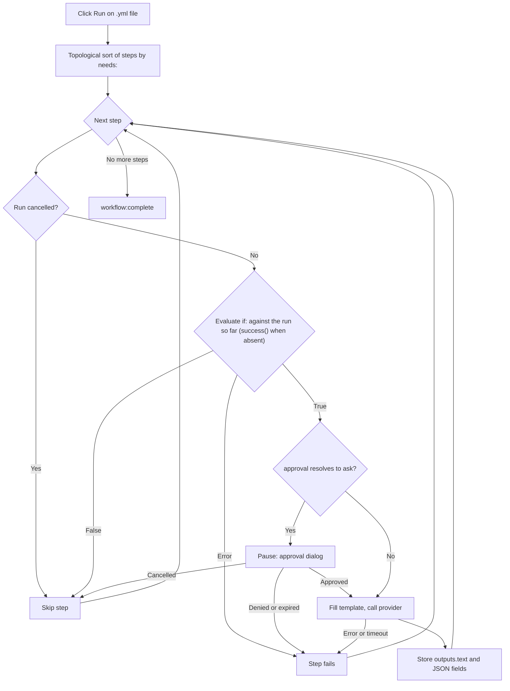

<script setup>
// Skip Vue template processing for the whole page so ${{ }} expressions
// in code spans and fenced YAML blocks are not interpreted as Vue bindings.
</script>

<div v-pre>

# Flujos de trabajo de Genie

Un **flujo de trabajo de genios** es un archivo YAML que encadena varios pasos de IA en un único pipeline. Mientras que un [Genio de IA](/es/guide/ai-genies) ejecuta un solo prompt sobre tu texto, un flujo de trabajo ejecuta un grafo ordenado de pasos — cada paso puede llamar a un genio, pasar su salida al paso siguiente, pedir tu aprobación o ejecutar una pequeña acción integrada — y te muestra todo el pipeline como un diagrama en vivo mientras se ejecuta.

::: tip Opción experimental
Los flujos de trabajo de genios dependen de un ajuste que hay que activar expresamente. En **Configuración → Avanzado**, activa **Herramientas de desarrollo** para mostrar el grupo experimental y, después, **Motor de flujo de trabajo**. Con él activado, un archivo de flujo de trabajo se abre con su grafo de pasos y una barra de herramientas **Ejecutar** / **Cancelar** junto al código fuente YAML, y los genios de flujo de trabajo pueden ejecutarse. Con él desactivado, un archivo de flujo de trabajo se muestra como un árbol YAML normal, y un genio de flujo de trabajo del selector se niega a ejecutarse. Los archivos de GitHub Actions no se ven afectados en ningún caso — siempre se abren en el [Visor de flujos de trabajo de GitHub Actions](/es/guide/workflow-viewer).
:::

## Cuándo usar un flujo de trabajo

| Necesidad | Usa |
|-----------|-----|
| Una única transformación (reescribir, traducir, resumir) | Un [genio](/es/guide/ai-genies) markdown |
| Esquema → borrador → pulido, en el que cada etapa alimenta la siguiente | Un flujo de trabajo |
| Modelos de IA distintos para etapas distintas | Un flujo de trabajo |
| Una puerta de aprobación humana antes de un paso costoso o delicado | Un flujo de trabajo |
| Salida estructurada (JSON) que los pasos posteriores leen campo a campo | Un flujo de trabajo |

Si un solo prompt resuelve la tarea, escribe un genio markdown. Recurre a un flujo de trabajo solo cuando necesites componer etapas, encaminar datos entre ellas o hacer una pausa para aprobar.

## Escribir un flujo de trabajo

Un flujo de trabajo es un archivo YAML con un nombre, valores predeterminados opcionales y una lista ordenada de pasos. Este es un ejemplo completo y ejecutable — reproduce `triage-and-translate.yml`, el ejemplo incluido con VMark:

```yaml
name: Triage and Translate
description: Rewrite rough notes into clean English, then translate the result.

defaults:
  approval: auto

steps:
  - id: rewrite
    uses: genie/rewrite-in-english
    with:
      input: "Replace this seed text with the notes you want rewritten before running."

  - id: translate
    uses: genie/translate
    needs: rewrite
    with:
      input: ${{ steps.rewrite.outputs.text }}

  - id: save
    uses: action/save-file
    needs: translate
    with:
      path: triage-and-translate.out.md
      input: ${{ steps.translate.outputs.text }}
```

Este flujo de trabajo tiene tres pasos. `rewrite` ejecuta el genio markdown incluido `genie/rewrite-in-english` sobre el texto semilla. `translate` lo espera (`needs: rewrite`) y pasa su salida de texto a `genie/translate`. `save` escribe la traducción en `triage-and-translate.out.md` dentro del espacio de trabajo. El resultado es un grafo de tres nodos que se ejecuta de izquierda a derecha.

### ¿Archivo de flujo de trabajo o archivo de GitHub Actions?

Ambos son YAML, y VMark abre todos los archivos `.yml` / `.yaml` en la misma vista dividida. Los distingue así, en este orden:

| Comprobación | Flujo de trabajo de GitHub Actions | Flujo de trabajo de VMark |
|--------------|------------------------------------|---------------------------|
| Ruta bajo `.github/workflows/` | Siempre — esa carpeta es de GitHub | Nunca |
| `on:` y `jobs:` de nivel superior (fuera de esa carpeta hacen falta los dos) | Sí | Nunca |
| `steps:` de nivel superior cuyo `uses:` nombra `genie/`, `action/` o `webhook/` | Nunca — sus steps viven dentro de un job | Sí |

Un flujo de trabajo de VMark también puede tener `on:`, pero nunca `jobs:`: un archivo con `jobs:` de nivel superior nunca se ejecuta. Fuera de `.github/workflows/`, se abre como GitHub Actions solo si también tiene `on:` de nivel superior; si no, es YAML sin más, igual que un archivo sin ninguna de las dos formas.

::: info Dónde está el ejemplo incluido
El ejemplo viene dentro del paquete de la aplicación — `VMark.app/Contents/Resources/resources/workflows/examples/triage-and-translate.yml` en macOS, la carpeta `resources` de la aplicación en los demás sistemas — y en el [repositorio de código fuente](https://github.com/xiaolai/vmark/blob/main/src-tauri/resources/workflows/examples/triage-and-translate.yml). No se copia a tu carpeta de genios: para ejecutarlo como [genio de flujo de trabajo](/es/guide/workflow-genies), cópialo allí tú mismo y edita el texto semilla.
:::

### Campos de nivel superior

| Campo | Requerido | Propósito |
|-------|-----------|-----------|
| `name` | Sí | Etiqueta legible del flujo de trabajo. |
| `description` | No | Resumen de una línea. |
| `defaults` | No | `model`, `approval` y `limits` predeterminados que se aplican a cada paso (consulta [Ajustes por paso](#ajustes-por-paso)). |
| `env` | No | Variables de entorno, legibles en los valores de `with:` como `${{ env.NAME }}` o `${VAR}`. |
| `steps` | Sí | La lista ordenada de pasos. |

### Campos del paso

```yaml
- id: my-step           # required; unique within the workflow
  uses: genie/<name>    # required; what this step runs (see Step types)
  with:                 # inputs to the step
    input: "text or an ${{ ... }} expression"
  needs: prior-step     # optional; a single id or a list of ids
  if: ${{ success() }}  # optional condition (see Conditions)
  approval: ask         # optional; "auto" (default) or "ask"
  model: claude-sonnet  # optional; overrides defaults / genie default
  limits:
    timeout: 120s       # optional; default 300s
    max_tokens: 4096    # optional; REST providers only
```

### Tipos de paso

El prefijo de `uses:` decide qué hace un paso.

| Prefijo `uses:` | Comportamiento |
|-----------------|----------------|
| `genie/<name>` | Carga el genio markdown correspondiente, rellena su plantilla de prompt con el mapa `with:` del paso y llama al proveedor de IA activo. |
| `action/read-file` | Lee una ruta relativa al espacio de trabajo. El cuerpo del archivo se convierte en la salida de texto del paso. |
| `action/read-folder` | Lee todos los archivos situados directamente dentro de la carpeta relativa al espacio de trabajo `with.path` — opcionalmente solo los que coinciden con `with.accept` (`*.md`, o una lista como `*.md,*.txt`) — por orden de nombre, cada uno precedido de una línea `--- name ---`. Hasta 1.000 archivos, 10 MB por archivo y 100 MB en total. |
| `action/save-file` | Escribe `with.input` en `with.path` (relativa al espacio de trabajo). La ruta debe ser literal — sin expresiones `${{ }}` — para que el archivo pueda guardarse en una instantánea antes de la ejecución (consulta [Deshacer una ejecución](#deshacer-una-ejecucion)). |
| `action/notify` | Registra `with.message`. |
| `action/copy` | Devuelve `with.input` sin cambios — útil para renombrar un valor o repartirlo entre varios pasos. |

::: warning
Los pasos `webhook/*` aún no son compatibles — un flujo de trabajo que usa uno se rechaza antes de ejecutarse. Los genios con salida a archivo (`output.type: file` / `files`) también quedan pendientes.
:::

Una escritura correcta de `action/save-file` queda registrada por [Coherencia](/es/guide/coherence), con los pasos de lectura que la alimentaron como entradas, solo en la medida en que lo permita **Insertar bloque de identidad al guardar** (Configuración → Archivos e imágenes): con él desactivado, no se crea ninguna carpeta `.vmark` ni se marca ningún archivo, y un espacio de trabajo que ya tiene una registra la escritura solo para un documento que ya sigue.

## Pasos de genio y alias de `with:`

Cuando se ejecuta un paso `genie/<name>`, VMark carga la plantilla markdown de ese genio y rellena sus marcadores `{{...}}` a partir del mapa `with:` del paso. Este es el puente que permite que **los genios markdown existentes se ejecuten sin cambios dentro de los flujos de trabajo**.

Las reglas de vinculación, por orden de precedencia:

| Marcador | Se resuelve como | Si falta |
|----------|------------------|----------|
| `{{input}}` | `with.input` | Sin vincular → el paso falla |
| `{{content}}` | `with.content`, si no `with.input` | Fatal solo si no hay ninguno de los dos |
| `{{context}}` | `with.context`, si no la cadena vacía | Nunca fatal — se degrada a `""` |
| `{{any-other-key}}` | `with.<key>` | Sin vincular → el paso falla |

Se toleran espacios dentro de las llaves: `{{ key }}` funciona igual que `{{key}}`.

**El alias `{{content}}` es la clave de la compatibilidad.** Los genios markdown escritos para el editor usan `{{content}}` para el texto seleccionado. En un flujo de trabajo no hay selección, así que proporcionas `with: { input: "..." }` y el marcador `{{content}}` lo recoge mediante la cadena de alias. Justo en eso se apoya el ejemplo anterior — `genie/rewrite-in-english` y `genie/translate` usan `{{content}}` en sus plantillas, y aun así el flujo de trabajo solo define `input`.

::: danger Los marcadores sin vincular son fatales
Si una plantilla contiene un marcador que nada en `with:` resuelve — por ejemplo `{{topic}}` sin `with.topic` — el paso falla **antes de hacer ninguna llamada a la IA**, con un error que enumera todos los nombres sin resolver (`Unbound placeholders: {{topic}}`). Es deliberado: enviar un prompt que aún contiene un `{{topic}}` literal produciría basura en silencio y declararía un éxito falso. Las únicas relajaciones seguras son los dos alias anteriores (`{{content}}` y `{{context}}`).
:::

### `{{context}}` en los flujos de trabajo

En el editor, `{{context}}` se rellena con el texto que rodea tu selección. Un flujo de trabajo no tiene editor, así que `{{context}}` se degrada a la cadena vacía a menos que proporciones `with.context` de forma explícita. Los genios que realmente dependen del contexto circundante deben recibirlo:

```yaml
- id: rewrite
  uses: genie/fit-to-surroundings
  with:
    input: ${{ steps.draft.outputs.text }}
    context: "House style: terse, present tense, no marketing language."
```

## Conectar pasos entre sí: expresiones

Dentro de cualquier valor de `with:` puedes hacer referencia a pasos anteriores y a variables de entorno.

| Sintaxis | Se resuelve como |
|----------|------------------|
| `${{ steps.ID.outputs.FIELD }}` | Un campo de salida concreto de un paso anterior. |
| `${{ steps.ID.output }}` | Atajo de `${{ steps.ID.outputs.text }}`. |
| `${{ env.NAME }}` | Un valor `env:` del flujo de trabajo. |
| `${VAR}` | Lo mismo que `${{ env.VAR }}`, forma heredada. |
| `stepId.output` (solo el valor completo) | Alias heredado de `${{ steps.stepId.outputs.text }}`. |

Las referencias se resuelven antes de cualquier llamada a la IA. Una referencia a un paso desconocido (`${{ steps.typo.outputs.text }}`) o a un campo que un paso nunca produjo (`${{ steps.outline.outputs.missing }}`) hace fallar el paso con un mensaje claro — nunca pasa un valor vacío en silencio. La única excepción: un paso que produjo legítimamente una respuesta vacía se resuelve como la cadena vacía, no como un error.

## Salidas estructuradas

De forma predeterminada, un paso de genio guarda su resultado en `outputs.text`, y `${{ steps.ID.output }}` lo lee. Un genio también puede declarar una salida estructurada (JSON) en su frontmatter:

```yaml
output:
  type: json
  schema:
    title: string
    tags: array
```

Cuando un genio así se ejecuta en un flujo de trabajo, VMark analiza la respuesta como JSON, comprueba que cada campo declarado esté presente con el tipo primitivo correcto y expone cada campo de nivel superior por separado:

```yaml
- id: classify
  uses: genie/extract-metadata
  with:
    input: ${{ steps.read.output }}

- id: save
  uses: action/save-file
  needs: classify
  with:
    path: "meta.txt"
    input: ${{ steps.classify.outputs.title }}
```

La validación del esquema es mínima a propósito — confirma que las claves requeridas existen y que sus tipos coinciden. No impone longitudes, patrones ni formas anidadas. Si la respuesta no es JSON válido, o falta un campo requerido, el paso falla con un error concreto. Hoy solo se admiten los tipos de salida `text` y `json`; `file`, `files` y `pipe` no.

## Condiciones

Un paso puede llevar una condición `if:`. Si se evalúa como falsa, el paso se omite (no falla). Hay tres funciones de estado disponibles, y siguen las reglas de GitHub Actions:

| Condición | Verdadera cuando |
|-----------|------------------|
| `success()` | Ningún paso ha fallado hasta ahora **y** todos los pasos que este `needs` se completaron. |
| `failure()` | Cualquier paso anterior de la ejecución ha fallado — no solo un paso que este `needs`. |
| `always()` | Siempre. |

`success()` es el valor predeterminado. Un paso sin `if:` solo se ejecuta cuando se cumple `success()`, y lo mismo ocurre con un paso cuyo `if:` no nombra ninguna de las tres funciones — `if: X` significa `success() && (X)`. Eso es lo que impide que un paso normal se ejecute después de un fallo.

| Lo que ocurrió antes | Paso normal o con `success()` | Paso con `failure()` | Paso con `always()` |
|---|---|---|---|
| Todo lo que necesita tuvo éxito | se ejecuta | se omite | se ejecuta |
| Un paso que necesita **falló** (o agotó el tiempo, o se denegó su aprobación) | se omite | se ejecuta | se ejecuta |
| Un paso que necesita se **omitió** por su propio `if:` | se omite | se omite — nada falló | se ejecuta |
| La ejecución se **canceló** | se omite | se omite | se omite |

Una condición no puede ver una cancelación: se comprueba antes del `if:`, y todos los pasos restantes se omiten con *Workflow cancelled*, incluidos los pasos con `always()`. Una ejecución en la que falló un paso termina igualmente como **fallida** y nombra el primer paso que falló, aunque después se ejecutaran pasos con `failure()` o `always()`.

Puedes combinar referencias y comparaciones, p. ej. `${{ steps.classify.outputs.title == "Draft" }}`. Una condición mal formada o no admitida **hace fallar el paso de forma visible** en lugar de dejarlo pasar en silencio — no hay ninguna alternativa de «suponer verdadero si hay error».

## Ajustes por paso

`model`, `approval` y `limits` pueden definirse en tres niveles. Gana el más específico.

| Campo | Precedencia (de mayor a menor) |
|-------|--------------------------------|
| `model` | `model:` del paso → `model` propio del genio → `defaults.model` del flujo de trabajo → predeterminado del proveedor |
| `approval` | `approval:` del paso → `approval` del genio → `defaults.approval` del flujo de trabajo → `auto` |
| `timeout` | `limits.timeout` del paso → `defaults.limits.timeout` del flujo de trabajo → 300 s |
| `max_tokens` | `limits.max_tokens` del paso → `defaults.limits.max_tokens` → predeterminado del proveedor (**solo proveedores REST**) |

`max_tokens` solo se aplica en los proveedores REST (Anthropic, OpenAI, Google AI, Ollama). Los proveedores CLI (claude, codex, gemini) aceptan el campo pero no lo aplican; se registra una única advertencia por ejecución si algún paso CLI lo define.

### Tiempos de espera

Cada paso se envuelve en su tiempo de espera efectivo. Al agotarse, el paso falla con `Timed out after Xs`: el proceso hijo de un proveedor CLI se termina; una solicitud REST en curso se descarta. Un paso que agota el tiempo cuenta como fallido: los pasos que dependen de él se omiten a menos que su `if:` use `failure()` o `always()`. También hay un tope estricto de 5 MB para la salida acumulada de un solo paso — un proveedor descontrolado se cancela con `Provider output exceeded 5 MB cap`.

## Aprobaciones

Define `approval: ask` en un paso (o `defaults.approval: ask` para todo el flujo de trabajo) para hacer una pausa antes de que ese paso llame al proveedor. El ejecutor emite una solicitud de aprobación y aparece un diálogo que muestra:

- El id del paso.
- El modelo resuelto.
- Una vista previa del prompt ya rellenado (los primeros 500 caracteres).

Elige **Aprobar** para ejecutar el paso, o **Denegar** (Esc también deniega) para hacerlo fallar con `Approval denied by user`. La aprobación espera lo que sea menor entre el tiempo de espera del paso y un máximo de 10 minutos; si se agota, el paso falla con `Approval timed out`. Cerrar la ventana o descartar el diálogo de cualquier otra forma se trata como una denegación.

## Ejecutar un flujo de trabajo

Abre un archivo de flujo de trabajo `.yml` / `.yaml` en un espacio de trabajo (los flujos de trabajo requieren un espacio de trabajo abierto — los pasos de acción validan las rutas contra la raíz del espacio de trabajo). El archivo se abre en una vista dividida: el código fuente YAML a la izquierda y, a la derecha, los pasos como un grafo interactivo bajo una barra de herramientas. El selector **Fuente / Dividido / Vista previa** cambia la disposición, como en cualquier archivo YAML.

| Control | Icono | Acción |
|---------|-------|--------|
| Ejecutar | ▶ | Inicia el flujo de trabajo de este archivo, exactamente como está en el editor — guardado o no. Está deshabilitado mientras el archivo tiene un error de análisis, mientras se ejecuta un flujo de trabajo o si no hay ninguna carpeta abierta; la barra de herramientas indica el motivo. |
| Cancelar | ◼ | Sustituye a Ejecutar mientras se ejecuta el flujo de trabajo de este archivo. Detiene la ejecución, termina cualquier proceso hijo CLI en curso y descarta las solicitudes REST en curso. |
| Restaurar archivos | — | Aparece después de una ejecución que escribió archivos. Consulta [Deshacer una ejecución](#deshacer-una-ejecucion). |

A medida que avanza la ejecución, cada nodo se actualiza en vivo — en ejecución, correcto, omitido o con error —, de modo que puedes ver cómo avanza el pipeline y exactamente qué paso falló, si alguno falla. Al terminar, la barra de herramientas indica si se completó, falló o se canceló. Si el backend se niega a iniciar una ejecución — el motor está desactivado, el YAML no es válido, la instantánea falló — una notificación explica el motivo.

Solo se ejecuta un flujo de trabajo a la vez en toda la aplicación, no por ventana. Mientras uno se ejecuta, Ejecutar está deshabilitado en todos los demás archivos de flujo de trabajo **de la misma ventana**, y la barra de herramientas indica *Otro flujo de trabajo está en ejecución*. Un archivo de flujo de trabajo en otra ventana sigue mostrando Ejecutar habilitado; al hacer clic se rechaza con *Ya se está ejecutando un flujo de trabajo. Espere a que termine o cancélelo.* Un genio de flujo de trabajo iniciado entretanto también se rechaza.

### Deshacer una ejecución

Antes de una ejecución que tiene pasos `action/save-file`, VMark copia cada archivo que esos pasos van a escribir (hasta 64 MB por archivo y 256 MB en total) en una instantánea dentro de su carpeta de datos de la aplicación, y anota cuáles de ellos aún no existen. Si no se puede tomar la instantánea, el flujo de trabajo no se ejecuta en absoluto.

Cuando termina la ejecución, la barra de herramientas ofrece **Restaurar archivos**. Tras confirmar, VMark devuelve cada archivo de la instantánea al estado que tenía antes de la ejecución y elimina los archivos que creó la ejecución. Las ediciones hechas en esos archivos desde la ejecución se pierden. Si la restauración recupera todos los archivos, el botón desaparece; si tuvo que omitir alguno, se mantiene para que puedas reintentarlo. Un archivo que no se puede restaurar — por ejemplo, porque su carpeta se sustituyó por un enlace que lleva fuera del espacio de trabajo — se deja como está y se cuenta en la notificación. La restauración se rechaza mientras se está ejecutando cualquier flujo de trabajo.

### Flujo de ejecución



## Compartir el diagrama

El grafo de pasos de un flujo de trabajo de genios no tiene control de exportación. El lienzo del [Visor de flujos de trabajo de GitHub Actions](/es/guide/workflow-viewer), construido sobre la misma biblioteca React Flow, tiene uno con tres opciones:

| Exportación | Resultado |
|-------------|-----------|
| Copiar como Mermaid | Copia al portapapeles un `flowchart` de Mermaid del grafo (una aproximación textual con pérdidas). |
| Exportar como SVG | Guarda el lienzo renderizado como un SVG vectorial. |
| Exportar como PNG | Guarda el lienzo renderizado como un PNG rasterizado. |

Mermaid y SVG se indican como aproximaciones con pérdidas del lienzo en vivo; PNG es una instantánea de píxeles.

## Véase también

- [Genios de IA](/es/guide/ai-genies) — el formato de genio markdown y cómo crear uno.
- [Proveedores de IA](/es/guide/ai-providers) — configurar el proveedor CLI o REST al que llaman los pasos del flujo de trabajo.
- [Visor de flujos de trabajo de GitHub Actions](/es/guide/workflow-viewer) — el lienzo compartido y su control de exportación.

</div>
