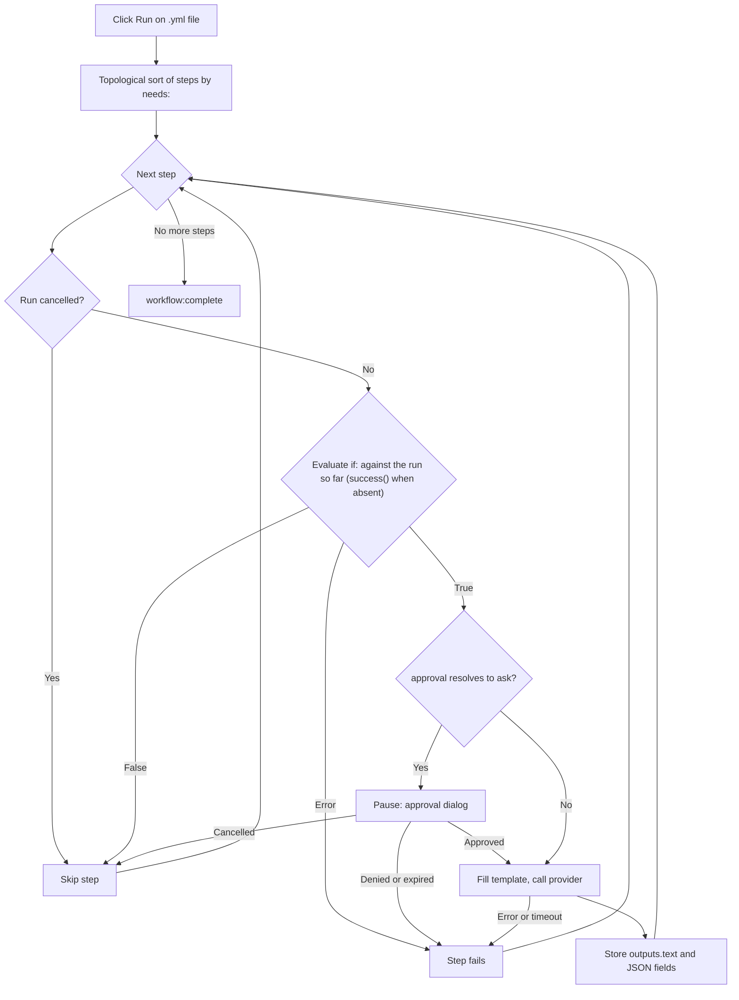

<script setup>
// Skip Vue template processing for the whole page so ${{ }} expressions
// in code spans and fenced YAML blocks are not interpreted as Vue bindings.
</script>

<div v-pre>

# Workflows Genie

Un **workflow de génies** est un fichier YAML qui enchaîne plusieurs étapes d'IA en un seul pipeline. Là où un [génie IA](/fr/guide/ai-genies) exécute une seule invite sur votre texte, un workflow exécute un graphe ordonné d'étapes — chaque étape peut appeler un génie, transmettre sa sortie à l'étape suivante, demander votre approbation ou exécuter une petite action intégrée — et vous montre l'ensemble du pipeline sous forme de diagramme en direct pendant son exécution.

::: tip Option de fonctionnalité
Les workflows de génies sont soumis à un réglage à activer explicitement. Dans **Paramètres → Avancé**, activez **Outils de développement** pour faire apparaître le groupe expérimental, puis **Moteur de workflow**. Réglage activé, un fichier de workflow s'ouvre avec son graphe d'étapes et une barre d'outils **Exécuter** / **Annuler** à côté de la source YAML, et les génies de workflow peuvent s'exécuter. Réglage désactivé, un fichier de workflow s'affiche comme une arborescence YAML ordinaire, et un génie de workflow choisi dans le sélecteur refuse de s'exécuter. Les fichiers GitHub Actions ne sont concernés dans aucun des deux cas — ils s'ouvrent toujours dans le [Visualiseur de workflows GitHub Actions](/fr/guide/workflow-viewer).
:::

## Quand utiliser un workflow

| Besoin | Utiliser |
|--------|----------|
| Une transformation unique (réécrire, traduire, résumer) | Un [génie](/fr/guide/ai-genies) Markdown |
| Plan → brouillon → polissage, chaque étape alimentant la suivante | Un workflow |
| Des modèles d'IA différents selon les étapes | Un workflow |
| Un point d'approbation humaine avant une étape coûteuse ou sensible | Un workflow |
| Une sortie structurée (JSON) que les étapes suivantes lisent champ par champ | Un workflow |

Si une seule invite suffit, écrivez un génie Markdown. Ne recourez à un workflow que lorsque vous devez composer des étapes, acheminer des données entre elles ou marquer une pause pour une approbation.

## Écrire un workflow

Un workflow est un fichier YAML comportant un nom, des valeurs par défaut facultatives et une liste ordonnée d'étapes. Voici un exemple complet et exécutable — il reprend `triage-and-translate.yml`, l'exemple fourni avec VMark&nbsp;:

```yaml
name: Triage and Translate
description: Rewrite rough notes into clean English, then translate the result.

defaults:
  approval: auto

steps:
  - id: rewrite
    uses: genie/rewrite-in-english
    with:
      input: "Replace this seed text with the notes you want rewritten before running."

  - id: translate
    uses: genie/translate
    needs: rewrite
    with:
      input: ${{ steps.rewrite.outputs.text }}

  - id: save
    uses: action/save-file
    needs: translate
    with:
      path: triage-and-translate.out.md
      input: ${{ steps.translate.outputs.text }}
```

Ce workflow comporte trois étapes. `rewrite` exécute le génie Markdown fourni `genie/rewrite-in-english` sur le texte de départ. `translate` l'attend (`needs: rewrite`) et transmet sa sortie texte à `genie/translate`. `save` écrit la traduction dans `triage-and-translate.out.md` dans l'espace de travail. Le résultat est un graphe de trois nœuds qui s'exécute de gauche à droite.

### Fichier de workflow ou fichier GitHub Actions ?

Les deux sont du YAML, et VMark ouvre tout fichier `.yml` / `.yaml` dans la même vue divisée. Il les distingue ainsi, dans cet ordre&nbsp;:

| Vérification | Workflow GitHub Actions | Workflow VMark |
|--------------|-------------------------|----------------|
| Chemin sous `.github/workflows/` | Toujours — ce dossier appartient à GitHub | Jamais |
| `on:` et `jobs:` de premier niveau (hors de ce dossier, les deux sont nécessaires) | Oui | Jamais |
| `steps:` de premier niveau dont les `uses:` nomment `genie/`, `action/` ou `webhook/` | Jamais — ses étapes se trouvent dans un job | Oui |

Un workflow VMark peut lui aussi avoir un `on:`, mais jamais de `jobs:` : un fichier comportant un `jobs:` de premier niveau n'est jamais exécuté. Hors de `.github/workflows/`, il ne s'ouvre comme du GitHub Actions que s'il a aussi un `on:` de premier niveau ; sinon, c'est du YAML ordinaire, tout comme un fichier qui n'a aucune de ces deux formes.

::: info Où se trouve l'exemple fourni
L'exemple est livré dans le paquet de l'application — `VMark.app/Contents/Resources/resources/workflows/examples/triage-and-translate.yml` sur macOS, le dossier `resources` de l'application ailleurs — ainsi que dans le [dépôt source](https://github.com/xiaolai/vmark/blob/main/src-tauri/resources/workflows/examples/triage-and-translate.yml). Il n'est pas copié dans votre dossier de génies&nbsp;: pour l'exécuter comme [génie de workflow](/fr/guide/workflow-genies), copiez-le vous-même à cet endroit et modifiez le texte de départ.
:::

### Champs de premier niveau

| Champ | Requis | Rôle |
|-------|--------|------|
| `name` | Oui | Libellé lisible du workflow. |
| `description` | Non | Résumé d'une ligne. |
| `defaults` | Non | `model`, `approval` et `limits` par défaut appliqués à chaque étape (voir [Paramètres par étape](#parametres-par-etape)). |
| `env` | Non | Variables d'environnement, lisibles dans les valeurs `with:` sous la forme `${{ env.NAME }}` ou `${VAR}`. |
| `steps` | Oui | La liste ordonnée des étapes. |

### Champs d'une étape

```yaml
- id: my-step           # required; unique within the workflow
  uses: genie/<name>    # required; what this step runs (see Step types)
  with:                 # inputs to the step
    input: "text or an ${{ ... }} expression"
  needs: prior-step     # optional; a single id or a list of ids
  if: ${{ success() }}  # optional condition (see Conditions)
  approval: ask         # optional; "auto" (default) or "ask"
  model: claude-sonnet  # optional; overrides defaults / genie default
  limits:
    timeout: 120s       # optional; default 300s
    max_tokens: 4096    # optional; REST providers only
```

### Types d'étapes

Le préfixe `uses:` détermine ce que fait une étape.

| Préfixe `uses:` | Comportement |
|-----------------|--------------|
| `genie/<name>` | Charge le génie Markdown correspondant, remplit son modèle d'invite à partir de la map `with:` de l'étape et appelle le fournisseur d'IA actif. |
| `action/read-file` | Lit un chemin relatif à l'espace de travail. Le contenu du fichier devient la sortie texte de l'étape. |
| `action/read-folder` | Lit chaque fichier situé directement dans le dossier relatif à l'espace de travail `with.path` — éventuellement seulement ceux qui correspondent à `with.accept` (`*.md`, ou une liste comme `*.md,*.txt`) — dans l'ordre des noms, chacun précédé d'une ligne `--- name ---`. Jusqu'à 1&nbsp;000 fichiers, 10 Mo par fichier et 100 Mo au total. |
| `action/save-file` | Écrit `with.input` dans `with.path` (relatif à l'espace de travail). Le chemin doit être littéral — aucune expression `${{ }}` — afin que le fichier puisse faire l'objet d'un instantané avant l'exécution (voir [Annuler une exécution](#annuler-une-execution)). |
| `action/notify` | Journalise `with.message`. |
| `action/copy` | Renvoie `with.input` inchangé — pratique pour renommer une valeur ou la distribuer à plusieurs étapes. |

::: warning
Les étapes `webhook/*` ne sont pas encore prises en charge — un workflow qui en utilise une est rejeté avant de s'exécuter. Les génies à sortie fichier (`output.type: file` / `files`) sont eux aussi reportés.
:::

Une écriture réussie par `action/save-file` est consignée par la [Cohérence](/fr/guide/coherence), avec les étapes de lecture qui l'ont alimentée comme entrées, uniquement dans la mesure où **Insérer le bloc d'identité à l'enregistrement** (Paramètres → Fichiers et images) le permet&nbsp;: réglage désactivé, aucun dossier `.vmark` n'est créé et aucun fichier n'est marqué, et un espace de travail qui en possède déjà un ne consigne l'écriture que pour un document qu'il suit déjà.

## Étapes génie et alias `with:`

Lorsqu'une étape `genie/<name>` s'exécute, VMark charge le modèle Markdown de ce génie et remplit ses espaces réservés `{{...}}` à partir de la map `with:` de l'étape. C'est ce pont qui permet aux **génies Markdown existants de s'exécuter sans modification dans les workflows**.

Les règles de liaison, par ordre de priorité&nbsp;:

| Espace réservé | Se résout en | S'il manque |
|----------------|--------------|-------------|
| `{{input}}` | `with.input` | Non lié → l'étape échoue |
| `{{content}}` | `with.content`, sinon `with.input` | Fatal seulement si aucun des deux n'est présent |
| `{{context}}` | `with.context`, sinon chaîne vide | Jamais fatal — se dégrade en `""` |
| `{{any-other-key}}` | `with.<key>` | Non lié → l'étape échoue |

Les espaces à l'intérieur des accolades sont tolérés&nbsp;: `{{ key }}` fonctionne comme `{{key}}`.

**L'alias `{{content}}` est la clé de la compatibilité.** Les génies Markdown écrits pour l'éditeur utilisent `{{content}}` pour le texte sélectionné. Dans un workflow, il n'y a pas de sélection&nbsp;; vous fournissez donc `with: { input: "..." }` et l'espace réservé `{{content}}` le récupère via la chaîne d'alias. C'est exactement ce sur quoi repose l'exemple ci-dessus — `genie/rewrite-in-english` et `genie/translate` utilisent tous deux `{{content}}` dans leurs modèles, et pourtant le workflow ne définit jamais que `input`.

::: danger Les espaces réservés non liés sont fatals
Si un modèle contient un espace réservé que rien dans `with:` ne résout — par exemple `{{topic}}` sans `with.topic` — l'étape échoue **avant tout appel à l'IA**, avec une erreur qui liste chaque nom non résolu (`Unbound placeholders: {{topic}}`). C'est voulu&nbsp;: envoyer une invite contenant encore un `{{topic}}` littéral produirait silencieusement des résultats absurdes et signalerait à tort un succès. Les seuls assouplissements sûrs sont les deux alias ci-dessus (`{{content}}` et `{{context}}`).
:::

### `{{context}}` dans les workflows

Dans l'éditeur, `{{context}}` est rempli avec le texte qui entoure votre sélection. Un workflow n'a pas d'éditeur&nbsp;; `{{context}}` se dégrade donc en chaîne vide, sauf si vous fournissez `with.context` explicitement. Les génies qui dépendent réellement du contexte environnant doivent le recevoir en paramètre&nbsp;:

```yaml
- id: rewrite
  uses: genie/fit-to-surroundings
  with:
    input: ${{ steps.draft.outputs.text }}
    context: "House style: terse, present tense, no marketing language."
```

## Relier les étapes : expressions

Dans n'importe quelle valeur `with:`, vous pouvez faire référence aux étapes précédentes et aux variables d'environnement.

| Syntaxe | Se résout en |
|---------|--------------|
| `${{ steps.ID.outputs.FIELD }}` | Un champ de sortie précis d'une étape antérieure. |
| `${{ steps.ID.output }}` | Raccourci pour `${{ steps.ID.outputs.text }}`. |
| `${{ env.NAME }}` | Une valeur de `env:` du workflow. |
| `${VAR}` | Identique à `${{ env.VAR }}`, forme héritée. |
| `stepId.output` (valeur entière uniquement) | Alias hérité de `${{ steps.stepId.outputs.text }}`. |

Les références sont résolues avant tout appel à l'IA. Une référence à une étape inconnue (`${{ steps.typo.outputs.text }}`) ou à un champ qu'une étape n'a jamais produit (`${{ steps.outline.outputs.missing }}`) fait échouer l'étape avec un message clair — elle ne transmet jamais silencieusement une valeur vide. Une seule exception&nbsp;: une étape qui a légitimement produit une réponse vide se résout en chaîne vide, et non en erreur.

## Sorties structurées

Par défaut, une étape génie stocke son résultat sous `outputs.text`, que `${{ steps.ID.output }}` lit. Un génie peut aussi déclarer une sortie structurée (JSON) dans son frontmatter&nbsp;:

```yaml
output:
  type: json
  schema:
    title: string
    tags: array
```

Lorsqu'un tel génie s'exécute dans un workflow, VMark analyse la réponse comme du JSON, vérifie que chaque champ déclaré est présent avec le bon type primitif et expose chaque champ de premier niveau individuellement&nbsp;:

```yaml
- id: classify
  uses: genie/extract-metadata
  with:
    input: ${{ steps.read.output }}

- id: save
  uses: action/save-file
  needs: classify
  with:
    path: "meta.txt"
    input: ${{ steps.classify.outputs.title }}
```

La validation du schéma est volontairement minimale — elle confirme que les clés requises existent et que leurs types correspondent. Elle n'impose ni longueurs, ni motifs, ni formes imbriquées. Si la réponse n'est pas du JSON valide, ou si un champ requis manque, l'étape échoue avec une erreur précise. Seuls les types de sortie `text` et `json` sont pris en charge aujourd'hui&nbsp;; `file`, `files` et `pipe` ne le sont pas.

## Conditions

Une étape peut porter une condition `if:`. Si elle s'évalue à faux, l'étape est ignorée (et non en échec). Trois fonctions d'état sont disponibles, et elles suivent les règles de GitHub Actions&nbsp;:

| Condition | Vraie lorsque |
|-----------|---------------|
| `success()` | Aucune étape n'a échoué jusqu'ici, **et** chaque étape dont celle-ci dépend (`needs`) s'est terminée. |
| `failure()` | Une étape antérieure quelconque de l'exécution a échoué — pas seulement une étape dont celle-ci dépend. |
| `always()` | Toujours. |

`success()` est la valeur par défaut. Une étape sans `if:` ne s'exécute que lorsque `success()` est vraie, de même qu'une étape dont le `if:` ne nomme aucune des trois fonctions — `if: X` signifie `success() && (X)`. C'est ce qui empêche une étape ordinaire de s'exécuter après un échec.

| Ce qui s'est passé auparavant | Étape simple ou `success()` | Étape `failure()` | Étape `always()` |
|---|---|---|---|
| Tout ce dont elle dépend a réussi | s'exécute | ignorée | s'exécute |
| Une étape dont elle dépend a **échoué** (ou a expiré, ou son approbation a été refusée) | ignorée | s'exécute | s'exécute |
| Une étape dont elle dépend a été **ignorée** par son propre `if:` | ignorée | ignorée — rien n'a échoué | s'exécute |
| L'exécution a été **annulée** | ignorée | ignorée | ignorée |

Une annulation n'est pas visible pour une condition&nbsp;: elle est vérifiée avant le `if:`, et chaque étape restante est ignorée avec *Workflow cancelled*, étapes `always()` comprises. Une exécution dans laquelle une étape a échoué se termine tout de même **en échec** et nomme la première étape qui a échoué, même lorsque des étapes `failure()` ou `always()` se sont exécutées ensuite.

Vous pouvez combiner références et comparaisons, par ex. `${{ steps.classify.outputs.title == "Draft" }}`. Une condition mal formée ou non prise en charge **fait échouer l'étape de manière visible** au lieu de passer silencieusement — il n'existe aucun repli du type « supposer vrai en cas d'erreur ».

## Paramètres par étape

`model`, `approval` et `limits` peuvent être définis à trois niveaux. Le plus spécifique l'emporte.

| Champ | Priorité (la plus haute en premier) |
|-------|-------------------------------------|
| `model` | `model:` de l'étape → `model` propre au génie → `defaults.model` du workflow → valeur par défaut du fournisseur |
| `approval` | `approval:` de l'étape → `approval` du génie → `defaults.approval` du workflow → `auto` |
| `timeout` | `limits.timeout` de l'étape → `defaults.limits.timeout` du workflow → 300 s |
| `max_tokens` | `limits.max_tokens` de l'étape → `defaults.limits.max_tokens` → valeur par défaut du fournisseur (**fournisseurs REST uniquement**) |

`max_tokens` n'est appliqué que pour les fournisseurs REST (Anthropic, OpenAI, Google AI, Ollama). Les fournisseurs CLI (claude, codex, gemini) acceptent le champ mais ne l'appliquent pas&nbsp;; un seul avertissement est journalisé par exécution si une étape CLI le définit.

### Délais d'expiration

Chaque étape est encadrée par son délai d'expiration effectif. À l'expiration, l'étape échoue avec `Timed out after Xs`&nbsp;: le processus enfant d'un fournisseur CLI est tué&nbsp;; une requête REST en cours est abandonnée. Une étape expirée compte comme un échec&nbsp;: les étapes qui en dépendent sont ignorées, sauf si leur `if:` utilise `failure()` ou `always()`. Il existe aussi une limite stricte de 5 Mo sur la sortie collectée d'une seule étape — un fournisseur qui s'emballe est annulé avec `Provider output exceeded 5 MB cap`.

## Approbations

Définissez `approval: ask` sur une étape (ou `defaults.approval: ask` pour l'ensemble du workflow) pour marquer une pause avant que cette étape n'appelle le fournisseur. L'exécuteur émet une demande d'approbation et une boîte de dialogue apparaît, qui affiche&nbsp;:

- L'identifiant de l'étape.
- Le modèle résolu.
- Un aperçu de l'invite remplie (les 500 premiers caractères).

Choisissez **Approuver** pour exécuter l'étape, ou **Refuser** (Échap refuse également) pour la faire échouer avec `Approval denied by user`. L'approbation attend le plus court des deux délais entre le délai d'expiration de l'étape et un plafond de 10 minutes&nbsp;; s'il expire, l'étape échoue avec `Approval timed out`. Fermer la fenêtre ou faire disparaître la boîte de dialogue de toute autre manière est traité comme un refus.

## Exécuter un workflow

Ouvrez un fichier de workflow `.yml` / `.yaml` dans un espace de travail (les workflows exigent un espace de travail ouvert — les étapes d'action valident les chemins par rapport à la racine de l'espace de travail). Le fichier s'ouvre dans une vue divisée&nbsp;: la source YAML à gauche et, à droite, les étapes sous forme de graphe interactif sous une barre d'outils. Le sélecteur **Source / Divisé / Aperçu** change de disposition, comme pour tout fichier YAML.

| Commande | Icône | Action |
|----------|-------|--------|
| Exécuter | ▶ | Lance le workflow de ce fichier, exactement tel qu'il est dans l'éditeur — enregistré ou non. Désactivé tant que le fichier contient une erreur d'analyse, pendant qu'un workflow s'exécute, ou lorsqu'aucun dossier n'est ouvert&nbsp;; la barre d'outils indique la raison. |
| Annuler | ◼ | Remplace Exécuter pendant que le workflow de ce fichier s'exécute. Arrête l'exécution, tue tout processus enfant CLI en cours et abandonne les requêtes REST en cours. |
| Restaurer les fichiers | — | Apparaît après une exécution qui a écrit des fichiers. Voir [Annuler une exécution](#annuler-une-execution). |

Au fil de l'exécution, chaque nœud se met à jour en direct — en cours, réussi, ignoré ou en erreur — pour que vous puissiez suivre la progression du pipeline et voir exactement quelle étape a échoué le cas échéant. À la fin, la barre d'outils indique si l'exécution s'est terminée, a échoué ou a été annulée. Si le backend refuse de lancer une exécution — le moteur est désactivé, le YAML n'est pas valide, l'instantané a échoué — une notification en indique la raison.

Un seul workflow s'exécute à la fois dans toute l'application, et non par fenêtre. Tant qu'un workflow s'exécute, Exécuter est désactivé dans tous les autres fichiers de workflow **de la même fenêtre**, et la barre d'outils affiche *Un autre workflow est en cours d’exécution*. Un fichier de workflow ouvert dans une autre fenêtre affiche toujours Exécuter comme actif&nbsp;; un clic est refusé avec *Un flux de travail est déjà en cours. Attendez la fin ou annulez-le.* Un génie de workflow lancé entre-temps est refusé lui aussi.

### Annuler une exécution

Avant une exécution qui comporte des étapes `action/save-file`, VMark copie chaque fichier que ces étapes vont écrire (jusqu'à 64 Mo par fichier et 256 Mo au total) dans un instantané de son dossier de données d'application, et note ceux qui n'existent pas encore. Si l'instantané ne peut pas être pris, le workflow n'est pas exécuté du tout.

À la fin de l'exécution, la barre d'outils propose **Restaurer les fichiers**. Après votre confirmation, VMark remet chaque fichier de l'instantané dans son état d'avant l'exécution et supprime les fichiers créés par l'exécution. Les modifications apportées à ces fichiers depuis l'exécution sont perdues. Si la restauration récupère tous les fichiers, le bouton disparaît ; si elle a dû en ignorer, il reste proposé pour que vous puissiez réessayer. Un fichier qui ne peut pas être restauré — parce que son dossier a été remplacé par un lien menant hors de l'espace de travail, par exemple — est laissé tel quel et comptabilisé dans la notification. La restauration est refusée tant qu'un workflow s'exécute.

### Déroulement de l'exécution



## Partager le diagramme

Le graphe d'étapes d'un workflow de génies n'a pas de commande d'export. Le canevas du [Visualiseur de workflows GitHub Actions](/fr/guide/workflow-viewer), construit sur la même bibliothèque React Flow, en possède une, avec trois options&nbsp;:

| Export | Résultat |
|--------|----------|
| Copier au format Mermaid | Copie dans le presse-papiers un `flowchart` Mermaid du graphe (une approximation textuelle avec perte). |
| Exporter au format SVG | Enregistre le canevas rendu sous forme d'image vectorielle SVG. |
| Exporter au format PNG | Enregistre le canevas rendu sous forme d'image matricielle PNG. |

Mermaid et SVG sont signalés comme des approximations avec perte du canevas en direct&nbsp;; PNG est un instantané au pixel près.

## Voir aussi

- [Génies IA](/fr/guide/ai-genies) — le format des génies Markdown et comment en écrire un.
- [Fournisseurs d'IA](/fr/guide/ai-providers) — configurer le fournisseur CLI ou REST qu'appellent les étapes de workflow.
- [Visualiseur de workflows GitHub Actions](/fr/guide/workflow-viewer) — le canevas partagé et sa commande d'export.

</div>
