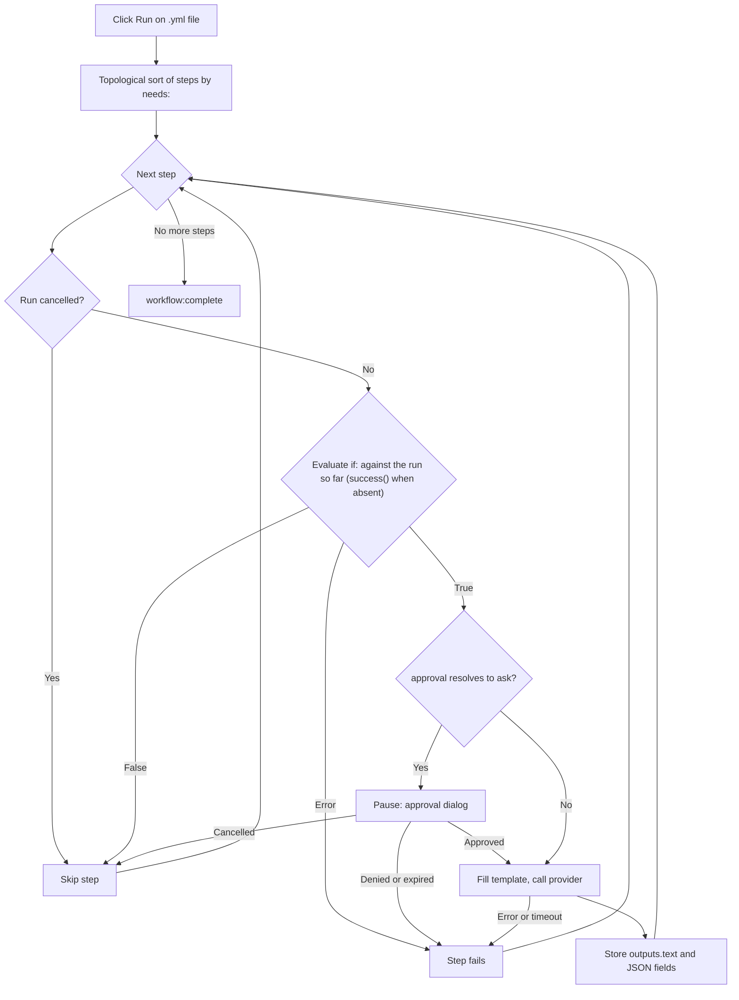

<script setup>
// Skip Vue template processing for the whole page so ${{ }} expressions
// in code spans and fenced YAML blocks are not interpreted as Vue bindings.
</script>

<div v-pre>

# Genie Workflows

A **genie workflow** is a YAML file that chains several AI steps into one pipeline. Where a single [AI Genie](/guide/ai-genies) runs one prompt against your text, a workflow runs an ordered graph of steps — each step can call a genie, pass its output to the next step, ask for your approval, or run a small built-in action — and shows you the whole pipeline as a live diagram while it runs.

::: tip Feature flag
Genie workflows are gated behind an opt-in setting. In **Settings → Advanced**, turn on **Developer Tools** to reveal the experimental group, then **Workflow Engine**. With it on, a workflow file opens with its step graph and a **Run** / **Cancel** toolbar beside the YAML source, and workflow genies can run. With it off, a workflow file shows as an ordinary YAML tree, and a workflow genie in the picker refuses to run. GitHub Actions files are not affected either way — they always open in the [GitHub Actions Workflow Viewer](/guide/workflow-viewer).
:::

## When to use a workflow

| Need | Use |
|------|-----|
| A single transformation (rewrite, translate, summarize) | A markdown [genie](/guide/ai-genies) |
| Outline → draft → polish, with each stage feeding the next | A workflow |
| Different AI models for different stages | A workflow |
| A human-approval gate before an expensive or sensitive step | A workflow |
| Structured (JSON) output that downstream steps read field-by-field | A workflow |

If one prompt does the job, write a markdown genie. Reach for a workflow only when you need to compose stages, route data between them, or pause for approval.

## Writing a workflow

A workflow is a YAML file with a name, optional defaults, and an ordered list of steps. Here is a complete, runnable example — it mirrors `triage-and-translate.yml`, the sample bundled with VMark:

```yaml
name: Triage and Translate
description: Rewrite rough notes into clean English, then translate the result.

defaults:
  approval: auto

steps:
  - id: rewrite
    uses: genie/rewrite-in-english
    with:
      input: "Replace this seed text with the notes you want rewritten before running."

  - id: translate
    uses: genie/translate
    needs: rewrite
    with:
      input: ${{ steps.rewrite.outputs.text }}

  - id: save
    uses: action/save-file
    needs: translate
    with:
      path: triage-and-translate.out.md
      input: ${{ steps.translate.outputs.text }}
```

This workflow has three steps. `rewrite` runs the bundled `genie/rewrite-in-english` markdown genie on the seed text. `translate` waits for it (`needs: rewrite`) and feeds its text output into `genie/translate`. `save` writes the translation to `triage-and-translate.out.md` in the workspace. The result is a three-node graph that runs left to right.

### Workflow file or GitHub Actions file?

Both are YAML, and VMark opens every `.yml` / `.yaml` file in the same split view. It tells them apart like this, in order:

| Check | GitHub Actions workflow | VMark workflow |
|-------|-------------------------|----------------|
| Path under `.github/workflows/` | Always — GitHub owns that folder | Never |
| Top-level `on:` and `jobs:` (outside that folder, both are needed) | Yes | Never |
| Top-level `steps:` whose `uses:` names `genie/`, `action/` or `webhook/` | Never — its steps live inside a job | Yes |

A VMark workflow may have an `on:` too, but never `jobs:`: a file with a top-level `jobs:` is never run. Outside `.github/workflows/`, it opens as GitHub Actions only when it also has a top-level `on:`; otherwise it is plain YAML, as is a file with neither shape.

::: info Where the bundled sample lives
The sample ships inside the app bundle — `VMark.app/Contents/Resources/resources/workflows/examples/triage-and-translate.yml` on macOS, the app's `resources` folder elsewhere — and in the [source repository](https://github.com/xiaolai/vmark/blob/main/src-tauri/resources/workflows/examples/triage-and-translate.yml). It is not copied into your genies folder: to run it as a [workflow genie](/guide/workflow-genies), copy it there yourself and edit the seed text.
:::

### Top-level fields

| Field | Required | Purpose |
|-------|----------|---------|
| `name` | Yes | Human-readable label for the workflow. |
| `description` | No | One-line summary. |
| `defaults` | No | Default `model`, `approval`, and `limits` applied to every step (see [Per-step settings](#per-step-settings)). |
| `env` | No | Environment variables, readable in `with:` values as `${{ env.NAME }}` or `${VAR}`. |
| `steps` | Yes | The ordered list of steps. |

### Step fields

```yaml
- id: my-step           # required; unique within the workflow
  uses: genie/<name>    # required; what this step runs (see Step types)
  with:                 # inputs to the step
    input: "text or an ${{ ... }} expression"
  needs: prior-step     # optional; a single id or a list of ids
  if: ${{ success() }}  # optional condition (see Conditions)
  approval: ask         # optional; "auto" (default) or "ask"
  model: claude-sonnet  # optional; overrides defaults / genie default
  limits:
    timeout: 120s       # optional; default 300s
    max_tokens: 4096    # optional; REST providers only
```

### Step types

The `uses:` prefix decides what a step does.

| `uses:` prefix | Behavior |
|----------------|----------|
| `genie/<name>` | Loads the matching markdown genie, fills its prompt template from the step's `with:` map, and calls the active AI provider. |
| `action/read-file` | Reads a workspace-relative path. The file body becomes the step's text output. |
| `action/read-folder` | Reads every file directly inside the workspace-relative folder `with.path` — optionally only those matching `with.accept` (`*.md`, or a list such as `*.md,*.txt`) — in name order, each introduced by a `--- name ---` line. Up to 1,000 files, 10 MB per file and 100 MB in total. |
| `action/save-file` | Writes `with.input` to `with.path` (workspace-relative). The path must be literal — no `${{ }}` expression — so the file can be snapshotted before the run (see [Undoing a run](#undoing-a-run)). |
| `action/notify` | Logs `with.message`. |
| `action/copy` | Returns `with.input` unchanged — handy for renaming or fanning out a value. |

::: warning
`webhook/*` steps are not supported yet — a workflow that uses one is rejected before it runs. File-output genies (`output.type: file` / `files`) are likewise deferred.
:::

A successful `action/save-file` write is recorded by [Coherence](/guide/coherence), with the read steps that fed it as inputs, only as far as **Stamp identity block on save** (Settings → Files & Images) allows: with it off, no `.vmark` folder is created and no file is stamped, and a workspace that already has one records the write only for a document it already tracks.

## Genie steps and `with:` aliasing

When a `genie/<name>` step runs, VMark loads that genie's markdown template and fills its `{{...}}` placeholders from the step's `with:` map. This is the bridge that lets **existing markdown genies run unchanged inside workflows**.

The binding rules, in precedence order:

| Placeholder | Resolves to | If missing |
|-------------|-------------|-----------|
| `{{input}}` | `with.input` | Unbound → step fails |
| `{{content}}` | `with.content`, else `with.input` | Fatal only if neither is present |
| `{{context}}` | `with.context`, else empty string | Never fatal — degrades to `""` |
| `{{any-other-key}}` | `with.<key>` | Unbound → step fails |

Whitespace inside braces is tolerated: `{{ key }}` works the same as `{{key}}`.

**The `{{content}}` alias is the key to compatibility.** Markdown genies written for the editor use `{{content}}` for the selected text. In a workflow there is no selection, so you supply `with: { input: "..." }` and the `{{content}}` placeholder picks it up through the alias chain. That is exactly what the sample above relies on — `genie/rewrite-in-english` and `genie/translate` both use `{{content}}` in their templates, yet the workflow only ever sets `input`.

::: danger Unbound placeholders are fatal
If a template contains a placeholder that nothing in `with:` resolves — for example `{{topic}}` with no `with.topic` — the step fails **before any AI call is made**, with an error listing every unresolved name (`Unbound placeholders: {{topic}}`). This is deliberate: shipping a prompt that still contains literal `{{topic}}` would silently produce garbage and falsely report success. The only safe relaxations are the two aliases above (`{{content}}` and `{{context}}`).
:::

### `{{context}}` in workflows

In the editor, `{{context}}` is filled with the text surrounding your selection. A workflow has no editor, so `{{context}}` degrades to the empty string unless you supply `with.context` explicitly. Genies that genuinely depend on surrounding context must pass it in:

```yaml
- id: rewrite
  uses: genie/fit-to-surroundings
  with:
    input: ${{ steps.draft.outputs.text }}
    context: "House style: terse, present tense, no marketing language."
```

## Wiring steps together: expressions

Inside any `with:` value, you can reference earlier steps and environment variables.

| Syntax | Resolves to |
|--------|-------------|
| `${{ steps.ID.outputs.FIELD }}` | A specific output field of a prior step. |
| `${{ steps.ID.output }}` | Shorthand for `${{ steps.ID.outputs.text }}`. |
| `${{ env.NAME }}` | A workflow `env:` value. |
| `${VAR}` | The same as `${{ env.VAR }}`, legacy form. |
| `stepId.output` (whole value only) | Legacy alias for `${{ steps.stepId.outputs.text }}`. |

References are resolved before any AI call. A reference to an unknown step (`${{ steps.typo.outputs.text }}`) or to a field a step never produced (`${{ steps.outline.outputs.missing }}`) fails the step with a clear message — it never silently passes an empty value. The one exception: a step that legitimately produced an empty response resolves to the empty string, not an error.

## Structured outputs

By default, a genie step stores its result under `outputs.text`, and `${{ steps.ID.output }}` reads it. A genie can also declare a structured (JSON) output in its frontmatter:

```yaml
output:
  type: json
  schema:
    title: string
    tags: array
```

When such a genie runs in a workflow, VMark parses the response as JSON, checks that each declared field is present with the right primitive type, and exposes every top-level field individually:

```yaml
- id: classify
  uses: genie/extract-metadata
  with:
    input: ${{ steps.read.output }}

- id: save
  uses: action/save-file
  needs: classify
  with:
    path: "meta.txt"
    input: ${{ steps.classify.outputs.title }}
```

Schema validation is intentionally minimal — it confirms that required keys exist and that their types match. It does not enforce lengths, patterns, or nested shapes. If the response is not valid JSON, or a required field is missing, the step fails with a specific error. Only `text` and `json` output types are supported today; `file`, `files`, and `pipe` are not.

## Conditions

A step may carry an `if:` condition. If it evaluates to false, the step is skipped (not failed). Three status functions are available, and they follow GitHub Actions' rules:

| Condition | True when |
|-----------|-----------|
| `success()` | No step has failed so far, **and** every step this one `needs` completed. |
| `failure()` | Any earlier step in the run has failed — not only a step this one `needs`. |
| `always()` | Always. |

`success()` is the default. A step with no `if:` runs only when `success()` holds, and so does a step whose `if:` names none of the three functions — `if: X` means `success() && (X)`. That is what keeps an ordinary step from running after a failure.

| What happened earlier | Plain or `success()` step | `failure()` step | `always()` step |
|---|---|---|---|
| Everything it needs succeeded | runs | skipped | runs |
| A step it needs **failed** (or timed out, or its approval was denied) | skipped | runs | runs |
| A step it needs was **skipped** by its own `if:` | skipped | skipped — nothing failed | runs |
| The run was **cancelled** | skipped | skipped | skipped |

A cancel is not something a condition can see: it is checked before the `if:`, and every remaining step is skipped with *Workflow cancelled*, `always()` steps included. A run in which a step failed still ends **failed** and names the first step that failed, even when `failure()` or `always()` steps ran afterwards.

You can combine references and comparisons, e.g. `${{ steps.classify.outputs.title == "Draft" }}`. A malformed or unsupported condition **fails the step loudly** rather than silently passing — there is no "assume true on error" fallback.

## Per-step settings

`model`, `approval`, and `limits` can be set at three levels. The most specific wins.

| Field | Precedence (highest first) |
|-------|----------------------------|
| `model` | step `model:` → genie's own `model` → workflow `defaults.model` → provider default |
| `approval` | step `approval:` → genie's `approval` → workflow `defaults.approval` → `auto` |
| `timeout` | step `limits.timeout` → workflow `defaults.limits.timeout` → 300 s |
| `max_tokens` | step `limits.max_tokens` → `defaults.limits.max_tokens` → provider default (**REST providers only**) |

`max_tokens` is enforced only for REST providers (Anthropic, OpenAI, Google AI, Ollama). CLI providers (claude, codex, gemini) accept the field but do not enforce it; a single warning is logged per run if any CLI step sets it.

### Timeouts

Each step is wrapped in its effective timeout. On expiry the step fails with `Timed out after Xs`: a CLI provider's child process is killed; an in-flight REST request is dropped. A timed-out step counts as failed: steps that depend on it are skipped unless their `if:` uses `failure()` or `always()`. There is also a hard 5 MB cap on a single step's collected output — a runaway provider is cancelled with `Provider output exceeded 5 MB cap`.

## Approvals

Set `approval: ask` on a step (or `defaults.approval: ask` for the whole workflow) to pause before that step calls the provider. The runner emits an approval request and a dialog appears showing:

- The step id.
- The resolved model.
- A preview of the filled prompt (first 500 characters).

Choose **Approve** to run the step, or **Deny** (Esc also denies) to fail it with `Approval denied by user`. The approval waits for the shorter of the step's timeout and a 10-minute ceiling; if it expires, the step fails with `Approval timed out`. Closing the window or otherwise dropping the dialog is treated as a denial.

## Running a workflow

Open a workflow `.yml` / `.yaml` file in a workspace (workflows require an open workspace — action steps validate paths against the workspace root). The file opens in a split view: the YAML source on the left, and on the right the steps as an interactive graph under a toolbar. The **Source / Split / Preview** toggle switches layouts, as for any YAML file.

| Control | Icon | Action |
|---------|------|--------|
| Run | ▶ | Starts the workflow in this file, exactly as it is in the editor — saved or not. Disabled while the file has a parse error, while a workflow is running, or with no folder open; the toolbar says which. |
| Cancel | ◼ | Replaces Run while this file's workflow is executing. Stops the run, kills any in-flight CLI child, and drops in-flight REST requests. |
| Restore Files | — | Appears after a run that wrote files. See [Undoing a run](#undoing-a-run). |

As the run proceeds, each node updates live — running, succeeded, skipped, or errored — so you can watch the pipeline advance and see exactly which step failed if one does. When it ends, the toolbar says whether it completed, failed or was cancelled. If the backend refuses to start a run — the engine is off, the YAML does not validate, the snapshot failed — a notification says why.

Only one workflow runs at a time across the whole app, not per window. While one is running, Run is disabled in every other workflow file **in the same window**, and the toolbar says *Another workflow is running*. A workflow file in another window still shows Run enabled; clicking it is refused with *A workflow is already running. Wait for it to complete or cancel it.* A workflow genie started meanwhile is refused too.

### Undoing a run

Before a run that has `action/save-file` steps, VMark copies every file those steps will write (up to 64 MB per file and 256 MB in total) into a snapshot in its app-data folder, and notes which of them do not exist yet. If the snapshot cannot be taken, the workflow is not run at all.

When the run ends, the toolbar offers **Restore Files**. After you confirm, VMark puts each snapshotted file back as it was before the run and deletes the files the run created. Edits made to those files since the run are lost. A restore that brings every file back removes the button; one that had to skip files keeps it, so you can retry them. A file that cannot be restored — its folder was replaced by a link leading outside the workspace, say — is left as it is and counted in the notification. Restore is refused while any workflow is running.

### Execution flow



## Sharing the diagram

The step graph of a genie workflow has no export control. The [GitHub Actions Workflow Viewer](/guide/workflow-viewer)'s canvas, built on the same React Flow library, has one with three options:

| Export | Result |
|--------|--------|
| Copy as Mermaid | Copies a Mermaid `flowchart` of the graph to the clipboard (a lossy text approximation). |
| Export as SVG | Saves the rendered canvas as a vector SVG. |
| Export as PNG | Saves the rendered canvas as a raster PNG. |

Mermaid and SVG are noted as lossy approximations of the live canvas; PNG is a pixel snapshot.

## See also

- [AI Genies](/guide/ai-genies) — the markdown genie format and how to author one.
- [AI Providers](/guide/ai-providers) — configuring the CLI or REST provider that workflow steps call.
- [GitHub Actions Workflow Viewer](/guide/workflow-viewer) — the shared canvas and its export control.

</div>
