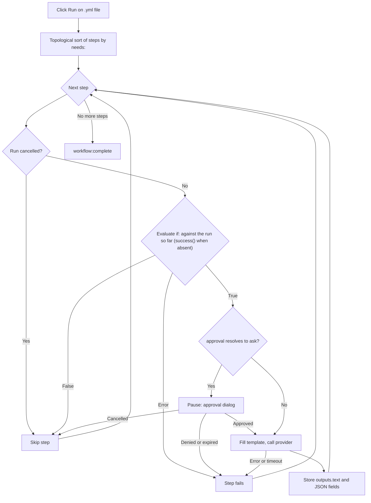

<script setup>
// Skip Vue template processing for the whole page so ${{ }} expressions
// in code spans and fenced YAML blocks are not interpreted as Vue bindings.
</script>

<div v-pre>

# Flussi di lavoro Genie

Un **flusso di lavoro Genie** è un file YAML che concatena più passaggi IA in un'unica pipeline. Mentre un singolo [AI Genie](/it/guide/ai-genies) esegue un prompt sul tuo testo, un workflow esegue un grafo ordinato di passaggi — ogni passaggio può chiamare un genie, passare il proprio output al passaggio successivo, chiedere la tua approvazione o eseguire una piccola azione integrata — e ti mostra l'intera pipeline come diagramma dal vivo durante l'esecuzione.

::: tip Flag di funzionalità
I flussi di lavoro Genie sono subordinati a un'impostazione da attivare esplicitamente. In **Impostazioni → Avanzate**, attiva **Strumenti sviluppatore** per mostrare il gruppo sperimentale, poi **Motore workflow**. Con l'opzione attiva, un file di workflow si apre con il suo grafo dei passaggi e una barra degli strumenti **Esegui** / **Annulla** accanto al sorgente YAML, e i genie del workflow possono essere eseguiti. Con l'opzione disattivata, un file di workflow viene mostrato come un normale albero YAML, e un genie del workflow nel selettore si rifiuta di partire. I file di GitHub Actions non ne sono influenzati in nessun caso — si aprono sempre nel [Visualizzatore di workflow GitHub Actions](/it/guide/workflow-viewer).
:::

## Quando usare un workflow

| Esigenza | Usa |
|------|-----|
| Una singola trasformazione (riscrittura, traduzione, riassunto) | Un [genie](/it/guide/ai-genies) markdown |
| Scaletta → bozza → rifinitura, con ogni fase che alimenta la successiva | Un workflow |
| Modelli IA diversi per fasi diverse | Un workflow |
| Un punto di approvazione umana prima di un passaggio costoso o delicato | Un workflow |
| Output strutturato (JSON) che i passaggi a valle leggono campo per campo | Un workflow |

Se basta un solo prompt, scrivi un genie markdown. Ricorri a un workflow solo quando devi comporre fasi, instradare dati tra di esse o metterti in pausa per un'approvazione.

## Scrivere un workflow

Un workflow è un file YAML con un nome, dei valori predefiniti opzionali e un elenco ordinato di passaggi. Ecco un esempio completo ed eseguibile — ricalca `triage-and-translate.yml`, l'esempio incluso in VMark:

```yaml
name: Triage and Translate
description: Rewrite rough notes into clean English, then translate the result.

defaults:
  approval: auto

steps:
  - id: rewrite
    uses: genie/rewrite-in-english
    with:
      input: "Replace this seed text with the notes you want rewritten before running."

  - id: translate
    uses: genie/translate
    needs: rewrite
    with:
      input: ${{ steps.rewrite.outputs.text }}

  - id: save
    uses: action/save-file
    needs: translate
    with:
      path: triage-and-translate.out.md
      input: ${{ steps.translate.outputs.text }}
```

Questo workflow ha tre passaggi. `rewrite` esegue il genie markdown incluso `genie/rewrite-in-english` sul testo iniziale. `translate` lo attende (`needs: rewrite`) e passa il suo output testuale a `genie/translate`. `save` scrive la traduzione in `triage-and-translate.out.md` nel workspace. Il risultato è un grafo di tre nodi che viene eseguito da sinistra a destra.

### File di workflow o file di GitHub Actions?

Entrambi sono YAML, e VMark apre ogni file `.yml` / `.yaml` nella stessa vista divisa. Li distingue così, in quest'ordine:

| Controllo | Workflow di GitHub Actions | Workflow di VMark |
|-------|-------------------------|----------------|
| Percorso sotto `.github/workflows/` | Sempre — quella cartella appartiene a GitHub | Mai |
| `on:` e `jobs:` di primo livello (fuori da quella cartella servono entrambi) | Sì | Mai |
| `steps:` di primo livello il cui `uses:` nomina `genie/`, `action/` o `webhook/` | Mai — i suoi step stanno dentro un job | Sì |

Anche un workflow VMark può avere `on:`, ma mai `jobs:`: un file con `jobs:` di primo livello non viene mai eseguito. Fuori da `.github/workflows/`, si apre come GitHub Actions solo se ha anche `on:` di primo livello; altrimenti è YAML semplice, come un file che non ha nessuna delle due forme.

::: info Dove si trova l'esempio incluso
L'esempio è distribuito all'interno del bundle dell'app — `VMark.app/Contents/Resources/resources/workflows/examples/triage-and-translate.yml` su macOS, nella cartella `resources` dell'app sugli altri sistemi — e nel [repository dei sorgenti](https://github.com/xiaolai/vmark/blob/main/src-tauri/resources/workflows/examples/triage-and-translate.yml). Non viene copiato nella tua cartella dei genie: per eseguirlo come [genie del workflow](/it/guide/workflow-genies), copialo lì tu stesso e modifica il testo iniziale.
:::

### Campi di primo livello

| Campo | Obbligatorio | Scopo |
|-------|----------|---------|
| `name` | Sì | Etichetta leggibile del workflow. |
| `description` | No | Riepilogo di una riga. |
| `defaults` | No | `model`, `approval` e `limits` predefiniti applicati a ogni passaggio (vedi [Impostazioni per passaggio](#impostazioni-per-passaggio)). |
| `env` | No | Variabili d'ambiente, leggibili nei valori `with:` come `${{ env.NAME }}` o `${VAR}`. |
| `steps` | Sì | L'elenco ordinato dei passaggi. |

### Campi del passaggio

```yaml
- id: my-step           # required; unique within the workflow
  uses: genie/<name>    # required; what this step runs (see Step types)
  with:                 # inputs to the step
    input: "text or an ${{ ... }} expression"
  needs: prior-step     # optional; a single id or a list of ids
  if: ${{ success() }}  # optional condition (see Conditions)
  approval: ask         # optional; "auto" (default) or "ask"
  model: claude-sonnet  # optional; overrides defaults / genie default
  limits:
    timeout: 120s       # optional; default 300s
    max_tokens: 4096    # optional; REST providers only
```

### Tipi di passaggio

Il prefisso di `uses:` decide che cosa fa un passaggio.

| Prefisso `uses:` | Comportamento |
|----------------|----------|
| `genie/<name>` | Carica il genie markdown corrispondente, ne riempie il modello di prompt con la mappa `with:` del passaggio e chiama il provider IA attivo. |
| `action/read-file` | Legge un percorso relativo al workspace. Il contenuto del file diventa l'output testuale del passaggio. |
| `action/read-folder` | Legge ogni file direttamente contenuto nella cartella relativa al workspace `with.path` — facoltativamente solo quelli che corrispondono a `with.accept` (`*.md`, o un elenco come `*.md,*.txt`) — in ordine di nome, ciascuno introdotto da una riga `--- name ---`. Fino a 1.000 file, 10 MB per file e 100 MB in totale. |
| `action/save-file` | Scrive `with.input` in `with.path` (relativo al workspace). Il percorso deve essere letterale — nessuna espressione `${{ }}` — così che il file possa essere salvato in uno snapshot prima dell'esecuzione (vedi [Annullare un'esecuzione](#annullare-un-esecuzione)). |
| `action/notify` | Registra `with.message` nel log. |
| `action/copy` | Restituisce `with.input` invariato — utile per rinominare un valore o distribuirlo a più passaggi. |

::: warning
I passaggi `webhook/*` non sono ancora supportati — un workflow che ne usa uno viene rifiutato prima dell'esecuzione. Anche i genie con output su file (`output.type: file` / `files`) sono rimandati.
:::

Una scrittura riuscita di `action/save-file` viene registrata dalla [Coerenza](/it/guide/coherence), con i passaggi di lettura che l'hanno alimentata come input, solo nella misura consentita da **Inserisci il blocco identità al salvataggio** (Impostazioni → File e immagini): con l'opzione disattivata non viene creata alcuna cartella `.vmark` e nessun file viene marcato, e un workspace che ne ha già una registra la scrittura solo per un documento che segue già.

## Passaggi genie e alias di `with:`

Quando viene eseguito un passaggio `genie/<name>`, VMark carica il modello markdown di quel genie e ne riempie i segnaposto `{{...}}` a partire dalla mappa `with:` del passaggio. È questo il ponte che permette ai **genie markdown esistenti di funzionare senza modifiche all'interno dei workflow**.

Le regole di associazione, in ordine di precedenza:

| Segnaposto | Si risolve in | Se manca |
|-------------|-------------|-----------|
| `{{input}}` | `with.input` | Non associato → il passaggio fallisce |
| `{{content}}` | `with.content`, altrimenti `with.input` | Fatale solo se mancano entrambi |
| `{{context}}` | `with.context`, altrimenti stringa vuota | Mai fatale — ripiega su `""` |
| `{{any-other-key}}` | `with.<key>` | Non associato → il passaggio fallisce |

Gli spazi all'interno delle graffe sono tollerati: `{{ key }}` funziona come `{{key}}`.

**L'alias `{{content}}` è la chiave della compatibilità.** I genie markdown scritti per l'editor usano `{{content}}` per il testo selezionato. In un workflow non c'è alcuna selezione, quindi fornisci `with: { input: "..." }` e il segnaposto `{{content}}` lo raccoglie tramite la catena di alias. È esattamente ciò su cui si basa l'esempio sopra — `genie/rewrite-in-english` e `genie/translate` usano entrambi `{{content}}` nei loro modelli, eppure il workflow imposta sempre e solo `input`.

::: danger I segnaposto non associati sono fatali
Se un modello contiene un segnaposto che nulla in `with:` risolve — ad esempio `{{topic}}` senza `with.topic` — il passaggio fallisce **prima che venga effettuata qualsiasi chiamata IA**, con un errore che elenca ogni nome non risolto (`Unbound placeholders: {{topic}}`). È voluto: inviare un prompt che contiene ancora un `{{topic}}` letterale produrrebbe in silenzio risultati privi di senso e segnalerebbe falsamente un successo. Le uniche deroghe sicure sono i due alias sopra (`{{content}}` e `{{context}}`).
:::

### `{{context}}` nei workflow

Nell'editor, `{{context}}` viene riempito con il testo che circonda la selezione. Un workflow non ha editor, quindi `{{context}}` ripiega sulla stringa vuota, a meno che tu non fornisca esplicitamente `with.context`. I genie che dipendono davvero dal contesto circostante devono riceverlo esplicitamente:

```yaml
- id: rewrite
  uses: genie/fit-to-surroundings
  with:
    input: ${{ steps.draft.outputs.text }}
    context: "House style: terse, present tense, no marketing language."
```

## Collegare i passaggi: le espressioni

All'interno di qualsiasi valore `with:` puoi fare riferimento ai passaggi precedenti e alle variabili d'ambiente.

| Sintassi | Si risolve in |
|--------|-------------|
| `${{ steps.ID.outputs.FIELD }}` | Un campo di output specifico di un passaggio precedente. |
| `${{ steps.ID.output }}` | Forma abbreviata di `${{ steps.ID.outputs.text }}`. |
| `${{ env.NAME }}` | Un valore `env:` del workflow. |
| `${VAR}` | Equivale a `${{ env.VAR }}`, forma legacy. |
| `stepId.output` (solo come valore intero) | Alias legacy di `${{ steps.stepId.outputs.text }}`. |

I riferimenti vengono risolti prima di qualsiasi chiamata IA. Un riferimento a un passaggio sconosciuto (`${{ steps.typo.outputs.text }}`) o a un campo che un passaggio non ha mai prodotto (`${{ steps.outline.outputs.missing }}`) fa fallire il passaggio con un messaggio chiaro — non passa mai in silenzio un valore vuoto. L'unica eccezione: un passaggio che ha legittimamente prodotto una risposta vuota si risolve nella stringa vuota, non in un errore.

## Output strutturati

Per impostazione predefinita, un passaggio genie memorizza il risultato in `outputs.text`, e `${{ steps.ID.output }}` lo legge. Un genie può anche dichiarare nel frontmatter un output strutturato (JSON):

```yaml
output:
  type: json
  schema:
    title: string
    tags: array
```

Quando un genie del genere viene eseguito in un workflow, VMark analizza la risposta come JSON, controlla che ogni campo dichiarato sia presente con il tipo primitivo corretto ed espone singolarmente ogni campo di primo livello:

```yaml
- id: classify
  uses: genie/extract-metadata
  with:
    input: ${{ steps.read.output }}

- id: save
  uses: action/save-file
  needs: classify
  with:
    path: "meta.txt"
    input: ${{ steps.classify.outputs.title }}
```

La validazione dello schema è volutamente minima — conferma che le chiavi richieste esistano e che i loro tipi corrispondano. Non impone lunghezze, pattern né strutture annidate. Se la risposta non è JSON valido, o manca un campo richiesto, il passaggio fallisce con un errore specifico. Oggi sono supportati solo i tipi di output `text` e `json`; `file`, `files` e `pipe` non lo sono.

## Condizioni

Un passaggio può avere una condizione `if:`. Se risulta falsa, il passaggio viene saltato (non fallisce). Sono disponibili tre funzioni di stato, che seguono le regole di GitHub Actions:

| Condizione | Vera quando |
|-----------|-----------|
| `success()` | Nessun passaggio è fallito finora, **e** ogni passaggio indicato in `needs` di questo passaggio è stato completato. |
| `failure()` | Un qualsiasi passaggio precedente dell'esecuzione è fallito — non solo un passaggio indicato in `needs`. |
| `always()` | Sempre. |

`success()` è il valore predefinito. Un passaggio senza `if:` viene eseguito solo quando vale `success()`, e lo stesso vale per un passaggio il cui `if:` non nomina nessuna delle tre funzioni — `if: X` significa `success() && (X)`. È questo che impedisce a un passaggio ordinario di essere eseguito dopo un errore.

| Cosa è successo prima | Passaggio semplice o `success()` | Passaggio `failure()` | Passaggio `always()` |
|---|---|---|---|
| Tutto ciò che indica in `needs` è riuscito | eseguito | saltato | eseguito |
| Un passaggio indicato in `needs` è **fallito** (o è scaduto, o la sua approvazione è stata rifiutata) | saltato | eseguito | eseguito |
| Un passaggio indicato in `needs` è stato **saltato** dal proprio `if:` | saltato | saltato — nulla è fallito | eseguito |
| L'esecuzione è stata **annullata** | saltato | saltato | saltato |

Un annullamento non è qualcosa che una condizione possa vedere: viene verificato prima dell'`if:`, e ogni passaggio rimanente viene saltato con *Workflow cancelled*, compresi i passaggi `always()`. Un'esecuzione in cui un passaggio è fallito termina comunque come **fallita** e nomina il primo passaggio fallito, anche se in seguito sono stati eseguiti passaggi `failure()` o `always()`.

Puoi combinare riferimenti e confronti, ad es. `${{ steps.classify.outputs.title == "Draft" }}`. Una condizione malformata o non supportata **fa fallire il passaggio in modo esplicito** invece di lasciarlo passare in silenzio — non esiste un ripiego del tipo «in caso di errore considera vero».

## Impostazioni per passaggio

`model`, `approval` e `limits` possono essere impostati a tre livelli. Vince il più specifico.

| Campo | Precedenza (dalla più alta) |
|-------|----------------------------|
| `model` | `model:` del passaggio → `model` del genie → `defaults.model` del workflow → predefinito del provider |
| `approval` | `approval:` del passaggio → `approval` del genie → `defaults.approval` del workflow → `auto` |
| `timeout` | `limits.timeout` del passaggio → `defaults.limits.timeout` del workflow → 300 s |
| `max_tokens` | `limits.max_tokens` del passaggio → `defaults.limits.max_tokens` → predefinito del provider (**solo provider REST**) |

`max_tokens` viene applicato solo per i provider REST (Anthropic, OpenAI, Google AI, Ollama). I provider CLI (claude, codex, gemini) accettano il campo ma non lo applicano; se un passaggio CLI lo imposta, viene registrato un unico avviso per esecuzione.

### Timeout

Ogni passaggio è racchiuso nel proprio timeout effettivo. Allo scadere, il passaggio fallisce con `Timed out after Xs`: il processo figlio di un provider CLI viene terminato; una richiesta REST in corso viene abbandonata. Un passaggio scaduto conta come fallito: i passaggi che dipendono da esso vengono saltati, a meno che il loro `if:` usi `failure()` o `always()`. Esiste inoltre un limite rigido di 5 MB sull'output raccolto da un singolo passaggio — un provider fuori controllo viene annullato con `Provider output exceeded 5 MB cap`.

## Approvazioni

Imposta `approval: ask` su un passaggio (o `defaults.approval: ask` per l'intero workflow) per mettere in pausa l'esecuzione prima che quel passaggio chiami il provider. L'esecutore emette una richiesta di approvazione e compare una finestra di dialogo che mostra:

- L'id del passaggio.
- Il modello risolto.
- Un'anteprima del prompt compilato (primi 500 caratteri).

Scegli **Approva** per eseguire il passaggio, oppure **Rifiuta** (anche Esc rifiuta) per farlo fallire con `Approval denied by user`. L'approvazione attende il minore tra il timeout del passaggio e un limite massimo di 10 minuti; se scade, il passaggio fallisce con `Approval timed out`. Chiudere la finestra o comunque abbandonare la finestra di dialogo equivale a un rifiuto.

## Eseguire un workflow

Apri un file di workflow `.yml` / `.yaml` in un workspace (i workflow richiedono un workspace aperto — i passaggi di azione validano i percorsi rispetto alla radice del workspace). Il file si apre in una vista divisa: il sorgente YAML a sinistra e, a destra, i passaggi come grafo interattivo sotto una barra degli strumenti. Il selettore **Sorgente / Diviso / Anteprima** cambia layout, come per qualsiasi file YAML.

| Controllo | Icona | Azione |
|---------|------|--------|
| Esegui | ▶ | Avvia il workflow di questo file, esattamente com'è nell'editor — salvato o no. È disattivato quando il file ha un errore di analisi, mentre un workflow è in esecuzione o se non è aperta alcuna cartella; la barra degli strumenti indica il motivo. |
| Annulla | ◼ | Sostituisce Esegui mentre il workflow di questo file è in esecuzione. Interrompe l'esecuzione, termina qualsiasi processo figlio CLI in corso e abbandona le richieste REST in corso. |
| Ripristina file | — | Compare dopo un'esecuzione che ha scritto dei file. Vedi [Annullare un'esecuzione](#annullare-un-esecuzione). |

Man mano che l'esecuzione procede, ogni nodo si aggiorna dal vivo — in esecuzione, riuscito, saltato o in errore — così puoi seguire l'avanzamento della pipeline e vedere esattamente quale passaggio è fallito, se succede. Al termine, la barra degli strumenti indica se l'esecuzione è stata completata, è fallita o è stata annullata. Se il backend si rifiuta di avviare un'esecuzione — il motore è disattivato, lo YAML non è valido, lo snapshot non è riuscito — una notifica ne spiega il motivo.

Viene eseguito un solo workflow alla volta in tutta l'app, non per finestra. Mentre uno è in esecuzione, Esegui è disattivato in ogni altro file di workflow **nella stessa finestra**, e la barra degli strumenti indica *È in esecuzione un altro workflow*. Un file di workflow in un'altra finestra mostra ancora Esegui attivo; facendo clic, la richiesta viene rifiutata con *È già in esecuzione un flusso di lavoro. Attendi che finisca oppure annullalo.* Anche un genie del workflow avviato nel frattempo viene rifiutato.

### Annullare un'esecuzione

Prima di un'esecuzione che contiene passaggi `action/save-file`, VMark copia ogni file che quei passaggi scriveranno (fino a 64 MB per file e 256 MB in totale) in uno snapshot nella propria cartella dei dati dell'app, e annota quali di essi non esistono ancora. Se non è possibile creare lo snapshot, il workflow non viene eseguito affatto.

Al termine dell'esecuzione, la barra degli strumenti offre **Ripristina file**. Dopo la tua conferma, VMark rimette ogni file dello snapshot com'era prima dell'esecuzione ed elimina i file creati dall'esecuzione. Le modifiche apportate a quei file dopo l'esecuzione vanno perse. Se il ripristino recupera tutti i file, il pulsante scompare; se ha dovuto saltarne qualcuno, resta disponibile per riprovare. Un file che non può essere ripristinato — ad esempio perché la sua cartella è stata sostituita da un collegamento che porta fuori dal workspace — viene lasciato com'è e conteggiato nella notifica. Il ripristino viene rifiutato mentre è in esecuzione un qualsiasi workflow.

### Flusso di esecuzione



## Condividere il diagramma

Il grafo dei passaggi di un flusso di lavoro Genie non ha un controllo di esportazione. Il canvas del [Visualizzatore di workflow GitHub Actions](/it/guide/workflow-viewer), costruito sulla stessa libreria React Flow, ne ha uno con tre opzioni:

| Esportazione | Risultato |
|--------|--------|
| Copia come Mermaid | Copia negli appunti un `flowchart` Mermaid del grafo (un'approssimazione testuale con perdita di informazioni). |
| Esporta come SVG | Salva il canvas renderizzato come SVG vettoriale. |
| Esporta come PNG | Salva il canvas renderizzato come PNG raster. |

Mermaid e SVG sono indicati come approssimazioni con perdita di informazioni del canvas dal vivo; PNG è un'istantanea dei pixel.

## Vedi anche

- [AI Genies](/it/guide/ai-genies) — il formato dei genie markdown e come crearne uno.
- [Provider IA](/it/guide/ai-providers) — configurare il provider CLI o REST chiamato dai passaggi del workflow.
- [Visualizzatore di workflow GitHub Actions](/it/guide/workflow-viewer) — il canvas condiviso e il suo controllo di esportazione.

</div>
