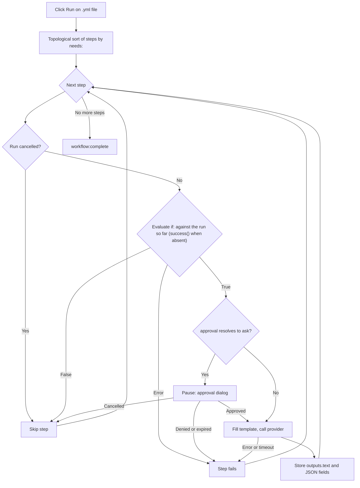

<script setup>
// Skip Vue template processing for the whole page so ${{ }} expressions
// in code spans and fenced YAML blocks are not interpreted as Vue bindings.
</script>

<div v-pre>

# Genie ワークフロー

**Genie ワークフロー**は、複数の AI ステップを 1 つのパイプラインにつなげる YAML ファイルです。単一の [AI Genie](/ja/guide/ai-genies) がテキストに対して 1 つのプロンプトを実行するのに対し、ワークフローはステップの順序付きグラフを実行します——各ステップは Genie を呼び出す、出力を次のステップに渡す、承認を求める、小さな組み込みアクションを実行する、のいずれかを行えます——そして実行中はパイプライン全体をライブの図として表示します。

::: tip 機能フラグ
Genie ワークフローはオプトインの設定で有効にします。**設定 → 詳細設定** で **開発者ツール** をオンにして実験的な設定グループを表示し、続けて **ワークフローエンジン** をオンにします。オンにすると、ワークフローファイルは YAML ソースの横にステップグラフと **実行** / **キャンセル** のツールバーを伴って開き、ワークフロー Genie を実行できるようになります。オフの場合、ワークフローファイルは通常の YAML ツリーとして表示され、ピッカーのワークフロー Genie は実行を拒否します。GitHub Actions のファイルはどちらの場合も影響を受けず、常に [GitHub Actions ワークフロービューア](/ja/guide/workflow-viewer)で開きます。
:::

## ワークフローを使うべき場面

| 必要なこと | 使うもの |
|------|-----|
| 単一の変換（リライト、翻訳、要約） | Markdown の [Genie](/ja/guide/ai-genies) |
| アウトライン → ドラフト → 仕上げ、各段階が次の段階に入力を渡す | ワークフロー |
| 段階ごとに異なる AI モデルを使う | ワークフロー |
| 高コストまたは慎重を要するステップの前に人間の承認ゲートを置く | ワークフロー |
| 後続のステップがフィールド単位で読み取る構造化（JSON）出力 | ワークフロー |

1 つのプロンプトで済むなら、Markdown の Genie を書いてください。段階を組み合わせる、段階間でデータを受け渡す、承認のために一時停止する、といった必要がある場合にだけワークフローを使います。

## ワークフローの書き方

ワークフローは、名前、任意のデフォルト、ステップの順序付きリストを持つ YAML ファイルです。以下は完全で実行可能な例です——VMark に同梱されているサンプル `triage-and-translate.yml` と同じ内容です：

```yaml
name: Triage and Translate
description: Rewrite rough notes into clean English, then translate the result.

defaults:
  approval: auto

steps:
  - id: rewrite
    uses: genie/rewrite-in-english
    with:
      input: "Replace this seed text with the notes you want rewritten before running."

  - id: translate
    uses: genie/translate
    needs: rewrite
    with:
      input: ${{ steps.rewrite.outputs.text }}

  - id: save
    uses: action/save-file
    needs: translate
    with:
      path: triage-and-translate.out.md
      input: ${{ steps.translate.outputs.text }}
```

このワークフローには 3 つのステップがあります。`rewrite` は同梱の Markdown Genie `genie/rewrite-in-english` をシードテキストに対して実行します。`translate` はその完了を待ち（`needs: rewrite`）、テキスト出力を `genie/translate` に渡します。`save` は翻訳結果をワークスペース内の `triage-and-translate.out.md` に書き込みます。結果は左から右へ実行される 3 ノードのグラフになります。

### ワークフローファイルか、GitHub Actions のファイルか

どちらも YAML であり、VMark はすべての `.yml` / `.yaml` ファイルを同じ分割ビューで開きます。両者は次の順序で区別されます：

| チェック | GitHub Actions のワークフロー | VMark のワークフロー |
|-------|-------------------------|----------------|
| `.github/workflows/` 配下のパス | 常に該当——そのフォルダーは GitHub のもの | 該当しない |
| トップレベルの `on:` と `jobs:`（このフォルダーの外では両方が必要） | あり | ない |
| `uses:` が `genie/`、`action/`、`webhook/` を指すトップレベルの `steps:` | ない——ステップはジョブの中にある | あり |

VMark ワークフローにも `on:` はありえますが、`jobs:` を持つことはありません。トップレベルに `jobs:` を持つファイルは実行されることはありません。`.github/workflows/` の外では、トップレベルに `on:` もある場合にだけ GitHub Actions として開かれ、そうでなければ通常の YAML です。どちらの形も持たないファイルも通常の YAML です。

::: info 同梱サンプルの場所
サンプルはアプリバンドルの中に含まれています——macOS では `VMark.app/Contents/Resources/resources/workflows/examples/triage-and-translate.yml`、その他のプラットフォームではアプリの `resources` フォルダー——また[ソースリポジトリ](https://github.com/xiaolai/vmark/blob/main/src-tauri/resources/workflows/examples/triage-and-translate.yml)にもあります。Genie フォルダーにはコピーされません：[ワークフロー Genie](/ja/guide/workflow-genies) として実行するには、自分でそこにコピーし、シードテキストを編集してください。
:::

### トップレベルのフィールド

| フィールド | 必須 | 用途 |
|-------|----------|---------|
| `name` | はい | ワークフローの人間が読めるラベル。 |
| `description` | いいえ | 1 行の概要。 |
| `defaults` | いいえ | すべてのステップに適用されるデフォルトの `model`、`approval`、`limits`（[ステップごとの設定](#ステップごとの設定)を参照）。 |
| `env` | いいえ | 環境変数。`with:` の値の中で `${{ env.NAME }}` または `${VAR}` として読み取れます。 |
| `steps` | はい | ステップの順序付きリスト。 |

### ステップのフィールド

```yaml
- id: my-step           # required; unique within the workflow
  uses: genie/<name>    # required; what this step runs (see Step types)
  with:                 # inputs to the step
    input: "text or an ${{ ... }} expression"
  needs: prior-step     # optional; a single id or a list of ids
  if: ${{ success() }}  # optional condition (see Conditions)
  approval: ask         # optional; "auto" (default) or "ask"
  model: claude-sonnet  # optional; overrides defaults / genie default
  limits:
    timeout: 120s       # optional; default 300s
    max_tokens: 4096    # optional; REST providers only
```

### ステップの種類

`uses:` のプレフィックスによって、ステップの動作が決まります。

| `uses:` プレフィックス | 動作 |
|----------------|----------|
| `genie/<name>` | 対応する Markdown Genie を読み込み、ステップの `with:` マップでプロンプトテンプレートを埋め、アクティブな AI プロバイダーを呼び出します。 |
| `action/read-file` | ワークスペース相対パスのファイルを読み込みます。ファイル本文がステップのテキスト出力になります。 |
| `action/read-folder` | ワークスペース相対のフォルダー `with.path` の直下にあるすべてのファイルを読み込みます——任意で `with.accept`（`*.md`、または `*.md,*.txt` のようなリスト）に一致するものだけに絞れます——名前順に、それぞれ `--- name ---` 行を先頭に付けて連結します。最大 1,000 ファイル、1 ファイルあたり 10 MB、合計 100 MB までです。 |
| `action/save-file` | `with.input` を `with.path`（ワークスペース相対）に書き込みます。パスはリテラルでなければなりません——`${{ }}` 式は使えません——実行前にファイルのスナップショットを取れるようにするためです（[実行を元に戻す](#実行を元に戻す)を参照）。 |
| `action/notify` | `with.message` をログに出力します。 |
| `action/copy` | `with.input` をそのまま返します——値の名前を変えたり、複数のステップに分配したりするのに便利です。 |

::: warning
`webhook/*` ステップはまだサポートされていません——それを使うワークフローは実行前に拒否されます。ファイル出力の Genie（`output.type: file` / `files`）も同様に対応が先送りされています。
:::

`action/save-file` による書き込みが成功すると、それに入力を渡した読み取りステップとともに [整合性](/ja/guide/coherence) に記録されます。ただしその範囲は **保存時に識別ブロックを書き込む**（設定 → ファイルと画像）が許す範囲に限られます：オフの場合、`.vmark` フォルダーは作成されず、どのファイルにも識別ブロックは書き込まれません。すでに `.vmark` フォルダーを持つワークスペースでは、すでに追跡しているドキュメントへの書き込みだけが記録されます。

## Genie ステップと `with:` のエイリアス

`genie/<name>` ステップが実行されると、VMark はその Genie の Markdown テンプレートを読み込み、`{{...}}` プレースホルダーをステップの `with:` マップから埋めます。これが、**既存の Markdown Genie をワークフローの中でそのまま実行できる**ようにする橋渡しです。

バインディングのルールは、優先順位の高い順に次のとおりです：

| プレースホルダー | 解決される値 | 値がない場合 |
|-------------|-------------|-----------|
| `{{input}}` | `with.input` | 未バインド → ステップは失敗 |
| `{{content}}` | `with.content`、なければ `with.input` | どちらもない場合にのみ致命的 |
| `{{context}}` | `with.context`、なければ空文字列 | 致命的にならない——`""` に縮退 |
| `{{any-other-key}}` | `with.<key>` | 未バインド → ステップは失敗 |

波括弧の内側の空白は許容されます：`{{ key }}` は `{{key}}` と同じように動作します。

**互換性の鍵は `{{content}}` エイリアスです。** エディタ向けに書かれた Markdown Genie は、選択テキストに `{{content}}` を使います。ワークフローには選択範囲がないため、`with: { input: "..." }` を指定すると、`{{content}}` プレースホルダーがエイリアスの連鎖を通じてそれを拾います。上のサンプルが頼っているのはまさにこの仕組みです——`genie/rewrite-in-english` と `genie/translate` はどちらもテンプレートで `{{content}}` を使っていますが、ワークフローが設定しているのは `input` だけです。

::: danger 未バインドのプレースホルダーは致命的
`with:` のどれによっても解決されないプレースホルダーがテンプレートに含まれている場合——たとえば `with.topic` がないのに `{{topic}}` がある場合——そのステップは**AI 呼び出しの前に**失敗し、未解決の名前をすべて列挙したエラー（`Unbound placeholders: {{topic}}`）を出します。これは意図的です：リテラルの `{{topic}}` が残ったままのプロンプトを送ると、黙って意味のない結果を生み、誤って成功を報告してしまいます。安全な緩和は、上の 2 つのエイリアス（`{{content}}` と `{{context}}`）だけです。
:::

### ワークフローでの `{{context}}`

エディタでは、`{{context}}` には選択範囲の周辺テキストが入ります。ワークフローにはエディタがないため、`with.context` を明示的に指定しない限り、`{{context}}` は空文字列に縮退します。周辺のコンテキストに本当に依存する Genie には、それを渡す必要があります：

```yaml
- id: rewrite
  uses: genie/fit-to-surroundings
  with:
    input: ${{ steps.draft.outputs.text }}
    context: "House style: terse, present tense, no marketing language."
```

## ステップをつなぐ：式

任意の `with:` の値の中で、前のステップや環境変数を参照できます。

| 構文 | 解決される値 |
|--------|-------------|
| `${{ steps.ID.outputs.FIELD }}` | 前のステップの特定の出力フィールド。 |
| `${{ steps.ID.output }}` | `${{ steps.ID.outputs.text }}` の省略形。 |
| `${{ env.NAME }}` | ワークフローの `env:` の値。 |
| `${VAR}` | `${{ env.VAR }}` と同じ、レガシー形式。 |
| `stepId.output`（値全体の場合のみ） | `${{ steps.stepId.outputs.text }}` のレガシーエイリアス。 |

参照は AI 呼び出しの前に解決されます。未知のステップへの参照（`${{ steps.typo.outputs.text }}`）や、ステップが生成しなかったフィールドへの参照（`${{ steps.outline.outputs.missing }}`）は、わかりやすいメッセージとともにステップを失敗させます——空の値を黙って渡すことは決してありません。唯一の例外：正当に空の応答を生成したステップは、エラーではなく空文字列に解決されます。

## 構造化出力

デフォルトでは、Genie ステップは結果を `outputs.text` に格納し、`${{ steps.ID.output }}` でそれを読み取ります。Genie はフロントマターで構造化（JSON）出力を宣言することもできます：

```yaml
output:
  type: json
  schema:
    title: string
    tags: array
```

そのような Genie がワークフローで実行されると、VMark は応答を JSON として解析し、宣言された各フィールドが正しいプリミティブ型で存在することを確認したうえで、トップレベルの各フィールドを個別に公開します：

```yaml
- id: classify
  uses: genie/extract-metadata
  with:
    input: ${{ steps.read.output }}

- id: save
  uses: action/save-file
  needs: classify
  with:
    path: "meta.txt"
    input: ${{ steps.classify.outputs.title }}
```

スキーマの検証は意図的に最小限です——必須キーが存在し、その型が一致することだけを確認します。長さ、パターン、ネストした構造は強制しません。応答が有効な JSON でない場合や、必須フィールドが欠けている場合、ステップは具体的なエラーとともに失敗します。現在サポートされている出力タイプは `text` と `json` だけで、`file`、`files`、`pipe` はサポートされていません。

## 条件

ステップには `if:` 条件を付けられます。false と評価された場合、ステップはスキップされます（失敗ではありません）。3 つのステータス関数が使え、GitHub Actions のルールに従います：

| 条件 | true になるとき |
|-----------|-----------|
| `success()` | これまでにどのステップも失敗しておらず、**かつ** このステップが `needs` で指定したすべてのステップが完了しているとき。 |
| `failure()` | 実行中のそれより前のいずれかのステップが失敗したとき——このステップが `needs` で指定したステップに限りません。 |
| `always()` | 常に。 |

デフォルトは `success()` です。`if:` のないステップは `success()` が成り立つときにだけ実行され、3 つの関数のどれも含まない `if:` を持つステップも同様です——`if: X` は `success() && (X)` を意味します。これにより、通常のステップが失敗の後に実行されることはありません。

| それまでに起きたこと | 条件なしまたは `success()` のステップ | `failure()` のステップ | `always()` のステップ |
|---|---|---|---|
| 依存するステップがすべて成功した | 実行 | スキップ | 実行 |
| 依存するステップが **失敗** した（またはタイムアウトした、承認が拒否された） | スキップ | 実行 | 実行 |
| 依存するステップが自身の `if:` によって **スキップ** された | スキップ | スキップ——何も失敗していない | 実行 |
| 実行が **キャンセル** された | スキップ | スキップ | スキップ |

キャンセルは条件から見えるものではありません：キャンセルは `if:` より前にチェックされ、残りのステップはすべて *Workflow cancelled* でスキップされます。`always()` のステップも例外ではありません。いずれかのステップが失敗した実行は、その後に `failure()` や `always()` のステップが実行されたとしても、**失敗** として終わり、最初に失敗したステップの名前を示します。

参照と比較を組み合わせることもできます。例：`${{ steps.classify.outputs.title == "Draft" }}`。形式が不正な条件やサポートされていない条件は、黙って通すのではなく**ステップをはっきりと失敗させます**——「エラー時は true とみなす」ようなフォールバックはありません。

## ステップごとの設定

`model`、`approval`、`limits` は 3 つのレベルで設定できます。最も具体的な設定が優先されます。

| フィールド | 優先順位（高い順） |
|-------|----------------------------|
| `model` | ステップの `model:` → Genie 自身の `model` → ワークフローの `defaults.model` → プロバイダーのデフォルト |
| `approval` | ステップの `approval:` → Genie の `approval` → ワークフローの `defaults.approval` → `auto` |
| `timeout` | ステップの `limits.timeout` → ワークフローの `defaults.limits.timeout` → 300 秒 |
| `max_tokens` | ステップの `limits.max_tokens` → `defaults.limits.max_tokens` → プロバイダーのデフォルト（**REST プロバイダーのみ**） |

`max_tokens` が強制されるのは REST プロバイダー（Anthropic、OpenAI、Google AI、Ollama）だけです。CLI プロバイダー（claude、codex、gemini）はこのフィールドを受け付けますが強制はしません。いずれかの CLI ステップがこれを設定している場合、実行ごとに警告が 1 回ログに出力されます。

### タイムアウト

各ステップは実効タイムアウトで包まれます。期限が切れると、ステップは `Timed out after Xs` で失敗します：CLI プロバイダーの子プロセスは強制終了され、処理中の REST リクエストは破棄されます。タイムアウトしたステップは失敗として扱われます：それに依存するステップは、`if:` で `failure()` または `always()` を使っていない限りスキップされます。また、1 つのステップが収集する出力には 5 MB の厳格な上限があります——暴走したプロバイダーは `Provider output exceeded 5 MB cap` でキャンセルされます。

## 承認

ステップに `approval: ask` を設定する（またはワークフロー全体に `defaults.approval: ask` を設定する）と、そのステップがプロバイダーを呼び出す前に一時停止します。ランナーは承認リクエストを発行し、次の内容を示すダイアログが表示されます：

- ステップ ID。
- 解決されたモデル。
- 埋められたプロンプトのプレビュー（最初の 500 文字）。

**承認** を選ぶとステップを実行し、**拒否**（Esc でも拒否）を選ぶと `Approval denied by user` でステップを失敗させます。承認の待ち時間は、ステップのタイムアウトと 10 分の上限のうち短い方です。期限が切れると、ステップは `Approval timed out` で失敗します。ウィンドウを閉じるなどしてダイアログがなくなった場合は、拒否として扱われます。

## ワークフローの実行

ワークスペースでワークフローの `.yml` / `.yaml` ファイルを開きます（ワークフローにはワークスペースを開いている必要があります——アクションステップはパスをワークスペースのルートに対して検証します）。ファイルは分割ビューで開きます：左側に YAML ソース、右側にツールバーの下でインタラクティブなグラフとして表示されたステップです。**ソース / 分割 / プレビュー** の切り替えで、他の YAML ファイルと同じようにレイアウトを切り替えられます。

| コントロール | アイコン | 動作 |
|---------|------|--------|
| 実行 | ▶ | このファイルのワークフローを、エディタ上の内容そのままで開始します——保存済みかどうかは問いません。ファイルに解析エラーがある間、ワークフローの実行中、フォルダーが開かれていないときは無効になり、ツールバーがその理由を表示します。 |
| キャンセル | ◼ | このファイルのワークフローの実行中は、実行の代わりに表示されます。実行を停止し、処理中の CLI 子プロセスを強制終了し、処理中の REST リクエストを破棄します。 |
| ファイルを復元 | — | ファイルを書き込んだ実行の後に表示されます。[実行を元に戻す](#実行を元に戻す)を参照してください。 |

実行が進むにつれて、各ノードは実行中、成功、スキップ、エラーのいずれかにライブで更新されるので、パイプラインの進行を見守り、失敗した場合はどのステップで失敗したかを正確に確認できます。終了すると、ツールバーは完了、失敗、キャンセルのどれで終わったかを表示します。バックエンドが実行の開始を拒否した場合——エンジンがオフ、YAML が検証に通らない、スナップショットに失敗した、など——通知がその理由を伝えます。

同時に実行できるワークフローは、ウィンドウごとではなくアプリ全体で 1 つだけです。1 つが実行中の間は、**同じウィンドウ内の** 他のすべてのワークフローファイルで実行が無効になり、ツールバーに *別のワークフローが実行中です* と表示されます。別のウィンドウのワークフローファイルでは実行は有効なまま表示されますが、クリックすると *別のワークフローがすでに実行中です。完了またはキャンセルをお待ちください。* と表示されて拒否されます。その間に開始されたワークフロー Genie も拒否されます。

### 実行を元に戻す

`action/save-file` ステップを含む実行の前に、VMark はそれらのステップが書き込むすべてのファイル（1 ファイルあたり最大 64 MB、合計 256 MB まで）をアプリデータフォルダー内のスナップショットにコピーし、そのうちまだ存在しないファイルを記録します。スナップショットを取れない場合、ワークフローはまったく実行されません。

実行が終わると、ツールバーに **ファイルを復元** が表示されます。確認すると、VMark はスナップショットを取った各ファイルを実行前の状態に戻し、実行によって作成されたファイルを削除します。実行後にそれらのファイルに加えた編集は失われます。すべてのファイルを復元できた場合はボタンが消えます。スキップしたファイルがある場合はボタンが残るので、再試行できます。復元できないファイル——たとえば、そのフォルダーがワークスペースの外を指すリンクに置き換えられていた場合——はそのまま残され、通知の中で件数として報告されます。いずれかのワークフローの実行中は、復元は拒否されます。

### 実行の流れ



## 図の共有

Genie ワークフローのステップグラフにはエクスポート機能がありません。同じ React Flow ライブラリで構築された [GitHub Actions ワークフロービューア](/ja/guide/workflow-viewer)のキャンバスにはエクスポート機能があり、3 つのオプションがあります：

| エクスポート | 結果 |
|--------|--------|
| Mermaid としてコピー | グラフの Mermaid `flowchart` をクリップボードにコピーします（情報が失われるテキスト近似）。 |
| SVG としてエクスポート | レンダリングされたキャンバスをベクター SVG として保存します。 |
| PNG としてエクスポート | レンダリングされたキャンバスをラスター PNG として保存します。 |

Mermaid と SVG はライブキャンバスの情報が失われる近似であることが明示されています。PNG はピクセル単位のスナップショットです。

## 関連項目

- [AI Genie](/ja/guide/ai-genies)——Markdown の Genie 形式と、その作成方法。
- [AI プロバイダー](/ja/guide/ai-providers)——ワークフローのステップが呼び出す CLI または REST プロバイダーの設定。
- [GitHub Actions ワークフロービューア](/ja/guide/workflow-viewer)——共有のキャンバスとそのエクスポート機能。

</div>
