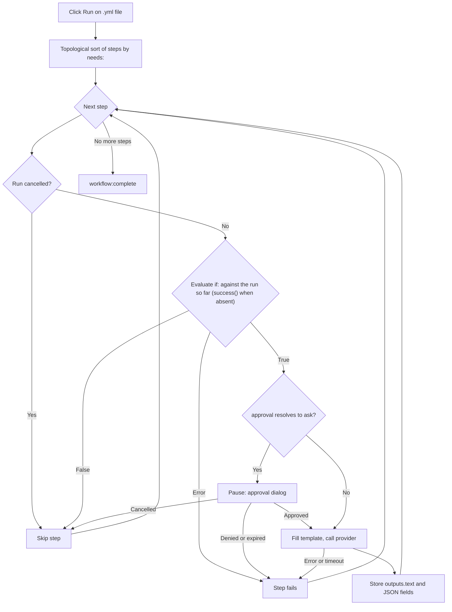

<script setup>
// Skip Vue template processing for the whole page so ${{ }} expressions
// in code spans and fenced YAML blocks are not interpreted as Vue bindings.
</script>

<div v-pre>

# 지니 워크플로

**지니 워크플로**는 여러 AI 단계를 하나의 파이프라인으로 연결하는 YAML 파일입니다. 하나의 [AI 지니](/ko/guide/ai-genies)가 텍스트에 프롬프트 하나를 실행한다면, 워크플로는 순서가 정해진 단계 그래프를 실행합니다 — 각 단계는 지니를 호출하거나, 자신의 출력을 다음 단계로 넘기거나, 승인을 요청하거나, 작은 내장 액션을 실행할 수 있습니다 — 그리고 실행하는 동안 전체 파이프라인을 실시간 다이어그램으로 보여 줍니다.

::: tip 기능 플래그
지니 워크플로는 직접 켜야 하는 설정 뒤에 있습니다. **설정 → 고급**에서 **개발자 도구**를 켜서 실험적 기능 그룹을 표시한 다음, **워크플로 엔진**을 켜세요. 켜져 있으면 워크플로 파일을 열 때 YAML 소스 옆에 단계 그래프와 **실행** / **취소** 도구 모음이 표시되고, 워크플로 지니를 실행할 수 있습니다. 꺼져 있으면 워크플로 파일은 일반 YAML 트리로 표시되고, 피커의 워크플로 지니는 실행을 거부합니다. GitHub Actions 파일은 어느 쪽이든 영향을 받지 않습니다 — 항상 [GitHub Actions 워크플로 뷰어](/ko/guide/workflow-viewer)에서 열립니다.
:::

## 워크플로를 사용해야 할 때

| 필요 | 사용 |
|------|-----|
| 단일 변환 (재작성, 번역, 요약) | 마크다운 [지니](/ko/guide/ai-genies) |
| 개요 → 초안 → 다듬기, 각 단계가 다음 단계에 입력을 전달 | 워크플로 |
| 단계별로 다른 AI 모델 사용 | 워크플로 |
| 비용이 크거나 민감한 단계 앞의 사람 승인 게이트 | 워크플로 |
| 이후 단계가 필드별로 읽는 구조화된 (JSON) 출력 | 워크플로 |

프롬프트 하나로 충분하다면 마크다운 지니를 작성하세요. 단계를 구성하거나, 단계 사이에 데이터를 전달하거나, 승인을 위해 멈춰야 할 때만 워크플로를 사용하세요.

## 워크플로 작성하기

워크플로는 이름, 선택적 기본값, 순서가 정해진 단계 목록을 가진 YAML 파일입니다. 다음은 완전하고 실행 가능한 예시입니다 — VMark에 번들로 포함된 샘플 `triage-and-translate.yml`과 같습니다:

```yaml
name: Triage and Translate
description: Rewrite rough notes into clean English, then translate the result.

defaults:
  approval: auto

steps:
  - id: rewrite
    uses: genie/rewrite-in-english
    with:
      input: "Replace this seed text with the notes you want rewritten before running."

  - id: translate
    uses: genie/translate
    needs: rewrite
    with:
      input: ${{ steps.rewrite.outputs.text }}

  - id: save
    uses: action/save-file
    needs: translate
    with:
      path: triage-and-translate.out.md
      input: ${{ steps.translate.outputs.text }}
```

이 워크플로에는 세 단계가 있습니다. `rewrite`는 번들로 포함된 `genie/rewrite-in-english` 마크다운 지니를 시드 텍스트에 실행합니다. `translate`는 그 단계를 기다린 뒤(`needs: rewrite`) 텍스트 출력을 `genie/translate`에 넘깁니다. `save`는 번역 결과를 워크스페이스의 `triage-and-translate.out.md`에 씁니다. 결과는 왼쪽에서 오른쪽으로 실행되는 세 노드짜리 그래프입니다.

### 워크플로 파일인가, GitHub Actions 파일인가?

둘 다 YAML이며, VMark는 모든 `.yml` / `.yaml` 파일을 같은 분할 보기로 엽니다. 두 종류는 다음 순서로 구분합니다:

| 확인 항목 | GitHub Actions 워크플로 | VMark 워크플로 |
|-------|-------------------------|----------------|
| `.github/workflows/` 아래의 경로 | 항상 — 이 폴더는 GitHub의 것입니다 | 절대 아님 |
| 최상위 `on:`과 `jobs:` (이 폴더 밖에서는 둘 다 필요) | 예 | 절대 아님 |
| `uses:`가 `genie/`, `action/` 또는 `webhook/`을 가리키는 최상위 `steps:` | 절대 아님 — 단계는 작업 안에 있습니다 | 예 |

VMark 워크플로에도 `on:`이 있을 수 있지만 `jobs:`는 절대 없습니다. 최상위 `jobs:`가 있는 파일은 절대 실행되지 않습니다. `.github/workflows/` 밖에서는 최상위 `on:`도 함께 있을 때만 GitHub Actions로 열리고, 그렇지 않으면 일반 YAML입니다. 어느 형태에도 해당하지 않는 파일도 일반 YAML입니다.

::: info 번들 샘플의 위치
샘플은 앱 번들 안에 포함되어 있습니다 — macOS에서는 `VMark.app/Contents/Resources/resources/workflows/examples/triage-and-translate.yml`, 다른 플랫폼에서는 앱의 `resources` 폴더 — 그리고 [소스 저장소](https://github.com/xiaolai/vmark/blob/main/src-tauri/resources/workflows/examples/triage-and-translate.yml)에도 있습니다. 지니 폴더로 복사되지는 않습니다: [워크플로 지니](/ko/guide/workflow-genies)로 실행하려면 직접 그곳에 복사하고 시드 텍스트를 편집하세요.
:::

### 최상위 필드

| 필드 | 필수 | 용도 |
|-------|----------|---------|
| `name` | 예 | 사람이 읽을 수 있는 워크플로 레이블. |
| `description` | 아니요 | 한 줄 요약. |
| `defaults` | 아니요 | 모든 단계에 적용되는 기본 `model`, `approval`, `limits` ([단계별 설정](#단계별-설정) 참조). |
| `env` | 아니요 | 환경 변수. `with:` 값에서 `${{ env.NAME }}` 또는 `${VAR}`로 읽을 수 있습니다. |
| `steps` | 예 | 순서가 정해진 단계 목록. |

### 단계 필드

```yaml
- id: my-step           # required; unique within the workflow
  uses: genie/<name>    # required; what this step runs (see Step types)
  with:                 # inputs to the step
    input: "text or an ${{ ... }} expression"
  needs: prior-step     # optional; a single id or a list of ids
  if: ${{ success() }}  # optional condition (see Conditions)
  approval: ask         # optional; "auto" (default) or "ask"
  model: claude-sonnet  # optional; overrides defaults / genie default
  limits:
    timeout: 120s       # optional; default 300s
    max_tokens: 4096    # optional; REST providers only
```

### 단계 유형

`uses:` 접두사가 단계가 하는 일을 결정합니다.

| `uses:` 접두사 | 동작 |
|----------------|----------|
| `genie/<name>` | 일치하는 마크다운 지니를 로드하고, 단계의 `with:` 맵으로 프롬프트 템플릿을 채운 다음, 활성 AI 제공자를 호출합니다. |
| `action/read-file` | 워크스페이스 상대 경로를 읽습니다. 파일 본문이 단계의 텍스트 출력이 됩니다. |
| `action/read-folder` | 워크스페이스 상대 폴더 `with.path` 바로 안에 있는 모든 파일을 읽습니다 — 선택적으로 `with.accept`(`*.md`, 또는 `*.md,*.txt` 같은 목록)와 일치하는 파일만 — 이름 순서로, 각 파일 앞에 `--- name ---` 줄을 붙입니다. 최대 1,000개 파일, 파일당 10 MB, 전체 100 MB까지입니다. |
| `action/save-file` | `with.input`을 `with.path`(워크스페이스 상대)에 씁니다. 실행 전에 파일의 스냅숏을 만들 수 있도록 경로는 리터럴이어야 합니다 — `${{ }}` 표현식은 쓸 수 없습니다 ([실행 되돌리기](#실행-되돌리기) 참조). |
| `action/notify` | `with.message`를 기록합니다. |
| `action/copy` | `with.input`을 변경 없이 반환합니다 — 값의 이름을 바꾸거나 여러 곳으로 나눠 보낼 때 편리합니다. |

::: warning
`webhook/*` 단계는 아직 지원되지 않습니다 — 이를 사용하는 워크플로는 실행 전에 거부됩니다. 파일 출력 지니(`output.type: file` / `files`)도 마찬가지로 보류되어 있습니다.
:::

성공한 `action/save-file` 쓰기는 이를 입력으로 공급한 읽기 단계와 함께 [정합성](/ko/guide/coherence)에 기록되지만, **저장 시 식별 블록 기록**(설정 → 파일 및 이미지)이 허용하는 범위까지만입니다: 이 설정이 꺼져 있으면 `.vmark` 폴더가 만들어지지 않고 어떤 파일에도 식별 블록이 기록되지 않으며, 이미 `.vmark` 폴더가 있는 워크스페이스는 이미 추적 중인 문서에 대해서만 쓰기를 기록합니다.

## 지니 단계와 `with:` 별칭

`genie/<name>` 단계가 실행되면 VMark는 해당 지니의 마크다운 템플릿을 로드하고, 단계의 `with:` 맵으로 `{{...}}` 자리 표시자를 채웁니다. 이것이 **기존 마크다운 지니를 워크플로 안에서 수정 없이 실행**할 수 있게 하는 다리입니다.

바인딩 규칙은 우선순위 순서로 다음과 같습니다:

| 자리 표시자 | 해석 결과 | 없는 경우 |
|-------------|-------------|-----------|
| `{{input}}` | `with.input` | 바인딩되지 않음 → 단계 실패 |
| `{{content}}` | `with.content`, 없으면 `with.input` | 둘 다 없을 때만 치명적 |
| `{{context}}` | `with.context`, 없으면 빈 문자열 | 절대 치명적이지 않음 — `""`로 대체 |
| `{{any-other-key}}` | `with.<key>` | 바인딩되지 않음 → 단계 실패 |

중괄호 안의 공백은 허용됩니다: `{{ key }}`는 `{{key}}`와 똑같이 동작합니다.

**`{{content}}` 별칭이 호환성의 핵심입니다.** 에디터용으로 작성된 마크다운 지니는 선택한 텍스트에 `{{content}}`를 사용합니다. 워크플로에는 선택 영역이 없으므로 `with: { input: "..." }`을 제공하면, `{{content}}` 자리 표시자가 별칭 체인을 통해 그 값을 가져옵니다. 위의 샘플이 바로 이것에 의존합니다 — `genie/rewrite-in-english`와 `genie/translate`는 모두 템플릿에서 `{{content}}`를 사용하지만, 워크플로는 `input`만 설정합니다.

::: danger 바인딩되지 않은 자리 표시자는 치명적입니다
템플릿에 `with:`의 어떤 값으로도 해석되지 않는 자리 표시자가 있으면 — 예를 들어 `with.topic` 없이 `{{topic}}`이 있으면 — 단계는 **AI 호출이 이루어지기 전에** 해석되지 않은 모든 이름을 나열한 오류(`Unbound placeholders: {{topic}}`)와 함께 실패합니다. 이는 의도된 동작입니다: 리터럴 `{{topic}}`이 남아 있는 프롬프트를 보내면 조용히 쓰레기 결과를 만들고 거짓으로 성공을 보고하게 됩니다. 안전하게 완화할 수 있는 것은 위의 두 별칭(`{{content}}`와 `{{context}}`)뿐입니다.
:::

### 워크플로에서의 `{{context}}`

에디터에서 `{{context}}`는 선택 영역 주변의 텍스트로 채워집니다. 워크플로에는 에디터가 없으므로 `with.context`를 명시적으로 제공하지 않으면 `{{context}}`는 빈 문자열로 대체됩니다. 주변 문맥에 실제로 의존하는 지니에는 문맥을 직접 전달해야 합니다:

```yaml
- id: rewrite
  uses: genie/fit-to-surroundings
  with:
    input: ${{ steps.draft.outputs.text }}
    context: "House style: terse, present tense, no marketing language."
```

## 단계 연결하기: 표현식

모든 `with:` 값 안에서 이전 단계와 환경 변수를 참조할 수 있습니다.

| 구문 | 해석 결과 |
|--------|-------------|
| `${{ steps.ID.outputs.FIELD }}` | 이전 단계의 특정 출력 필드. |
| `${{ steps.ID.output }}` | `${{ steps.ID.outputs.text }}`의 단축 표기. |
| `${{ env.NAME }}` | 워크플로 `env:` 값. |
| `${VAR}` | `${{ env.VAR }}`와 같음, 레거시 형식. |
| `stepId.output` (값 전체일 때만) | `${{ steps.stepId.outputs.text }}`의 레거시 별칭. |

참조는 AI 호출 전에 해석됩니다. 알 수 없는 단계에 대한 참조(`${{ steps.typo.outputs.text }}`)나 단계가 만들지 않은 필드에 대한 참조(`${{ steps.outline.outputs.missing }}`)는 명확한 메시지와 함께 단계를 실패시킵니다 — 빈 값을 조용히 넘기는 일은 절대 없습니다. 한 가지 예외가 있습니다: 정상적으로 빈 응답을 만든 단계는 오류가 아니라 빈 문자열로 해석됩니다.

## 구조화된 출력

기본적으로 지니 단계는 결과를 `outputs.text`에 저장하며, `${{ steps.ID.output }}`이 이를 읽습니다. 지니는 프런트매터에 구조화된 (JSON) 출력을 선언할 수도 있습니다:

```yaml
output:
  type: json
  schema:
    title: string
    tags: array
```

이런 지니가 워크플로에서 실행되면 VMark는 응답을 JSON으로 파싱하고, 선언된 각 필드가 올바른 기본 타입으로 존재하는지 확인한 다음, 모든 최상위 필드를 개별적으로 노출합니다:

```yaml
- id: classify
  uses: genie/extract-metadata
  with:
    input: ${{ steps.read.output }}

- id: save
  uses: action/save-file
  needs: classify
  with:
    path: "meta.txt"
    input: ${{ steps.classify.outputs.title }}
```

스키마 검증은 의도적으로 최소한입니다 — 필수 키가 존재하고 타입이 일치하는지만 확인합니다. 길이, 패턴, 중첩 구조는 강제하지 않습니다. 응답이 유효한 JSON이 아니거나 필수 필드가 없으면 단계는 구체적인 오류와 함께 실패합니다. 현재 지원되는 출력 유형은 `text`와 `json`뿐이며, `file`, `files`, `pipe`는 지원되지 않습니다.

## 조건

단계에 `if:` 조건을 붙일 수 있습니다. 조건이 거짓으로 평가되면 단계는 건너뜁니다(실패가 아님). 세 가지 상태 함수를 사용할 수 있으며, GitHub Actions의 규칙을 따릅니다:

| 조건 | 참이 되는 경우 |
|-----------|-----------|
| `success()` | 지금까지 실패한 단계가 없고, **그리고** 이 단계가 `needs`로 지정한 모든 단계가 완료되었을 때. |
| `failure()` | 이번 실행에서 앞선 단계 중 하나라도 실패했을 때 — 이 단계가 `needs`로 지정한 단계만이 아닙니다. |
| `always()` | 항상. |

`success()`가 기본값입니다. `if:`가 없는 단계는 `success()`가 성립할 때만 실행되며, `if:`가 세 함수 중 어느 것도 언급하지 않는 단계도 마찬가지입니다 — `if: X`는 `success() && (X)`를 뜻합니다. 이것이 일반 단계가 실패 이후에 실행되지 않게 하는 장치입니다.

| 앞서 일어난 일 | 일반 또는 `success()` 단계 | `failure()` 단계 | `always()` 단계 |
|---|---|---|---|
| 필요한 단계가 모두 성공함 | 실행 | 건너뜀 | 실행 |
| 필요한 단계가 **실패함** (또는 시간 초과되었거나 승인이 거부됨) | 건너뜀 | 실행 | 실행 |
| 필요한 단계가 자신의 `if:`로 **건너뛰어짐** | 건너뜀 | 건너뜀 — 실패한 것이 없음 | 실행 |
| 실행이 **취소됨** | 건너뜀 | 건너뜀 | 건너뜀 |

취소는 조건이 볼 수 있는 것이 아닙니다: 취소는 `if:`보다 먼저 확인되며, 남은 모든 단계는 `always()` 단계를 포함해 *Workflow cancelled*로 건너뛰어집니다. 단계가 실패한 실행은 이후에 `failure()`나 `always()` 단계가 실행되었더라도 여전히 **실패**로 끝나며, 처음 실패한 단계를 표시합니다.

참조와 비교를 조합할 수 있습니다. 예: `${{ steps.classify.outputs.title == "Draft" }}`. 잘못되었거나 지원되지 않는 조건은 조용히 통과시키는 대신 **단계를 명확하게 실패시킵니다** — "오류 시 참으로 간주" 같은 대체 동작은 없습니다.

## 단계별 설정

`model`, `approval`, `limits`는 세 수준에서 설정할 수 있습니다. 가장 구체적인 설정이 우선합니다.

| 필드 | 우선순위 (높은 순) |
|-------|----------------------------|
| `model` | 단계 `model:` → 지니 자체의 `model` → 워크플로 `defaults.model` → 제공자 기본값 |
| `approval` | 단계 `approval:` → 지니의 `approval` → 워크플로 `defaults.approval` → `auto` |
| `timeout` | 단계 `limits.timeout` → 워크플로 `defaults.limits.timeout` → 300초 |
| `max_tokens` | 단계 `limits.max_tokens` → `defaults.limits.max_tokens` → 제공자 기본값 (**REST 제공자 전용**) |

`max_tokens`는 REST 제공자(Anthropic, OpenAI, Google AI, Ollama)에서만 적용됩니다. CLI 제공자(claude, codex, gemini)는 이 필드를 받아들이지만 적용하지는 않으며, CLI 단계 중 하나라도 이를 설정하면 실행마다 경고가 한 번 기록됩니다.

### 시간 제한

각 단계는 유효 시간 제한 안에서 실행됩니다. 시간이 초과되면 단계는 `Timed out after Xs`로 실패합니다: CLI 제공자의 자식 프로세스는 종료되고, 진행 중인 REST 요청은 폐기됩니다. 시간 초과된 단계는 실패로 간주됩니다: 그 단계에 의존하는 단계는 `if:`가 `failure()`나 `always()`를 사용하지 않는 한 건너뜁니다. 또한 한 단계가 수집하는 출력에는 5 MB의 엄격한 상한이 있습니다 — 폭주하는 제공자는 `Provider output exceeded 5 MB cap`과 함께 취소됩니다.

## 승인

단계에 `approval: ask`를 설정하면(또는 워크플로 전체에 `defaults.approval: ask`를 설정하면) 해당 단계가 제공자를 호출하기 전에 일시 정지합니다. 러너가 승인 요청을 보내고 다음 내용을 보여 주는 대화 상자가 나타납니다:

- 단계 id.
- 해석된 모델.
- 채워진 프롬프트의 미리 보기(처음 500자).

**승인**을 선택하면 단계가 실행되고, **거부**(Esc도 거부로 처리)를 선택하면 단계가 `Approval denied by user`로 실패합니다. 승인은 단계의 시간 제한과 10분 상한 중 더 짧은 시간 동안 기다리며, 만료되면 단계는 `Approval timed out`으로 실패합니다. 창을 닫거나 다른 방식으로 대화 상자가 사라지면 거부로 처리됩니다.

## 워크플로 실행하기

워크스페이스에서 워크플로 `.yml` / `.yaml` 파일을 여세요(워크플로에는 열린 워크스페이스가 필요합니다 — 액션 단계는 경로를 워크스페이스 루트 기준으로 검증합니다). 파일은 분할 보기로 열립니다: 왼쪽에는 YAML 소스, 오른쪽에는 도구 모음 아래에 단계가 인터랙티브 그래프로 표시됩니다. **소스 / 분할 / 미리 보기** 토글은 다른 YAML 파일과 마찬가지로 레이아웃을 전환합니다.

| 컨트롤 | 아이콘 | 동작 |
|---------|------|--------|
| 실행 | ▶ | 이 파일의 워크플로를 에디터에 있는 그대로 시작합니다 — 저장 여부와 상관없습니다. 파일에 파싱 오류가 있을 때, 워크플로가 실행 중일 때, 또는 열린 폴더가 없을 때는 비활성화되며, 도구 모음이 그 이유를 알려 줍니다. |
| 취소 | ◼ | 이 파일의 워크플로가 실행되는 동안 실행 버튼을 대신합니다. 실행을 중지하고, 진행 중인 CLI 자식 프로세스를 종료하며, 진행 중인 REST 요청을 폐기합니다. |
| 파일 복원 | — | 파일을 쓴 실행 후에 나타납니다. [실행 되돌리기](#실행-되돌리기)를 참조하세요. |

실행이 진행되면 각 노드가 실시간으로 갱신됩니다 — 실행 중, 성공, 건너뜀, 오류 — 따라서 파이프라인이 진행되는 모습을 지켜보고, 단계가 실패하면 정확히 어느 단계인지 확인할 수 있습니다. 실행이 끝나면 도구 모음이 완료, 실패, 취소 중 어떻게 끝났는지 알려 줍니다. 백엔드가 실행 시작을 거부하면 — 엔진이 꺼져 있거나, YAML이 검증을 통과하지 못하거나, 스냅숏에 실패한 경우 — 알림이 그 이유를 알려 줍니다.

워크플로는 창별이 아니라 앱 전체에서 한 번에 하나만 실행됩니다. 하나가 실행 중이면 **같은 창**의 다른 모든 워크플로 파일에서 실행 버튼이 비활성화되고, 도구 모음에 *다른 워크플로가 실행 중입니다*라고 표시됩니다. 다른 창의 워크플로 파일에서는 실행 버튼이 여전히 활성화되어 보이지만, 클릭하면 *이미 실행 중인 워크플로가 있습니다. 완료되거나 취소된 후 다시 시도하세요.*라는 메시지와 함께 거부됩니다. 그동안 시작한 워크플로 지니도 거부됩니다.

### 실행 되돌리기

`action/save-file` 단계가 있는 실행 전에, VMark는 그 단계들이 쓸 모든 파일(파일당 최대 64 MB, 전체 256 MB)을 앱 데이터 폴더의 스냅숏에 복사하고, 그중 아직 존재하지 않는 파일을 기록해 둡니다. 스냅숏을 만들 수 없으면 워크플로는 아예 실행되지 않습니다.

실행이 끝나면 도구 모음에 **파일 복원**이 표시됩니다. 확인하면 VMark는 스냅숏에 저장된 각 파일을 실행 전 상태로 되돌리고, 실행이 만든 파일을 삭제합니다. 실행 이후 해당 파일에 적용한 편집은 사라집니다. 모든 파일을 복원하면 버튼이 사라지고, 건너뛴 파일이 있으면 다시 시도할 수 있도록 버튼이 남습니다. 복원할 수 없는 파일은 — 예를 들어 그 폴더가 워크스페이스 밖을 가리키는 링크로 바뀐 경우 — 그대로 남겨지고 알림에 개수가 표시됩니다. 워크플로가 실행 중일 때는 복원이 거부됩니다.

### 실행 흐름



## 다이어그램 공유하기

지니 워크플로의 단계 그래프에는 내보내기 컨트롤이 없습니다. 같은 React Flow 라이브러리로 만든 [GitHub Actions 워크플로 뷰어](/ko/guide/workflow-viewer)의 캔버스에는 세 가지 옵션이 있는 내보내기 컨트롤이 있습니다:

| 내보내기 | 결과 |
|--------|--------|
| Mermaid로 복사 | 그래프의 Mermaid `flowchart`를 클립보드에 복사합니다(손실이 있는 텍스트 근사). |
| SVG로 내보내기 | 렌더링된 캔버스를 벡터 SVG로 저장합니다. |
| PNG로 내보내기 | 렌더링된 캔버스를 래스터 PNG로 저장합니다. |

Mermaid와 SVG는 실시간 캔버스의 손실 있는 근사로 표시되며, PNG는 픽셀 스냅숏입니다.

## 함께 보기

- [AI 지니](/ko/guide/ai-genies) — 마크다운 지니 형식과 작성 방법.
- [AI 제공자](/ko/guide/ai-providers) — 워크플로 단계가 호출하는 CLI 또는 REST 제공자 구성.
- [GitHub Actions 워크플로 뷰어](/ko/guide/workflow-viewer) — 공유 캔버스와 내보내기 컨트롤.

</div>
