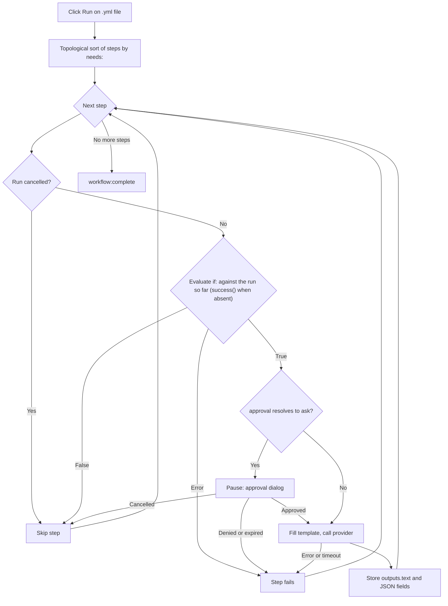

<script setup>
// Skip Vue template processing for the whole page so ${{ }} expressions
// in code spans and fenced YAML blocks are not interpreted as Vue bindings.
</script>

<div v-pre>

# Workflows de Genie

Um **workflow de genie** é um arquivo YAML que encadeia várias etapas de IA em um único pipeline. Enquanto um [AI Genie](/pt-BR/guide/ai-genies) isolado executa um prompt sobre o seu texto, um workflow executa um grafo ordenado de etapas — cada etapa pode chamar um genie, passar sua saída para a etapa seguinte, pedir a sua aprovação ou executar uma pequena ação integrada — e mostra o pipeline inteiro como um diagrama ao vivo enquanto é executado.

::: tip Flag de recurso
Os workflows de genie ficam atrás de uma configuração opcional. Em **Configurações → Avançado**, ative **Ferramentas de desenvolvedor** para revelar o grupo experimental e, em seguida, **Motor de workflow**. Com ela ativada, um arquivo de workflow abre com seu grafo de etapas e uma barra de ferramentas **Executar** / **Cancelar** ao lado do fonte YAML, e os genies de workflow podem ser executados. Com ela desativada, um arquivo de workflow aparece como uma árvore YAML comum, e um genie de workflow no seletor se recusa a ser executado. Arquivos do GitHub Actions não são afetados em nenhum dos casos — eles sempre abrem no [Visualizador de Workflows do GitHub Actions](/pt-BR/guide/workflow-viewer).
:::

## Quando usar um workflow

| Necessidade | Use |
|------|-----|
| Uma única transformação (reescrever, traduzir, resumir) | Um [genie](/pt-BR/guide/ai-genies) em Markdown |
| Esboço → rascunho → polimento, com cada estágio alimentando o seguinte | Um workflow |
| Modelos de IA diferentes para estágios diferentes | Um workflow |
| Um portão de aprovação humana antes de uma etapa cara ou sensível | Um workflow |
| Saída estruturada (JSON) que as etapas seguintes leem campo a campo | Um workflow |

Se um único prompt resolve, escreva um genie em Markdown. Recorra a um workflow apenas quando você precisar compor estágios, encaminhar dados entre eles ou pausar para aprovação.

## Escrevendo um workflow

Um workflow é um arquivo YAML com um nome, padrões opcionais e uma lista ordenada de etapas. Aqui está um exemplo completo e executável — ele reproduz `triage-and-translate.yml`, o exemplo incluído no VMark:

```yaml
name: Triage and Translate
description: Rewrite rough notes into clean English, then translate the result.

defaults:
  approval: auto

steps:
  - id: rewrite
    uses: genie/rewrite-in-english
    with:
      input: "Replace this seed text with the notes you want rewritten before running."

  - id: translate
    uses: genie/translate
    needs: rewrite
    with:
      input: ${{ steps.rewrite.outputs.text }}

  - id: save
    uses: action/save-file
    needs: translate
    with:
      path: triage-and-translate.out.md
      input: ${{ steps.translate.outputs.text }}
```

Este workflow tem três etapas. `rewrite` executa o genie em Markdown incluído `genie/rewrite-in-english` sobre o texto inicial. `translate` espera por ela (`needs: rewrite`) e passa sua saída de texto para `genie/translate`. `save` grava a tradução em `triage-and-translate.out.md` no workspace. O resultado é um grafo de três nós que é executado da esquerda para a direita.

### Arquivo de workflow ou arquivo do GitHub Actions?

Ambos são YAML, e o VMark abre todo arquivo `.yml` / `.yaml` na mesma visão dividida. Ele os distingue assim, nesta ordem:

| Verificação | Workflow do GitHub Actions | Workflow do VMark |
|-------|-------------------------|----------------|
| Caminho sob `.github/workflows/` | Sempre — o GitHub é dono dessa pasta | Nunca |
| `on:` e `jobs:` no nível superior (fora dessa pasta, os dois são necessários) | Sim | Nunca |
| `steps:` no nível superior cujo `uses:` nomeia `genie/`, `action/` ou `webhook/` | Nunca — seus steps ficam dentro de um job | Sim |

Um workflow do VMark também pode ter `on:`, mas nunca `jobs:`: um arquivo com `jobs:` no nível superior nunca é executado. Fora de `.github/workflows/`, ele só abre como GitHub Actions se também tiver `on:` no nível superior; caso contrário, é YAML comum, assim como um arquivo sem nenhum dos dois formatos.

::: info Onde fica o exemplo incluído
O exemplo vem dentro do pacote do aplicativo — `VMark.app/Contents/Resources/resources/workflows/examples/triage-and-translate.yml` no macOS, a pasta `resources` do aplicativo nas outras plataformas — e no [repositório do código-fonte](https://github.com/xiaolai/vmark/blob/main/src-tauri/resources/workflows/examples/triage-and-translate.yml). Ele não é copiado para a sua pasta de genies: para executá-lo como um [genie de workflow](/pt-BR/guide/workflow-genies), copie-o para lá você mesmo e edite o texto inicial.
:::

### Campos de nível superior

| Campo | Obrigatório | Função |
|-------|----------|---------|
| `name` | Sim | Rótulo legível por humanos para o workflow. |
| `description` | Não | Resumo de uma linha. |
| `defaults` | Não | `model`, `approval` e `limits` padrão aplicados a cada etapa (veja [Configurações por etapa](#configuracoes-por-etapa)). |
| `env` | Não | Variáveis de ambiente, legíveis em valores `with:` como `${{ env.NAME }}` ou `${VAR}`. |
| `steps` | Sim | A lista ordenada de etapas. |

### Campos de uma etapa

```yaml
- id: my-step           # required; unique within the workflow
  uses: genie/<name>    # required; what this step runs (see Step types)
  with:                 # inputs to the step
    input: "text or an ${{ ... }} expression"
  needs: prior-step     # optional; a single id or a list of ids
  if: ${{ success() }}  # optional condition (see Conditions)
  approval: ask         # optional; "auto" (default) or "ask"
  model: claude-sonnet  # optional; overrides defaults / genie default
  limits:
    timeout: 120s       # optional; default 300s
    max_tokens: 4096    # optional; REST providers only
```

### Tipos de etapa

O prefixo de `uses:` decide o que uma etapa faz.

| Prefixo `uses:` | Comportamento |
|----------------|----------|
| `genie/<name>` | Carrega o genie em Markdown correspondente, preenche o template do prompt a partir do mapa `with:` da etapa e chama o provedor de IA ativo. |
| `action/read-file` | Lê um caminho relativo ao workspace. O conteúdo do arquivo se torna a saída de texto da etapa. |
| `action/read-folder` | Lê cada arquivo diretamente dentro da pasta relativa ao workspace `with.path` — opcionalmente só os que correspondem a `with.accept` (`*.md`, ou uma lista como `*.md,*.txt`) — em ordem de nome, cada um introduzido por uma linha `--- name ---`. Até 1.000 arquivos, 10 MB por arquivo e 100 MB no total. |
| `action/save-file` | Grava `with.input` em `with.path` (relativo ao workspace). O caminho precisa ser literal — sem expressão `${{ }}` — para que o arquivo possa ser salvo em um snapshot antes da execução (veja [Desfazendo uma execução](#desfazendo-uma-execucao)). |
| `action/notify` | Registra `with.message` no log. |
| `action/copy` | Retorna `with.input` sem alterações — útil para renomear ou distribuir um valor. |

::: warning
Etapas `webhook/*` ainda não são suportadas — um workflow que usa uma é rejeitado antes de ser executado. Genies com saída em arquivo (`output.type: file` / `files`) também ficam para depois.
:::

Uma gravação bem-sucedida de `action/save-file` é registrada pela [Coerência](/pt-BR/guide/coherence), com as etapas de leitura que a alimentaram como entradas, apenas na medida em que **Gravar bloco de identidade ao salvar** (Configurações → Arquivos e imagens) permite: com a opção desativada, nenhuma pasta `.vmark` é criada e nenhum arquivo é marcado, e um workspace que já tem uma registra a gravação apenas para um documento que já acompanha.

## Etapas de genie e aliases em `with:`

Quando uma etapa `genie/<name>` é executada, o VMark carrega o template em Markdown desse genie e preenche seus marcadores `{{...}}` a partir do mapa `with:` da etapa. Essa é a ponte que permite que **genies em Markdown existentes sejam executados sem alterações dentro de workflows**.

As regras de vinculação, em ordem de precedência:

| Marcador | Resolve para | Se ausente |
|-------------|-------------|-----------|
| `{{input}}` | `with.input` | Não vinculado → a etapa falha |
| `{{content}}` | `with.content`, senão `with.input` | Fatal apenas se nenhum dos dois existir |
| `{{context}}` | `with.context`, senão string vazia | Nunca fatal — degrada para `""` |
| `{{any-other-key}}` | `with.<key>` | Não vinculado → a etapa falha |

Espaços dentro das chaves são tolerados: `{{ key }}` funciona da mesma forma que `{{key}}`.

**O alias `{{content}}` é a chave da compatibilidade.** Genies em Markdown escritos para o editor usam `{{content}}` para o texto selecionado. Em um workflow não há seleção, então você fornece `with: { input: "..." }` e o marcador `{{content}}` o capta pela cadeia de aliases. É exatamente disso que o exemplo acima depende — `genie/rewrite-in-english` e `genie/translate` usam `{{content}}` em seus templates, mas o workflow só define `input`.

::: danger Marcadores não vinculados são fatais
Se um template contém um marcador que nada em `with:` resolve — por exemplo `{{topic}}` sem `with.topic` — a etapa falha **antes de qualquer chamada de IA**, com um erro que lista todos os nomes não resolvidos (`Unbound placeholders: {{topic}}`). Isso é proposital: enviar um prompt que ainda contém o literal `{{topic}}` produziria lixo silenciosamente e reportaria sucesso falsamente. As únicas flexibilizações seguras são os dois aliases acima (`{{content}}` e `{{context}}`).
:::

### `{{context}}` em workflows

No editor, `{{context}}` é preenchido com o texto ao redor da sua seleção. Um workflow não tem editor, então `{{context}}` degrada para a string vazia, a menos que você forneça `with.context` explicitamente. Genies que realmente dependem do contexto ao redor precisam recebê-lo:

```yaml
- id: rewrite
  uses: genie/fit-to-surroundings
  with:
    input: ${{ steps.draft.outputs.text }}
    context: "House style: terse, present tense, no marketing language."
```

## Conectando etapas: expressões

Dentro de qualquer valor `with:`, você pode referenciar etapas anteriores e variáveis de ambiente.

| Sintaxe | Resolve para |
|--------|-------------|
| `${{ steps.ID.outputs.FIELD }}` | Um campo de saída específico de uma etapa anterior. |
| `${{ steps.ID.output }}` | Forma abreviada de `${{ steps.ID.outputs.text }}`. |
| `${{ env.NAME }}` | Um valor de `env:` do workflow. |
| `${VAR}` | O mesmo que `${{ env.VAR }}`, forma legada. |
| `stepId.output` (apenas o valor inteiro) | Alias legado para `${{ steps.stepId.outputs.text }}`. |

As referências são resolvidas antes de qualquer chamada de IA. Uma referência a uma etapa desconhecida (`${{ steps.typo.outputs.text }}`) ou a um campo que uma etapa nunca produziu (`${{ steps.outline.outputs.missing }}`) faz a etapa falhar com uma mensagem clara — ela nunca passa um valor vazio silenciosamente. A única exceção: uma etapa que legitimamente produziu uma resposta vazia resolve para a string vazia, não para um erro.

## Saídas estruturadas

Por padrão, uma etapa de genie armazena seu resultado em `outputs.text`, e `${{ steps.ID.output }}` o lê. Um genie também pode declarar uma saída estruturada (JSON) em seu frontmatter:

```yaml
output:
  type: json
  schema:
    title: string
    tags: array
```

Quando um genie assim é executado em um workflow, o VMark analisa a resposta como JSON, verifica se cada campo declarado está presente com o tipo primitivo correto e expõe cada campo de nível superior individualmente:

```yaml
- id: classify
  uses: genie/extract-metadata
  with:
    input: ${{ steps.read.output }}

- id: save
  uses: action/save-file
  needs: classify
  with:
    path: "meta.txt"
    input: ${{ steps.classify.outputs.title }}
```

A validação do schema é intencionalmente mínima — ela confirma que as chaves obrigatórias existem e que seus tipos correspondem. Ela não impõe comprimentos, padrões nem formatos aninhados. Se a resposta não for JSON válido, ou se faltar um campo obrigatório, a etapa falha com um erro específico. Apenas os tipos de saída `text` e `json` são suportados hoje; `file`, `files` e `pipe` não são.

## Condições

Uma etapa pode ter uma condição `if:`. Se ela for avaliada como falsa, a etapa é pulada (não falha). Há três funções de status disponíveis, e elas seguem as regras do GitHub Actions:

| Condição | Verdadeira quando |
|-----------|---------|
| `success()` | Nenhuma etapa falhou até agora, **e** todas as etapas de que esta depende (`needs`) foram concluídas. |
| `failure()` | Qualquer etapa anterior da execução falhou — não apenas uma etapa de que esta depende (`needs`). |
| `always()` | Sempre. |

`success()` é o padrão. Uma etapa sem `if:` só é executada quando `success()` é verdadeira, e o mesmo vale para uma etapa cujo `if:` não menciona nenhuma das três funções — `if: X` significa `success() && (X)`. É isso que impede que uma etapa comum seja executada depois de uma falha.

| O que aconteceu antes | Etapa comum ou `success()` | Etapa `failure()` | Etapa `always()` |
|---|---|---|---|
| Tudo de que ela depende foi bem-sucedido | é executada | é pulada | é executada |
| Uma etapa de que ela depende **falhou** (ou estourou o tempo, ou teve a aprovação negada) | é pulada | é executada | é executada |
| Uma etapa de que ela depende foi **pulada** pelo seu próprio `if:` | é pulada | é pulada — nada falhou | é executada |
| A execução foi **cancelada** | é pulada | é pulada | é pulada |

Um cancelamento não é algo que uma condição consiga ver: ele é verificado antes do `if:`, e todas as etapas restantes são puladas com *Workflow cancelled*, inclusive as etapas `always()`. Uma execução em que uma etapa falhou ainda termina como **falha** e indica a primeira etapa que falhou, mesmo quando etapas `failure()` ou `always()` foram executadas depois.

Você pode combinar referências e comparações, por exemplo `${{ steps.classify.outputs.title == "Draft" }}`. Uma condição malformada ou não suportada **faz a etapa falhar ruidosamente** em vez de passar em silêncio — não existe o recurso de "assumir verdadeiro em caso de erro".

## Configurações por etapa

`model`, `approval` e `limits` podem ser definidos em três níveis. O mais específico vence.

| Campo | Precedência (maior primeiro) |
|-------|----------------------------|
| `model` | `model:` da etapa → `model` do próprio genie → `defaults.model` do workflow → padrão do provedor |
| `approval` | `approval:` da etapa → `approval` do genie → `defaults.approval` do workflow → `auto` |
| `timeout` | `limits.timeout` da etapa → `defaults.limits.timeout` do workflow → 300 s |
| `max_tokens` | `limits.max_tokens` da etapa → `defaults.limits.max_tokens` → padrão do provedor (**apenas provedores REST**) |

`max_tokens` só é aplicado para provedores REST (Anthropic, OpenAI, Google AI, Ollama). Provedores CLI (claude, codex, gemini) aceitam o campo, mas não o aplicam; um único aviso é registrado por execução se alguma etapa CLI o definir.

### Timeouts

Cada etapa é envolvida pelo seu timeout efetivo. Quando ele se esgota, a etapa falha com `Timed out after Xs`: o processo filho de um provedor CLI é encerrado; uma requisição REST em andamento é descartada. Uma etapa que estourou o tempo conta como falha: as etapas que dependem dela são puladas, a menos que o `if:` delas use `failure()` ou `always()`. Também há um limite rígido de 5 MB para a saída coletada de uma única etapa — um provedor descontrolado é cancelado com `Provider output exceeded 5 MB cap`.

## Aprovações

Defina `approval: ask` em uma etapa (ou `defaults.approval: ask` para o workflow inteiro) para pausar antes de essa etapa chamar o provedor. O executor emite um pedido de aprovação e aparece uma caixa de diálogo mostrando:

- O id da etapa.
- O modelo resolvido.
- Uma prévia do prompt preenchido (os primeiros 500 caracteres).

Escolha **Aprovar** para executar a etapa, ou **Negar** (Esc também nega) para fazê-la falhar com `Approval denied by user`. A aprovação espera pelo menor valor entre o timeout da etapa e um teto de 10 minutos; se expirar, a etapa falha com `Approval timed out`. Fechar a janela ou descartar a caixa de diálogo de qualquer outra forma é tratado como uma negação.

## Executando um workflow

Abra um arquivo de workflow `.yml` / `.yaml` em um workspace (workflows exigem um workspace aberto — as etapas de ação validam caminhos em relação à raiz do workspace). O arquivo abre em uma visão dividida: o fonte YAML à esquerda e, à direita, as etapas como um grafo interativo sob uma barra de ferramentas. A alternância **Fonte / Dividido / Visualização** troca o layout, como em qualquer arquivo YAML.

| Controle | Ícone | Ação |
|---------|------|--------|
| Executar | ▶ | Inicia o workflow deste arquivo, exatamente como está no editor — salvo ou não. Fica desabilitado enquanto o arquivo tem um erro de análise, enquanto um workflow está em execução ou sem pasta aberta; a barra de ferramentas diz qual é o motivo. |
| Cancelar | ◼ | Substitui Executar enquanto o workflow deste arquivo está em execução. Interrompe a execução, encerra qualquer processo filho CLI em andamento e descarta as requisições REST em andamento. |
| Restaurar arquivos | — | Aparece depois de uma execução que gravou arquivos. Veja [Desfazendo uma execução](#desfazendo-uma-execucao). |

À medida que a execução avança, cada nó é atualizado ao vivo — em execução, concluído, pulado ou com erro — para que você acompanhe o pipeline avançando e veja exatamente qual etapa falhou, se alguma falhar. Quando termina, a barra de ferramentas informa se a execução foi concluída, falhou ou foi cancelada. Se o backend se recusar a iniciar uma execução — o motor está desativado, o YAML não é validado, o snapshot falhou — uma notificação diz o motivo.

Apenas um workflow é executado por vez em todo o aplicativo, não por janela. Enquanto um está em execução, Executar fica desabilitado em todos os outros arquivos de workflow **na mesma janela**, e a barra de ferramentas diz *Outro workflow está em execução*. Um arquivo de workflow em outra janela ainda mostra Executar habilitado; clicar nele é recusado com *Já existe um fluxo de trabalho em execução. Aguarde a conclusão ou cancele-o.* Um genie de workflow iniciado nesse meio-tempo também é recusado.

### Desfazendo uma execução

Antes de uma execução que tem etapas `action/save-file`, o VMark copia cada arquivo que essas etapas vão gravar (até 64 MB por arquivo e 256 MB no total) para um snapshot na sua pasta de dados do aplicativo, e anota quais deles ainda não existem. Se o snapshot não puder ser feito, o workflow não é executado.

Quando a execução termina, a barra de ferramentas oferece **Restaurar arquivos**. Depois que você confirma, o VMark devolve cada arquivo do snapshot ao estado em que estava antes da execução e apaga os arquivos que a execução criou. As edições feitas nesses arquivos desde a execução são perdidas. Se a restauração recupera todos os arquivos, o botão desaparece; se precisou pular algum, ele continua disponível para você tentar de novo. Um arquivo que não pode ser restaurado — porque sua pasta foi substituída por um link que leva para fora do workspace, por exemplo — é deixado como está e contado na notificação. A restauração é recusada enquanto qualquer workflow estiver em execução.

### Fluxo de execução



## Compartilhando o diagrama

O grafo de etapas de um workflow de genie não tem controle de exportação. O canvas do [Visualizador de Workflows do GitHub Actions](/pt-BR/guide/workflow-viewer), construído sobre a mesma biblioteca React Flow, tem um com três opções:

| Exportação | Resultado |
|--------|--------|
| Copiar como Mermaid | Copia um `flowchart` Mermaid do grafo para a área de transferência (uma aproximação textual com perdas). |
| Exportar como SVG | Salva o canvas renderizado como um SVG vetorial. |
| Exportar como PNG | Salva o canvas renderizado como um PNG rasterizado. |

Mermaid e SVG são indicados como aproximações com perdas do canvas ao vivo; o PNG é um instantâneo em pixels.

## Veja também

- [AI Genies](/pt-BR/guide/ai-genies) — o formato de genie em Markdown e como criar um.
- [Provedores de IA](/pt-BR/guide/ai-providers) — como configurar o provedor CLI ou REST que as etapas do workflow chamam.
- [Visualizador de Workflows do GitHub Actions](/pt-BR/guide/workflow-viewer) — o canvas compartilhado e seu controle de exportação.

</div>
