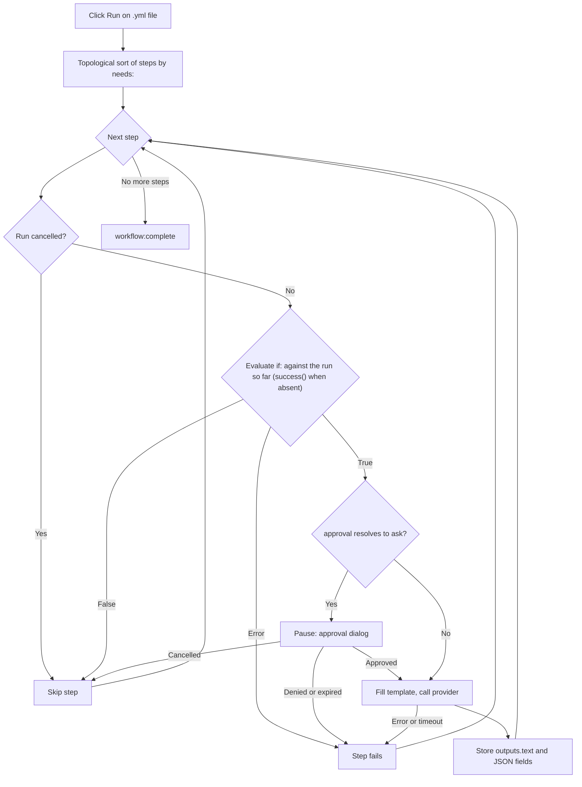

<script setup>
// Skip Vue template processing for the whole page so ${{ }} expressions
// in code spans and fenced YAML blocks are not interpreted as Vue bindings.
</script>

<div v-pre>

# Genie 工作流

**Genie 工作流**（精灵工作流）是一个 YAML 文件，它把多个 AI 步骤串接成一条流水线。单个 [AI 精灵](/zh-CN/guide/ai-genies) 是对你的文本运行一个提示词，而工作流运行的是一张有序的步骤图——每个步骤可以调用一个精灵、把输出传给下一个步骤、请求你的审批，或运行一个小型内置操作——并在运行过程中以实时图表的形式向你展示整条流水线。

::: tip 功能开关
Genie 工作流受一个需要手动开启的设置控制。在 **设置 → 高级** 中，先打开 **开发者工具** 以显示实验性功能分组，再打开 **工作流引擎**。开启后，工作流文件会在 YAML 源码旁显示其步骤图以及 **运行** / **取消** 工具栏，工作流精灵也可以运行。关闭时，工作流文件显示为普通的 YAML 树，选择器中的工作流精灵也会拒绝运行。GitHub Actions 文件不受任何影响——它们始终在 [GitHub Actions 工作流查看器](/zh-CN/guide/workflow-viewer) 中打开。
:::

## 何时使用工作流

| 需求 | 使用 |
|------|-----|
| 单次转换（改写、翻译、摘要） | Markdown [精灵](/zh-CN/guide/ai-genies) |
| 大纲 → 草稿 → 润色，每个阶段的输出作为下一阶段的输入 | 工作流 |
| 不同阶段使用不同 AI 模型 | 工作流 |
| 在昂贵或敏感的步骤之前设置人工审批关卡 | 工作流 |
| 结构化（JSON）输出，供下游步骤按字段读取 | 工作流 |

如果一个提示词就够用，就写一个 Markdown 精灵。只有在需要组合多个阶段、在阶段之间传递数据，或暂停等待审批时，才使用工作流。

## 编写工作流

工作流是一个 YAML 文件，包含名称、可选的默认值，以及一个有序的步骤列表。下面是一个完整、可运行的示例——它与 VMark 附带的示例 `triage-and-translate.yml` 相同：

```yaml
name: Triage and Translate
description: Rewrite rough notes into clean English, then translate the result.

defaults:
  approval: auto

steps:
  - id: rewrite
    uses: genie/rewrite-in-english
    with:
      input: "Replace this seed text with the notes you want rewritten before running."

  - id: translate
    uses: genie/translate
    needs: rewrite
    with:
      input: ${{ steps.rewrite.outputs.text }}

  - id: save
    uses: action/save-file
    needs: translate
    with:
      path: triage-and-translate.out.md
      input: ${{ steps.translate.outputs.text }}
```

这个工作流有三个步骤。`rewrite` 对种子文本运行内置的 Markdown 精灵 `genie/rewrite-in-english`。`translate` 等待它完成（`needs: rewrite`），并把它的文本输出交给 `genie/translate`。`save` 把译文写入工作区中的 `triage-and-translate.out.md`。结果是一张从左到右运行的三节点图。

### 工作流文件还是 GitHub Actions 文件？

两者都是 YAML，VMark 会在同一种分屏视图中打开每个 `.yml` / `.yaml` 文件。它按以下顺序区分二者：

| 检查项 | GitHub Actions 工作流 | VMark 工作流 |
|-------|-------------------------|----------------|
| 路径位于 `.github/workflows/` 下 | 总是——GitHub 拥有该文件夹 | 从不 |
| 顶层有 `on:` 和 `jobs:`（在该文件夹之外，两者都需要） | 是 | 从不 |
| 顶层有 `steps:`，且其 `uses:` 指向 `genie/`、`action/` 或 `webhook/` | 从不——它的步骤位于 job 之内 | 是 |

VMark 工作流也可以有 `on:`，但绝不会有 `jobs:`：带有顶层 `jobs:` 的文件绝不会运行。在 `.github/workflows/` 之外，只有同时带有顶层 `on:` 时才会作为 GitHub Actions 打开，否则就是普通的 YAML；两种结构都不具备的文件同样是普通的 YAML。

::: info 内置示例的位置
该示例随应用包一起发布——在 macOS 上位于 `VMark.app/Contents/Resources/resources/workflows/examples/triage-and-translate.yml`，在其他平台上位于应用的 `resources` 文件夹——也可以在[源代码仓库](https://github.com/xiaolai/vmark/blob/main/src-tauri/resources/workflows/examples/triage-and-translate.yml)中找到。它不会被复制到你的精灵文件夹：要把它作为[工作流精灵](/zh-CN/guide/workflow-genies)运行，请自行把它复制到那里并编辑种子文本。
:::

### 顶层字段

| 字段 | 是否必填 | 用途 |
|-------|----------|---------|
| `name` | 是 | 工作流的人类可读标签。 |
| `description` | 否 | 一行简介。 |
| `defaults` | 否 | 应用于每个步骤的默认 `model`、`approval` 和 `limits`（参见[按步骤设置](#按步骤设置)）。 |
| `env` | 否 | 环境变量，可在 `with:` 值中以 `${{ env.NAME }}` 或 `${VAR}` 读取。 |
| `steps` | 是 | 有序的步骤列表。 |

### 步骤字段

```yaml
- id: my-step           # required; unique within the workflow
  uses: genie/<name>    # required; what this step runs (see Step types)
  with:                 # inputs to the step
    input: "text or an ${{ ... }} expression"
  needs: prior-step     # optional; a single id or a list of ids
  if: ${{ success() }}  # optional condition (see Conditions)
  approval: ask         # optional; "auto" (default) or "ask"
  model: claude-sonnet  # optional; overrides defaults / genie default
  limits:
    timeout: 120s       # optional; default 300s
    max_tokens: 4096    # optional; REST providers only
```

### 步骤类型

`uses:` 前缀决定步骤做什么。

| `uses:` 前缀 | 行为 |
|----------------|----------|
| `genie/<name>` | 加载匹配的 Markdown 精灵，用步骤的 `with:` 映射填充其提示词模板，并调用当前激活的 AI 提供商。 |
| `action/read-file` | 读取一个相对于工作区的路径。文件正文成为该步骤的文本输出。 |
| `action/read-folder` | 读取相对于工作区的文件夹 `with.path` 中直接包含的每个文件——可选地只读取匹配 `with.accept` 的文件（`*.md`，或诸如 `*.md,*.txt` 的列表）——按名称排序，每个文件以一行 `--- name ---` 开头。最多 1,000 个文件，每个文件 10 MB，总计 100 MB。 |
| `action/save-file` | 把 `with.input` 写入 `with.path`（相对于工作区）。路径必须是字面值——不能使用 `${{ }}` 表达式——这样才能在运行前为该文件创建快照（参见[撤销一次运行](#撤销一次运行)）。 |
| `action/notify` | 记录 `with.message`。 |
| `action/copy` | 原样返回 `with.input`——便于为某个值重命名或扇出。 |

::: warning
`webhook/*` 步骤尚不支持——使用它的工作流会在运行前被拒绝。文件输出型精灵（`output.type: file` / `files`）同样被推迟支持。
:::

成功的 `action/save-file` 写入会被[一致性](/zh-CN/guide/coherence)记录下来，并把为它提供输入的读取步骤记为输入，但仅限于 **保存时写入标识块**（设置 → 文件与图片）所允许的范围：该设置关闭时，不会创建 `.vmark` 文件夹，也不会给任何文件写入标识块；已有 `.vmark` 文件夹的工作区只会为它已跟踪的文档记录这次写入。

## 精灵步骤与 `with:` 别名

当一个 `genie/<name>` 步骤运行时，VMark 会加载该精灵的 Markdown 模板，并用步骤的 `with:` 映射填充其中的 `{{...}}` 占位符。正是这座桥梁让**现有的 Markdown 精灵无需改动即可在工作流中运行**。

绑定规则按优先级排列如下：

| 占位符 | 解析为 | 缺失时 |
|-------------|-------------|-----------|
| `{{input}}` | `with.input` | 未绑定 → 步骤失败 |
| `{{content}}` | `with.content`，否则 `with.input` | 仅当两者都不存在时才致命 |
| `{{context}}` | `with.context`，否则为空字符串 | 永不致命——降级为 `""` |
| `{{any-other-key}}` | `with.<key>` | 未绑定 → 步骤失败 |

花括号内可以有空白：`{{ key }}` 与 `{{key}}` 效果相同。

**`{{content}}` 别名是兼容性的关键**。为编辑器编写的 Markdown 精灵用 `{{content}}` 表示选中的文本。工作流中没有选区，所以你提供 `with: { input: "..." }`，`{{content}}` 占位符会通过别名链取到它。上面的示例正是依赖这一点——`genie/rewrite-in-english` 和 `genie/translate` 的模板都使用 `{{content}}`，而工作流始终只设置了 `input`。

::: danger 未绑定的占位符是致命错误
如果模板中含有 `with:` 无法解析的占位符——例如有 `{{topic}}` 却没有 `with.topic`——该步骤会**在发起任何 AI 调用之前**失败，并给出列出所有未解析名称的错误（`Unbound placeholders: {{topic}}`）。这是有意为之：发送一个仍包含字面 `{{topic}}` 的提示词会悄无声息地产生垃圾结果，并错误地报告成功。唯一安全的放宽就是上面的两个别名（`{{content}}` 和 `{{context}}`）。
:::

### 工作流中的 `{{context}}`

在编辑器中，`{{context}}` 会填入选区周围的文本。工作流没有编辑器，因此除非你显式提供 `with.context`，否则 `{{context}}` 会降级为空字符串。真正依赖周边上下文的精灵必须把它传进去：

```yaml
- id: rewrite
  uses: genie/fit-to-surroundings
  with:
    input: ${{ steps.draft.outputs.text }}
    context: "House style: terse, present tense, no marketing language."
```

## 把步骤连接起来：表达式

在任意 `with:` 值中，你都可以引用之前的步骤和环境变量。

| 语法 | 解析为 |
|--------|-------------|
| `${{ steps.ID.outputs.FIELD }}` | 前序步骤的某个特定输出字段。 |
| `${{ steps.ID.output }}` | `${{ steps.ID.outputs.text }}` 的简写。 |
| `${{ env.NAME }}` | 工作流 `env:` 中的某个值。 |
| `${VAR}` | 与 `${{ env.VAR }}` 相同，旧式写法。 |
| `stepId.output`（仅限整个值） | `${{ steps.stepId.outputs.text }}` 的旧式别名。 |

引用会在任何 AI 调用之前解析。对未知步骤的引用（`${{ steps.typo.outputs.text }}`），或对某个步骤从未产生的字段的引用（`${{ steps.outline.outputs.missing }}`），都会让该步骤失败并给出明确的信息——绝不会悄悄传入一个空值。唯一的例外是：确实产生了空响应的步骤会解析为空字符串，而不是错误。

## 结构化输出

默认情况下，精灵步骤把结果存放在 `outputs.text` 下，`${{ steps.ID.output }}` 读取的就是它。精灵也可以在其 frontmatter 中声明结构化（JSON）输出：

```yaml
output:
  type: json
  schema:
    title: string
    tags: array
```

当这样的精灵在工作流中运行时，VMark 会把响应解析为 JSON，检查每个声明的字段都存在且基本类型正确，并把每个顶层字段单独公开：

```yaml
- id: classify
  uses: genie/extract-metadata
  with:
    input: ${{ steps.read.output }}

- id: save
  uses: action/save-file
  needs: classify
  with:
    path: "meta.txt"
    input: ${{ steps.classify.outputs.title }}
```

结构校验被有意保持在最低限度——它只确认必需的键存在且类型匹配，不检查长度、模式或嵌套结构。如果响应不是有效的 JSON，或缺少某个必需字段，该步骤会以具体的错误失败。目前只支持 `text` 和 `json` 两种输出类型；`file`、`files` 和 `pipe` 均不支持。

## 条件

步骤可以带有 `if:` 条件。如果它求值为假，该步骤会被跳过（而不是失败）。可用的状态函数有三个，它们遵循 GitHub Actions 的规则：

| 条件 | 何时为真 |
|-----------|-----------|
| `success()` | 到目前为止没有任何步骤失败，**并且**本步骤 `needs` 的每个步骤都已完成。 |
| `failure()` | 本次运行中任何更早的步骤失败——不仅限于本步骤 `needs` 的步骤。 |
| `always()` | 始终。 |

`success()` 是默认值。没有 `if:` 的步骤只在 `success()` 成立时运行；`if:` 中没有提到这三个函数中任何一个的步骤也是如此——`if: X` 的含义是 `success() && (X)`。正是这一点让普通步骤不会在失败之后运行。

| 之前发生了什么 | 普通步骤或 `success()` 步骤 | `failure()` 步骤 | `always()` 步骤 |
|---|---|---|---|
| 它所需的步骤全部成功 | 运行 | 跳过 | 运行 |
| 它所需的某个步骤**失败**（或超时，或其审批被拒绝） | 跳过 | 运行 | 运行 |
| 它所需的某个步骤因自身的 `if:` 而被**跳过** | 跳过 | 跳过——没有任何失败 | 运行 |
| 运行被**取消** | 跳过 | 跳过 | 跳过 |

取消不是条件能够感知到的：它在 `if:` 之前检查，所有剩余步骤都会以 *工作流已取消* 被跳过，`always()` 步骤也不例外。如果某次运行中有步骤失败，即使之后运行了 `failure()` 或 `always()` 步骤，这次运行仍然以**失败**结束，并指出第一个失败的步骤。

你可以组合引用与比较，例如 `${{ steps.classify.outputs.title == "Draft" }}`。格式错误或不受支持的条件会**让该步骤明确失败**，而不是悄悄放行——不存在“出错时视为真”的回退。

## 按步骤设置

`model`、`approval` 和 `limits` 可以在三个层级上设置，最具体的那一层优先。

| 字段 | 优先级（从高到低） |
|-------|----------------------------|
| `model` | 步骤的 `model:` → 精灵自己的 `model` → 工作流的 `defaults.model` → 提供商默认值 |
| `approval` | 步骤的 `approval:` → 精灵的 `approval` → 工作流的 `defaults.approval` → `auto` |
| `timeout` | 步骤的 `limits.timeout` → 工作流的 `defaults.limits.timeout` → 300 秒 |
| `max_tokens` | 步骤的 `limits.max_tokens` → `defaults.limits.max_tokens` → 提供商默认值（**仅 REST 提供商**） |

`max_tokens` 只对 REST 提供商（Anthropic、OpenAI、Google AI、Ollama）生效。CLI 提供商（claude、codex、gemini）接受该字段但不会执行它；如果某次运行中有任何 CLI 步骤设置了它，会记录一条警告（每次运行仅一条）。

### 超时

每个步骤都包裹在其有效超时之内。超时后，该步骤以 `Timed out after Xs` 失败：CLI 提供商的子进程会被杀死，在途的 REST 请求会被丢弃。超时的步骤视为失败：依赖它的步骤会被跳过，除非它们的 `if:` 使用了 `failure()` 或 `always()`。此外，单个步骤收集的输出还有 5 MB 的硬性上限——失控的提供商会被取消，并报 `Provider output exceeded 5 MB cap`。

## 审批

在某个步骤上设置 `approval: ask`（或为整个工作流设置 `defaults.approval: ask`），即可在该步骤调用提供商之前暂停。运行器会发出一个审批请求，并弹出对话框，显示：

- 步骤 id。
- 解析后的模型。
- 已填充提示词的预览（前 500 个字符）。

选择 **批准** 运行该步骤，或选择 **拒绝**（Esc 同样表示拒绝），让该步骤以 `Approval denied by user` 失败。审批的等待时间取步骤超时与 10 分钟上限中的较小值；超时后，该步骤以 `Approval timed out` 失败。关闭窗口或以其他方式丢弃对话框，都视为拒绝。

## 运行工作流

在工作区中打开一个工作流 `.yml` / `.yaml` 文件（工作流需要打开工作区——操作步骤会根据工作区根目录校验路径）。文件会以分屏视图打开：左侧是 YAML 源码，右侧是工具栏下方以交互式图表呈现的步骤。**源代码 / 分屏 / 预览** 切换按钮用于切换布局，和其他 YAML 文件一样。

| 控件 | 图标 | 操作 |
|---------|------|--------|
| 运行 | ▶ | 启动此文件中的工作流，完全按编辑器中的内容运行——无论是否已保存。当文件存在解析错误、已有工作流正在运行，或没有打开文件夹时禁用；工具栏会说明原因。 |
| 取消 | ◼ | 在此文件的工作流执行期间取代“运行”。停止运行，杀死任何在途的 CLI 子进程，并丢弃在途的 REST 请求。 |
| 恢复文件 | — | 在写入过文件的运行结束后出现。参见[撤销一次运行](#撤销一次运行)。 |

随着运行推进，每个节点都会实时更新——运行中、成功、跳过或出错——因此你可以看着流水线前进，并在出错时准确看到是哪一步失败。运行结束时，工具栏会说明它是已完成、失败还是被取消。如果后端拒绝启动运行——引擎已关闭、YAML 校验未通过、快照失败——会有通知说明原因。

整个应用同一时间只能运行一个工作流，而不是每个窗口一个。一个工作流运行期间，**同一窗口中**其他所有工作流文件里的“运行”都会被禁用，工具栏会显示 *另一个工作流正在运行*。另一个窗口中的工作流文件仍显示“运行”可用；点击它会被拒绝，并提示 *已有工作流正在运行。请等待其完成或取消后再试。* 期间启动的工作流精灵同样会被拒绝。

### 撤销一次运行

在运行一个包含 `action/save-file` 步骤的工作流之前，VMark 会把这些步骤将要写入的每个文件（每个文件最多 64 MB，总计最多 256 MB）复制到其应用数据文件夹中的一份快照里，并记下其中哪些文件尚不存在。如果无法创建快照，工作流根本不会运行。

运行结束后，工具栏会提供 **恢复文件**。确认之后，VMark 会把每个快照中的文件恢复到运行之前的样子，并删除这次运行新建的文件。运行之后对这些文件所做的编辑会丢失。如果所有文件都恢复了，该按钮就会消失；如果有文件被跳过，按钮会保留，方便你重试。无法恢复的文件——例如它所在的文件夹被替换成了一个指向工作区之外的链接——会保持原样，并计入通知中。任何工作流正在运行时，恢复都会被拒绝。

### 执行流程



## 分享图表

Genie 工作流的步骤图没有导出控件。[GitHub Actions 工作流查看器](/zh-CN/guide/workflow-viewer)的画布基于同一个 React Flow 库构建，它有一个导出控件，提供三个选项：

| 导出 | 结果 |
|--------|--------|
| 复制为 Mermaid | 把图表的 Mermaid `flowchart` 复制到剪贴板（有损的文本近似）。 |
| 导出为 SVG | 把渲染后的画布保存为矢量 SVG。 |
| 导出为 PNG | 把渲染后的画布保存为位图 PNG。 |

Mermaid 和 SVG 被标注为实时画布的有损近似；PNG 是像素快照。

## 另请参阅

- [AI 精灵](/zh-CN/guide/ai-genies)——Markdown 精灵格式及其编写方法。
- [AI 提供商](/zh-CN/guide/ai-providers)——配置工作流步骤所调用的 CLI 或 REST 提供商。
- [GitHub Actions 工作流查看器](/zh-CN/guide/workflow-viewer)——共享的画布及其导出控件。

</div>
