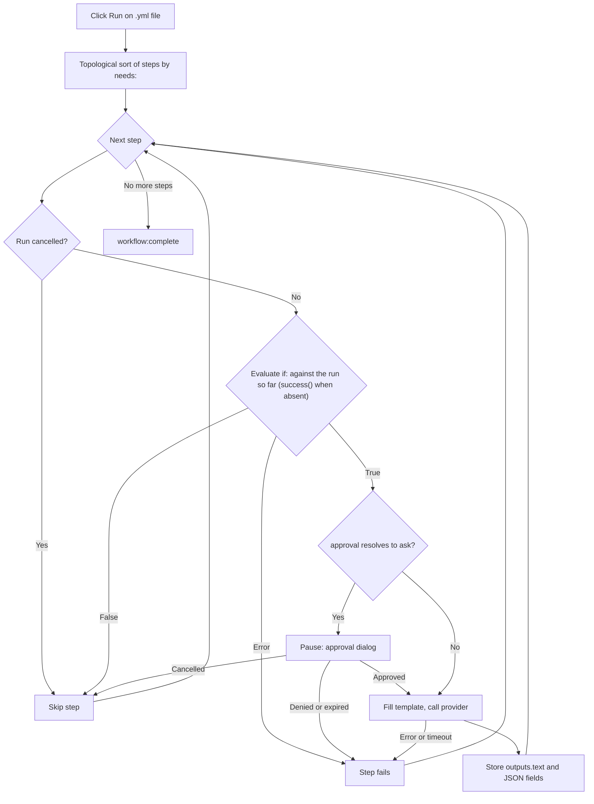

<script setup>
// Skip Vue template processing for the whole page so ${{ }} expressions
// in code spans and fenced YAML blocks are not interpreted as Vue bindings.
</script>

<div v-pre>

# 精靈工作流程

**精靈工作流程**是一份 YAML 檔案，把多個 AI 步驟串成一條流程。單一 [AI 精靈](/zh-TW/guide/ai-genies)只對你的文字執行一個提示詞；工作流程則執行一張有順序的步驟圖——每個步驟都可以呼叫一個精靈、把輸出傳給下一個步驟、請你核准，或執行一個小型的內建動作——並在執行時以即時圖表呈現整條流程。

::: tip 功能旗標
精靈工作流程需要手動開啟。在 **設定 → 進階** 中開啟 **開發者工具** 以顯示實驗性群組，再開啟 **工作流程引擎**。開啟後，工作流程檔案會在 YAML 原始碼旁顯示其步驟圖以及 **執行** / **取消** 工具列，工作流程精靈也能執行。關閉時，工作流程檔案會顯示為一般的 YAML 樹狀結構，挑選器中的工作流程精靈也會拒絕執行。GitHub Actions 檔案不受任何影響——它們一律在 [GitHub Actions 工作流程檢視器](/zh-TW/guide/workflow-viewer)中開啟。
:::

## 何時使用工作流程

| 需求 | 使用 |
|------|-----|
| 單一轉換（改寫、翻譯、摘要） | Markdown [精靈](/zh-TW/guide/ai-genies) |
| 大綱 → 草稿 → 潤飾，每個階段餵給下一個階段 | 工作流程 |
| 不同階段使用不同的 AI 模型 | 工作流程 |
| 在昂貴或敏感的步驟之前設置人工核准關卡 | 工作流程 |
| 下游步驟逐欄讀取的結構化（JSON）輸出 | 工作流程 |

如果單一提示詞就能完成，就寫一個 Markdown 精靈。只有在需要組合多個階段、在階段之間傳遞資料，或暫停等待核准時，才改用工作流程。

## 撰寫工作流程

工作流程是一份 YAML 檔案，包含名稱、選用的預設值，以及依序排列的步驟清單。以下是一個完整、可執行的範例——它與 VMark 隨附的範例 `triage-and-translate.yml` 相同：

```yaml
name: Triage and Translate
description: Rewrite rough notes into clean English, then translate the result.

defaults:
  approval: auto

steps:
  - id: rewrite
    uses: genie/rewrite-in-english
    with:
      input: "Replace this seed text with the notes you want rewritten before running."

  - id: translate
    uses: genie/translate
    needs: rewrite
    with:
      input: ${{ steps.rewrite.outputs.text }}

  - id: save
    uses: action/save-file
    needs: translate
    with:
      path: triage-and-translate.out.md
      input: ${{ steps.translate.outputs.text }}
```

這個工作流程有三個步驟。`rewrite` 對種子文字執行內建的 `genie/rewrite-in-english` Markdown 精靈。`translate` 等待它完成（`needs: rewrite`），並把它的文字輸出餵給 `genie/translate`。`save` 把翻譯結果寫入工作區中的 `triage-and-translate.out.md`。結果是一張由左至右執行的三節點圖。

### 工作流程檔案還是 GitHub Actions 檔案？

兩者都是 YAML，VMark 也會以同一種分割檢視開啟每個 `.yml` / `.yaml` 檔案。它依下列順序區分兩者：

| 檢查 | GitHub Actions 工作流程 | VMark 工作流程 |
|-------|-------------------------|----------------|
| 路徑位於 `.github/workflows/` 之下 | 一律是——這個資料夾歸 GitHub 所有 | 從不 |
| 最上層有 `on:` 與 `jobs:`（在該資料夾之外，兩者都需要） | 是 | 從不 |
| 最上層有 `steps:`，且其 `uses:` 指向 `genie/`、`action/` 或 `webhook/` | 從不——它的步驟位於 job 之內 | 是 |

VMark 工作流程也可以有 `on:`，但絕不會有 `jobs:`：具有最上層 `jobs:` 的檔案永遠不會被執行。在 `.github/workflows/` 之外，只有同時具有最上層 `on:` 時才會以 GitHub Actions 開啟，否則就是一般的 YAML；兩種形狀都不符合的檔案同樣是一般的 YAML。

::: info 內建範例的位置
範例隨附在應用程式套件中——macOS 上位於 `VMark.app/Contents/Resources/resources/workflows/examples/triage-and-translate.yml`，其他平台則位於應用程式的 `resources` 資料夾——也可以在[原始碼儲存庫](https://github.com/xiaolai/vmark/blob/main/src-tauri/resources/workflows/examples/triage-and-translate.yml)中找到。它不會被複製到你的精靈資料夾：若要把它當作[工作流程精靈](/zh-TW/guide/workflow-genies)執行，請自行將它複製過去並編輯種子文字。
:::

### 最上層欄位

| 欄位 | 必填 | 用途 |
|-------|----------|---------|
| `name` | 是 | 工作流程的易讀標籤。 |
| `description` | 否 | 單行摘要。 |
| `defaults` | 否 | 套用到每個步驟的預設 `model`、`approval` 與 `limits`（參見[單步驟設定](#單步驟設定)）。 |
| `env` | 否 | 環境變數，可在 `with:` 值中以 `${{ env.NAME }}` 或 `${VAR}` 讀取。 |
| `steps` | 是 | 依序排列的步驟清單。 |

### 步驟欄位

```yaml
- id: my-step           # required; unique within the workflow
  uses: genie/<name>    # required; what this step runs (see Step types)
  with:                 # inputs to the step
    input: "text or an ${{ ... }} expression"
  needs: prior-step     # optional; a single id or a list of ids
  if: ${{ success() }}  # optional condition (see Conditions)
  approval: ask         # optional; "auto" (default) or "ask"
  model: claude-sonnet  # optional; overrides defaults / genie default
  limits:
    timeout: 120s       # optional; default 300s
    max_tokens: 4096    # optional; REST providers only
```

### 步驟類型

`uses:` 的前綴決定步驟要做什麼。

| `uses:` 前綴 | 行為 |
|----------------|----------|
| `genie/<name>` | 載入對應的 Markdown 精靈，以該步驟的 `with:` 對應表填入其提示詞範本，再呼叫目前啟用的 AI 供應商。 |
| `action/read-file` | 讀取相對於工作區的路徑。檔案內容成為該步驟的文字輸出。 |
| `action/read-folder` | 依名稱順序讀取相對於工作區的資料夾 `with.path` 中直接包含的每個檔案——也可只讀取符合 `with.accept` 的檔案（`*.md`，或像 `*.md,*.txt` 這樣的清單）— 每個檔案以一行 `--- name ---` 開頭。最多 1,000 個檔案，每個檔案 10 MB，總計 100 MB。 |
| `action/save-file` | 將 `with.input` 寫入 `with.path`（相對於工作區）。路徑必須是字面值——不能是 `${{ }}` 運算式——以便在執行前為該檔案建立快照（參見[復原一次執行](#復原一次執行)）。 |
| `action/notify` | 記錄 `with.message`。 |
| `action/copy` | 原樣回傳 `with.input`——適合用來為某個值改名或分送給多個步驟。 |

::: warning
`webhook/*` 步驟目前尚未支援——使用它的工作流程會在執行前被拒絕。檔案輸出型精靈（`output.type: file` / `files`）同樣延後支援。
:::

成功的 `action/save-file` 寫入會由[一致性](/zh-TW/guide/coherence)記錄下來，並把餵給它的讀取步驟記為輸入，但僅限於 **儲存時寫入識別區塊**（設定 → 檔案與圖片）所允許的範圍：關閉時，不會建立 `.vmark` 資料夾，也不會在任何檔案寫入識別區塊；已經有 `.vmark` 資料夾的工作區，只會為它已追蹤的文件記錄這次寫入。

## 精靈步驟與 `with:` 別名

當 `genie/<name>` 步驟執行時，VMark 會載入該精靈的 Markdown 範本，並以步驟的 `with:` 對應表填入其中的 `{{...}}` 佔位符。正是這座橋樑讓**既有的 Markdown 精靈無需修改即可在工作流程中執行**。

綁定規則依優先順序如下：

| 佔位符 | 解析為 | 缺少時 |
|-------------|-------------|-----------|
| `{{input}}` | `with.input` | 未綁定 → 步驟失敗 |
| `{{content}}` | `with.content`，否則為 `with.input` | 只有兩者皆無時才是致命錯誤 |
| `{{context}}` | `with.context`，否則為空字串 | 從不致命——退化為 `""` |
| `{{any-other-key}}` | `with.<key>` | 未綁定 → 步驟失敗 |

大括號內的空白會被容許：`{{ key }}` 與 `{{key}}` 效果相同。

**`{{content}}` 別名是相容性的關鍵。** 為編輯器撰寫的 Markdown 精靈以 `{{content}}` 代表選取的文字。工作流程中沒有選取範圍，因此你提供 `with: { input: "..." }`，`{{content}}` 佔位符就會透過別名鏈取得它。上面的範例正是依賴這一點——`genie/rewrite-in-english` 與 `genie/translate` 的範本都使用 `{{content}}`，而工作流程從頭到尾只設定了 `input`。

::: danger 未綁定的佔位符是致命錯誤
如果範本中有某個佔位符無法由 `with:` 中的任何值解析——例如有 `{{topic}}` 卻沒有 `with.topic`——該步驟會**在發出任何 AI 呼叫之前**失敗，錯誤訊息會列出每一個未解析的名稱（`Unbound placeholders: {{topic}}`）。這是刻意的設計：送出一份仍含有字面 `{{topic}}` 的提示詞，只會悄悄產生垃圾，還錯誤地回報成功。唯一安全的放寬只有上述兩個別名（`{{content}}` 與 `{{context}}`）。
:::

### 工作流程中的 `{{context}}`

在編輯器中，`{{context}}` 會被填入選取範圍周圍的文字。工作流程沒有編輯器，因此除非你明確提供 `with.context`，`{{context}}` 都會退化為空字串。真正依賴周圍情境的精靈，必須由你傳入：

```yaml
- id: rewrite
  uses: genie/fit-to-surroundings
  with:
    input: ${{ steps.draft.outputs.text }}
    context: "House style: terse, present tense, no marketing language."
```

## 串接步驟：運算式

在任何 `with:` 值之中，你都可以引用先前的步驟與環境變數。

| 語法 | 解析為 |
|--------|-------------|
| `${{ steps.ID.outputs.FIELD }}` | 前一個步驟的特定輸出欄位。 |
| `${{ steps.ID.output }}` | `${{ steps.ID.outputs.text }}` 的簡寫。 |
| `${{ env.NAME }}` | 工作流程 `env:` 中的值。 |
| `${VAR}` | 與 `${{ env.VAR }}` 相同，舊式寫法。 |
| `stepId.output`（僅限整段值） | `${{ steps.stepId.outputs.text }}` 的舊式別名。 |

引用會在任何 AI 呼叫之前解析。引用不存在的步驟（`${{ steps.typo.outputs.text }}`），或引用某個步驟從未產生的欄位（`${{ steps.outline.outputs.missing }}`），都會讓該步驟以清楚的訊息失敗——絕不會悄悄傳入空值。唯一的例外：確實產生了空回應的步驟，會解析為空字串，而不是錯誤。

## 結構化輸出

預設情況下，精靈步驟會把結果存放在 `outputs.text` 之下，由 `${{ steps.ID.output }}` 讀取。精靈也可以在其前置資料中宣告結構化（JSON）輸出：

```yaml
output:
  type: json
  schema:
    title: string
    tags: array
```

這樣的精靈在工作流程中執行時，VMark 會把回應解析為 JSON，檢查每個宣告的欄位都存在且原始型別正確，並把每個最上層欄位個別公開出來：

```yaml
- id: classify
  uses: genie/extract-metadata
  with:
    input: ${{ steps.read.output }}

- id: save
  uses: action/save-file
  needs: classify
  with:
    path: "meta.txt"
    input: ${{ steps.classify.outputs.title }}
```

結構描述驗證刻意保持精簡——它只確認必要的鍵存在且型別相符，不檢查長度、模式或巢狀結構。若回應不是有效的 JSON，或缺少必要欄位，該步驟會以具體的錯誤失敗。目前只支援 `text` 與 `json` 兩種輸出類型；`file`、`files` 與 `pipe` 尚未支援。

## 條件

步驟可以帶有 `if:` 條件。若其結果為 false，該步驟會被略過（而非失敗）。可用的狀態函式有三個，它們遵循 GitHub Actions 的規則：

| 條件 | 何時為 true |
|-----------|---------|
| `success()` | 到目前為止沒有任何步驟失敗，**而且**此步驟 `needs` 的每個步驟都已完成。 |
| `failure()` | 這次執行中任何較早的步驟失敗了——不只是此步驟 `needs` 的步驟。 |
| `always()` | 永遠。 |

`success()` 是預設值。沒有 `if:` 的步驟只在 `success()` 成立時執行；`if:` 中完全沒有提到這三個函式的步驟也是如此——`if: X` 代表 `success() && (X)`。正是這一點讓一般步驟不會在失敗之後執行。

| 先前發生的情況 | 一般或 `success()` 步驟 | `failure()` 步驟 | `always()` 步驟 |
|---|---|---|---|
| 它所需要的每個步驟都成功了 | 執行 | 略過 | 執行 |
| 它所需要的某個步驟**失敗**（或逾時，或核准被拒絕） | 略過 | 執行 | 執行 |
| 它所需要的某個步驟被自己的 `if:` **略過** | 略過 | 略過——沒有任何步驟失敗 | 執行 |
| 這次執行被**取消** | 略過 | 略過 | 略過 |

取消不是條件能看見的事：它在 `if:` 之前就會被檢查，所有剩餘的步驟都會以*Workflow cancelled*被略過，`always()` 步驟也不例外。有步驟失敗的執行，最後仍會以**失敗**結束，並指出第一個失敗的步驟，即使之後有 `failure()` 或 `always()` 步驟執行過也一樣。

你可以組合引用與比較，例如 `${{ steps.classify.outputs.title == "Draft" }}`。格式錯誤或不支援的條件會**讓步驟明確失敗**，而不是悄悄放行——沒有「出錯時視為 true」的退路。

## 單步驟設定

`model`、`approval` 與 `limits` 可以在三個層級設定，最具體的設定優先。

| 欄位 | 優先順序（由高到低） |
|-------|----------------------------|
| `model` | 步驟的 `model:` → 精靈自己的 `model` → 工作流程 `defaults.model` → 供應商預設值 |
| `approval` | 步驟的 `approval:` → 精靈的 `approval` → 工作流程 `defaults.approval` → `auto` |
| `timeout` | 步驟的 `limits.timeout` → 工作流程 `defaults.limits.timeout` → 300 秒 |
| `max_tokens` | 步驟的 `limits.max_tokens` → `defaults.limits.max_tokens` → 供應商預設值（**僅限 REST 供應商**） |

`max_tokens` 只對 REST 供應商（Anthropic、OpenAI、Google AI、Ollama）生效。CLI 供應商（claude、codex、gemini）接受此欄位但不會強制執行；若任何 CLI 步驟設定了它，每次執行只會記錄一則警告。

### 逾時

每個步驟都包在其有效逾時之內。逾時後，該步驟以 `Timed out after Xs` 失敗：CLI 供應商的子行程會被終止；進行中的 REST 請求會被捨棄。逾時的步驟視為失敗：依賴它的步驟會被略過，除非它們的 `if:` 使用了 `failure()` 或 `always()`。單一步驟收集到的輸出另有 5 MB 的硬性上限——失控的供應商會以 `Provider output exceeded 5 MB cap` 被取消。

## 核准

在步驟上設定 `approval: ask`（或以 `defaults.approval: ask` 套用到整個工作流程），即可在該步驟呼叫供應商之前暫停。執行器會發出核准請求，並顯示一個對話框，內容包括：

- 步驟 id。
- 解析後的模型。
- 已填入的提示詞預覽（前 500 個字元）。

選擇 **核准** 執行該步驟，或選擇 **拒絕**（按 Esc 也等同拒絕）讓它以 `Approval denied by user` 失敗。核准的等待時間取步驟逾時與 10 分鐘上限兩者中的較短者；時間到了，該步驟會以 `Approval timed out` 失敗。關閉視窗或以其他方式捨棄對話框，都會被視為拒絕。

## 執行工作流程

在工作區中開啟一個工作流程 `.yml` / `.yaml` 檔案（工作流程需要開啟的工作區——動作步驟會以工作區根目錄驗證路徑）。檔案會以分割檢視開啟：左側是 YAML 原始碼，右側是工具列下方以互動式圖表呈現的步驟。**原始碼 / 分割 / 預覽** 切換鈕可切換版面，與任何 YAML 檔案相同。

| 控制項 | 圖示 | 動作 |
|---------|------|--------|
| 執行 | ▶ | 以編輯器中目前的內容啟動此檔案中的工作流程——無論是否已儲存。檔案有解析錯誤、已有工作流程正在執行，或沒有開啟資料夾時會停用；工具列會說明原因。 |
| 取消 | ◼ | 此檔案的工作流程執行期間取代「執行」。停止執行、終止任何進行中的 CLI 子行程，並捨棄進行中的 REST 請求。 |
| 還原檔案 | — | 在寫入過檔案的執行之後出現。參見[復原一次執行](#復原一次執行)。 |

隨著執行推進，每個節點都會即時更新——執行中、成功、已略過或錯誤——讓你看著流程前進，並在某個步驟失敗時清楚看出是哪一個。執行結束時，工具列會說明它是已完成、失敗還是已取消。若後端拒絕啟動執行——引擎已關閉、YAML 驗證未通過、快照失敗——會有通知說明原因。

整個應用程式同一時間只能執行一個工作流程，而不是每個視窗各一個。有工作流程在執行時，**同一視窗中**其他所有工作流程檔案的「執行」都會停用，工具列會顯示*另一個工作流程正在執行*。另一個視窗中的工作流程檔案仍會顯示「執行」為可用；點擊它會被拒絕，並顯示*已有工作流程正在執行。請等待完成或取消後再試。*期間啟動的工作流程精靈也會被拒絕。

### 復原一次執行

在含有 `action/save-file` 步驟的執行之前，VMark 會把這些步驟將寫入的每個檔案（每個檔案最多 64 MB，總計 256 MB）複製到其應用程式資料資料夾中的快照，並記下其中哪些檔案尚不存在。若無法建立快照，工作流程就完全不會執行。

執行結束後，工具列會提供 **還原檔案**。確認之後，VMark 會把每個有快照的檔案放回執行前的狀態，並刪除這次執行所建立的檔案。執行之後對這些檔案所做的編輯都會遺失。如果所有檔案都還原了，此按鈕就會消失；如果有檔案被略過，按鈕會保留，方便你重試。無法還原的檔案——例如它的資料夾被替換成指向工作區外部的連結——會保持原狀，並計入通知中。有任何工作流程正在執行時，還原會被拒絕。

### 執行流程



## 分享圖表

精靈工作流程的步驟圖沒有匯出控制項。[GitHub Actions 工作流程檢視器](/zh-TW/guide/workflow-viewer)的畫布建立在同一套 React Flow 函式庫之上，它有一個匯出控制項，提供三個選項：

| 匯出 | 結果 |
|--------|--------|
| 複製為 Mermaid | 將圖的 Mermaid `flowchart` 複製到剪貼簿（有損的文字近似）。 |
| 匯出為 SVG | 將繪製出的畫布儲存為向量 SVG。 |
| 匯出為 PNG | 將繪製出的畫布儲存為點陣 PNG。 |

Mermaid 與 SVG 被標示為即時畫布的有損近似；PNG 則是像素快照。

## 延伸閱讀

- [AI 精靈](/zh-TW/guide/ai-genies)——Markdown 精靈格式與撰寫方式。
- [AI 供應商](/zh-TW/guide/ai-providers)——設定工作流程步驟所呼叫的 CLI 或 REST 供應商。
- [GitHub Actions 工作流程檢視器](/zh-TW/guide/workflow-viewer)——共用的畫布及其匯出控制項。

</div>
